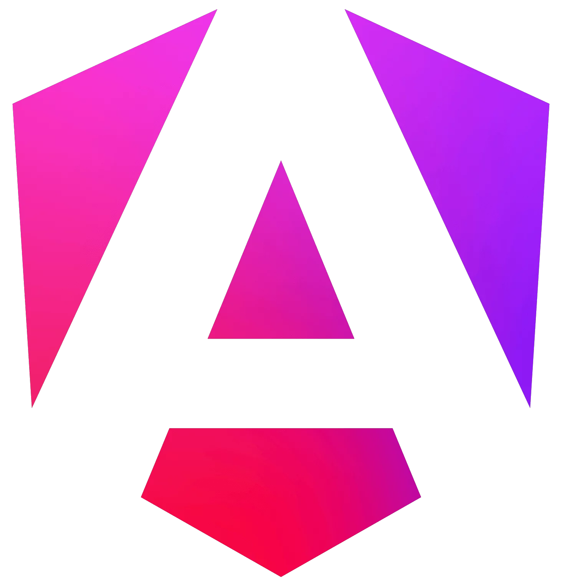

# Iniciación en Angular



```{warning}
https://angular.dev/
```
Con Angular podemos desarrollar para multitud de plataformas: desarrollo móvil, plataformas como MACOS. 
En Angular trabajamos con componentes que están compuestos por:
- HTML
- .ts (puede tener el html inline)
- CSS
- Spec: archivos relacionados al testing.

```{note}
Recomendación: si el HTML tiene más de 4 líneas, mejor tener un archivo
```

En Angular tenemos:
- Marco de trabajo estandarizado: todos seguimos las recomendaciones de forma normal.
- Viene con todo lo que necesitas trabajar, salvo librerías que quieras incorporar.
- Es una aplicación modular.
- Google mantiene el framework de angular.

## Pilares fundamentales en Angular
- Componentes: se desarrollan con la parte de HTML y una clase TypeScript que tendrá un decorador. Se busca que sean pequeñas y funcionales.
- Servicios: son singleton fuertes que permiten trabajar con la información centralizada. Lugares centralizados de información.
- Directivas:  
  - Directivas de componentes: es un componente que tiene un código HTML reutilizable que ya viene conectado. Se coloca la directiva y crea el html con esa funcionalidad integrada.
  - Directivas estructurales: modifican el DOM o el HTML.
  - Directivas de atributos: cambian la apariencia o el comportamiento de un elemento, otro componente o una directiva.
- Rutas: componentes que se muestran basados en la URL.
- Módulos: permiten agrupar componentes, rutas, directivas, servicios e incluso otros módulos.
  - Ejemplos: módulo de productos, clientes, proveedores...
  - Desde angular v17, por defecto los proyectos se trabajan sin módulos (**module-less**). Para trabajar de forma tradicional, como haremos al principio haremos.
  ```bash
  ng new <nombre_aplicación> --standalone false
  ```


  