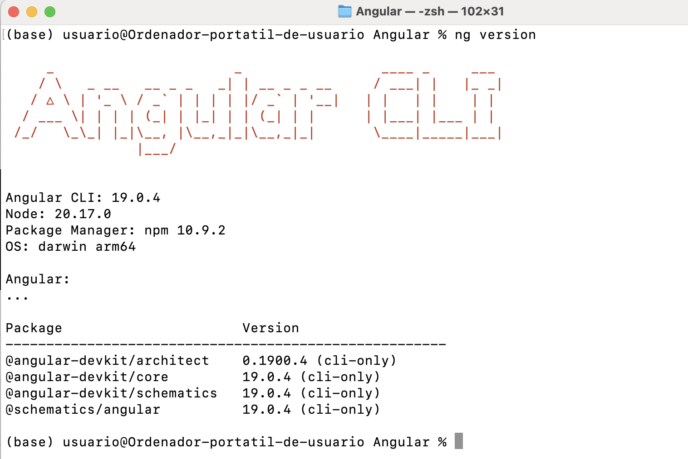
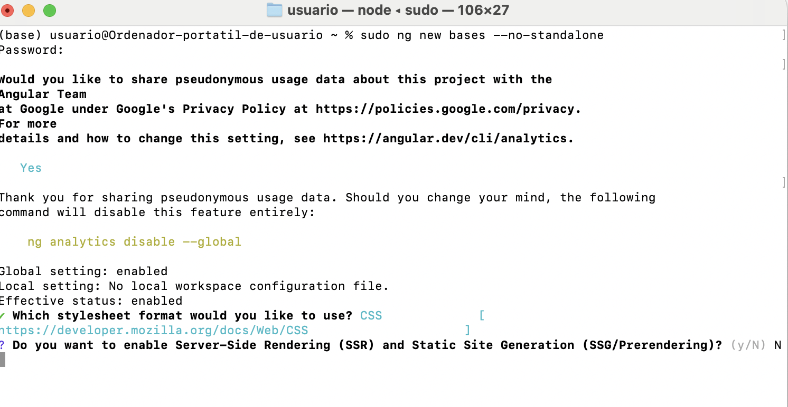
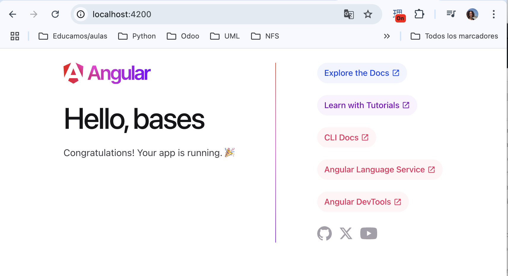
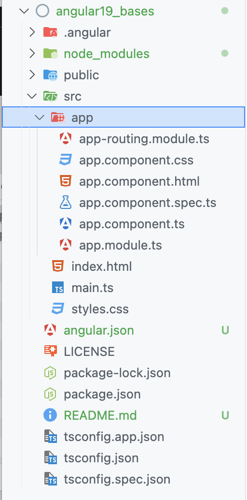

# Primer proyecto en Angular



Con permisos de administración:

```bash
ng new bases --no-standalone
```
Se puede trabajar con Angular del lado del servidor, pero de momento vamos a trabajar con la manera tradicional así que elegimos **No**



```bash
ng serve -o
```
Nos pregunta si queremos mandarle estadísticas a Google.



Si abrimos la carpeta en VSCode: 


```{note}
Hasta la versión 17 de Angular siguen la metodología de módulos y ahora estamos en transición. Tenemos que ver las dos formas de trabajo porque la mayor parte de los proyectos que hay están con módulos. Los módulos sirven para agrupar funcionalidades en común.
Ahora se está empezando a trabajar con **standalone components** y también lo vamos a ver.

Ambos patrones de trabajo son compatibles entre sí. Podemos mezclarlos.
```
## Estructura  de archivos

- `.editorconfig` Son configuraciones por defecto para este proyecto para nuestro editor. 
- `.gitignore` Archivo de Git para decidir qué ficheros/directorios no van a tener seguimiento.
- `angular.json` Es un archivo de configuración global del proyecto: directorio de salida, builder, index.html, archivo principal (main)... No se suele tocar mucho.
- `package-lock.json` No se toca manualmente. Se actualiza cuando se añaden paquetes al `package.json`
- `package.json` Propio de las aplicaciones de node. Se indican los scripts con los comandos y también todas las dependencias con los paquetes necesarios para nuestra aplicación. `dependencies` son dependencias de producción. `devDependencies` son dependencias de desarrollo.
- `README.md` Debemos utilizarlo para indicar configuración y cómo ejecutar nuestra aplicación. Cómo montar la BDD. Configuración de variables de entorno...
- `tsconfig.X` Son archivos de configuración de TypeScript.
- `.angular` Es un directorio que se genera de forma automática. Tiene una carpeta de caché. Esta carpeta ayuda a levantar rápidamente la aplicación y detectar cambios.
- `.vscode` Es un directorio de VSCode que se genera de forma automática. En `extensions.json` podríamos poner recomendaciones para otros desarrolladores, como extensiones... (en ese caso se le daría seguimiento).
- `node_modules` Son también ignorados en `.gitignore` porque si los borro, se reconstruyen con el comando `npm install` a partir de `package.json`. 
  ```{warning}
  Las aplicaciones en desarrollo de Angular son de gran tamaño por el `node_modules` pero cuando generamos con `ng build` el bundle que se distribuye, éste puede ocupar unos pocos KB.
  ```
- `src` Es nuestro directorio estrella. Aquí creamos nuestro código de Angular.
  - `public` para recursos.
  - `index.html` El el archivo html inicial de la aplicación y nuestra aplicación se va a desplegar a partir de la etiqueta `<app-root>` que veremos después.
  - `main.ts` Es el punto de entrada de nuestra aplicación en Angular. `platformBrowserDynamic` es porque estamos trabajando en la web... si trabajamos para otras plataformas, podemos utilizar otros componentes.
  - `app` A partir de esta carpeta empezaremos a crear nuestra aplicación, módulos. 
    - Los archivos `*.spec.*` son archivos de testing.
    - `app.component.ts` Es un archivo TypeScript que tiene un decorador `@Component` que si nos fijamos, además está definiendo `app-root`. Esto está relacionado con el componente principal que veíamos en el `index.html` con la etiqueta `<app-root>`.
    - `app.module.ts` Es el módulo principal. 
  

  ```{warning}
  Repositorio de Bases:
  https://github.com/igijon/angular19_bases
  ```
