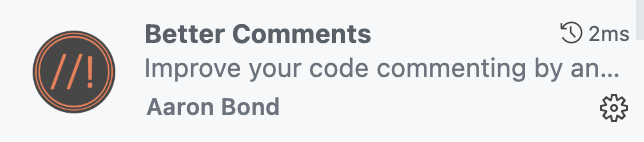

# Instalaciones recomendadas
## Node
Necesario para construir la aplicación, aunque no para ejecutar un proyecto en Angular. (Ya debemos tenerlo instalado desde principio de curso).

## Chrome, Firefox...
## Postman
## Git
## Angular CLI
Para su instalación, miramos siempre la documentación oficial por si algo hubiese cambiado: https://angular.dev/installation

Lo ejecutamos como administrador:

```bash
npm install -g @angular/cli
ng version
```


## Extensiones de VSCode
Las extensiones que muestro a continuación son opcionales pero pueden ser recomendables para facilitar el desarrollo con Angular.

### Angular Language Service


### Auto Close Tag


### Auto Import


### Auto Rename Tag


### Error Lens
Permite ver los errores sin tener que mantener el cursor.


### Paste JSON as Code
Permite copiar código JSON y poder crear las interfaces a partir de un objeto.


### TypeScript Importer
Útil para las autoimportaciones.


### EditorConfig for VSCode
Permite editar el `.editorconfig` de Angular.


### Better Comments
Permite comentarios de distintos modos y en colores que es muy intuitivo


### Material Icon Theme
Iconos para todas las extensiones de archivos


## Extensiones de Chrome

### JSON Viewer Pro


### Angular DevTools
