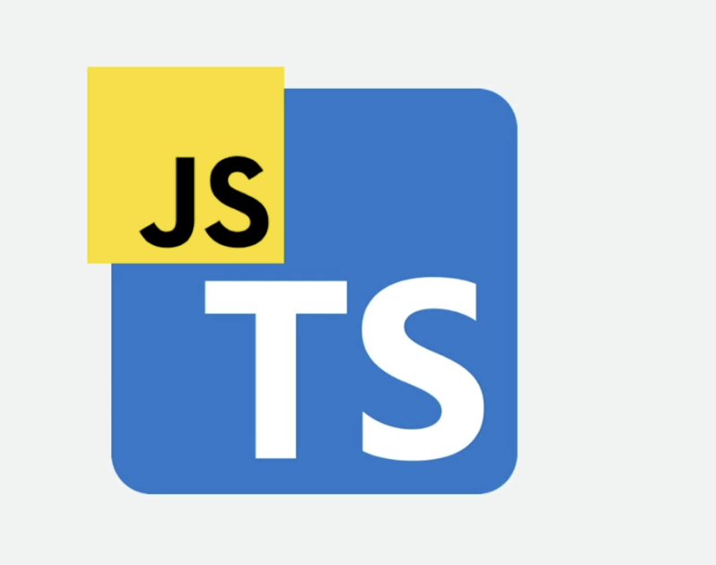

# Introducción a Angular

```{note}
https://angular.dev/overview
```

## TypeScript

TypeScript es un superconjunto de JavaScript. Le extiende características a JS y añade otras características expandiendo las funcionalidades de JS.



TypeScript es mantenido por Microsoft con actualizaciones constantes.

La extensión de los ficheros TypeScript es `.ts`.

- Ofrece tipado estricto y flexible (permimte inferir el tipo como JS pero no es lo más recomendable).
- Mejora la legibilidad del código.
- Permite utilizar nuevas características sin problemas de compatibilidad.
- Mejora el intellisense de los editores.


Angular utiliza TypeScript para:
- Tener todos los beneficios de TypeScript
- Otros frameworks tienen sus versiones con TypeScript
- Permite inyección de dependencias.
- Las clases de TypeScript están integradas con los decoradores de Angular (ya lo veremos).
- También podemos incorporar librerías de JS en nuestros proyectos de TS.
  