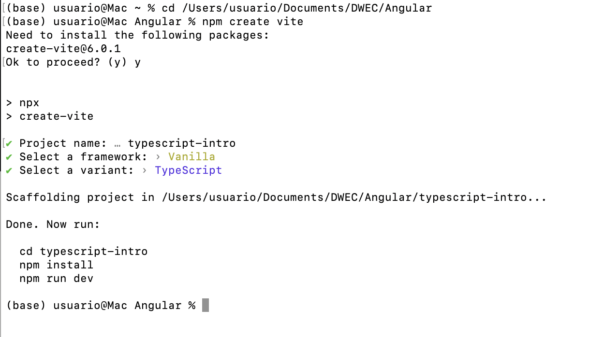
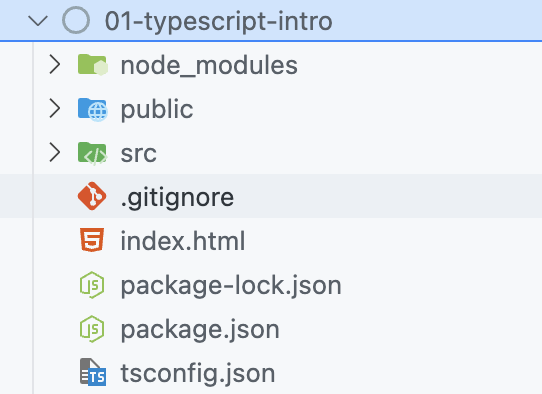
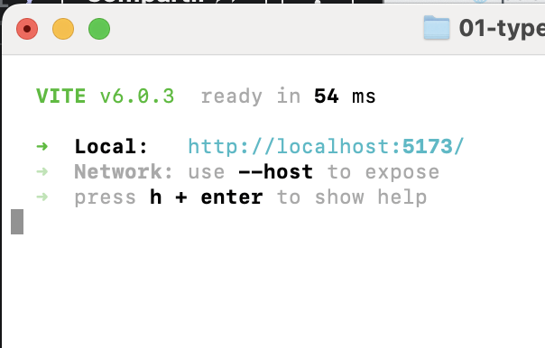
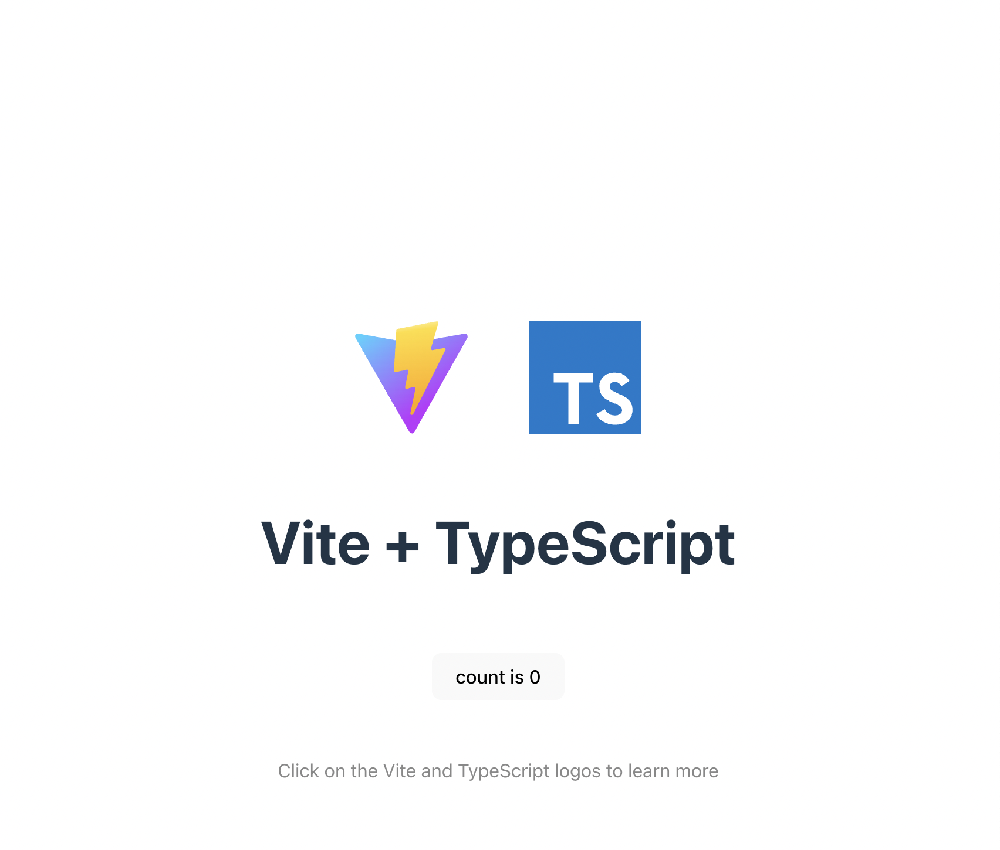

# Iniciación en TypeScript

```{nota}
Para hacer pruebas online sin guardar nada en ningún sitio podemos utilizar:
https://stackblitz.com/edit/typescript-vxnz8z?file=index.ts
```
Crearemos un proyecto con Vite para ver los fundamentos de TypeScript.

```bash
npm create vite
```


Después haremos dentro de la carpeta:
```bash
npm install
```
Podría tener una estructura similar a:


En `package.json` podemos ver:
- La definición global del proyecto.
- Los scripts que se pueden ejecutar.
- Las dependencias de desarrollo.
  
Para ejecutar nuestro proyecto hacemos:

```bash
npm run dev
```




```{note}
https://github.com/igijon/typescript-bases-vite
```
