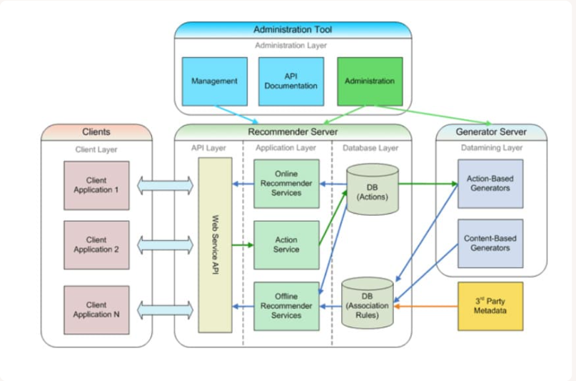

---
jupytext:
  cell_metadata_filter: -all
  formats: md:myst
  text_representation:
    extension: .md
    format_name: myst
    format_version: 0.13
    jupytext_version: 1.11.5
kernelspec:
  display_name: Python 3
  language: python
  name: python3
---

# Arquitectura y tecnologías del lado del cliente

Internet está instaurado en nuestro día a día y las aplicaciones web se han convertido en nuestro lugar de trabajo, ocio... Para dar cabida a todos los propósitos actuales, cada aplicación web debe estar diseñada para ofrecer un alto rendimiento y personalización.

El padre de la **WWW**, World Wide Web, fue Tim Berners-Lee. Este científico británico estableció la primera comunicación entre un cliente y un servidor usando el protocolo HTTP en 1990 y en 1994 fundó el Consorcio de la WWW (**W3C**), con sede en **MIT**, el Instituto Tecnológico de Masachusets. Este consorcio se encarga de supervisar y estandarizar las tecnologías sobre las que se fundamenta la **Web** y que permiten el funcionamiento de Internet. 

## Áreas en entornos clientes/servidor
- **Lado del servidor**: Incluye el hardware y el software del servidor web así como los diferentes elementos de programación y tecnología utilizados, como pueden ser: PHP, Python, Node.js...
    Éste área también es llamada **Backend**.

- **Lado del cliente**: hace referencia a los navegadores web, es decir, son las tecnologías que se ejecutan en el navegador del usuario y le permiten interactuar. Las tecnologías utilizadas son: HTML, CSS, JavaScript...
    Éste área también es llamada **Frontend**

- **La red**: describe los diferentes elementos de conectividad utilizados para mostrar el sitio web al usuario.

## Arquitectura de las Aplicaciones Web

Como decíamos antes, cada aplicación web debe ser diseñada para ofrecer un alto rendimiento y personalización y es la arquitectura que elijamos la que se encargará de resolver este problema.

La **arquitectura de aplicaciones web** es un esquema de cómo interactúan entre sí los distintos componentes de tu aplicación web.

Puede ser tan simple como definir una relación entre cliente y servidor como esta:

También puede ser tan compleja como definir interrelaciones entre un enjambre de servidores backend en contenedores, equilibradores de carga, pasarelas API y frontends SPA orientados al usuario (ya hablaremos de todo esto más adelante).

La forma de diseñar tu aplicación web desempeña un papel **clave** tanto en su usabilidad como en la optimización de costes.

Otro ejemplo de arquitectura web es este: 

## Funcionamiento de un sitio web sencillo

Antes de hablar de los distintos tipos de arquitectura que nos podemos encontrar, vamos a ver cómo funciona un sitio web sencillo:

1. El usuario introduce la **URL** (Uniform Resource Locators) de tu aplicación en la barra de direcciones del navegador o hace click en un enlace.
2. El navegador busca la URL en los servidores **DNS** (sistema de nombres de dominio) e identifica la dirección IP de tu aplicación.
3. El navegador envía una petición **HTTP** a la aplicación.
4. Tu aplicacó´n responde con el contenido correcto (normalmente una página web).
5. El navegador muestra la página web en pantalla.

## Componentes de la Aplicación Web

### Componentes del lado del servidor

Son los componentes que residen en el backend de tu aplicación web. No están expuestos directamente a los usuarios y contienen la lógica de negocio y los recursos más importantes de tu aplicación web.

#### DNS y Enrutamiento

El DNS controla cómo se expone tu aplicación a la web. Los registros DNS son utilizados por los clientes HTTP, que también pueden ser un navegador, para encontrar y enviar solicitudes a los componentes de tu aplicación. El DNS también es utilizado por tus clientes frontend para resolver la ubicación de tus servicores web y endpoints de la API para enviar solicitudes y procesar las operaciones de los usuarios.

El equilibrio de carga es otro componente popular de la arquitectura de las aplicaciones web. Un equilibrador de carga se utiliza para distribuir las peticiones HTTP entre varios servidores web idénticos. La intención de tener varios servidores web es mantener la redundancia que ayuda a aumentar la tolerancia a fallos, así como distribuir el tráfico para mantener un alto rendimiento.

Los endpoints de la API se utilizan para exponer los servicios del bakend a la aplicación frontend. Ayudan a facilitar la comunicación entre cliente y servidor y a veces entre varios servidores.

#### Almacenamiento de Datos

Hay datos que deben persistir a través de las sesiones de los usuarios y suele ser de dos tipos:
- **Bases de datos**: se utilizan para almacenar datos para un acceso rápido. Admiten el almacenamiento de una pequeña cantidad de datos a los que accede regularmente tu aplicación.
- **Almacenes de datos**: pensados para la conservación de datos históricos. No se necesitan con mucha frecuencia en la aplicación pero se procesan con regularidad para generar información empresarial. 

#### Almacenamiento en Caché

Se implementa en algunas arquitecturas para servir el contenido más rápidamente a los usuarios. Una parte del contenido de la app suele ser repetitiva durante un cierto tiempo.

Los tipos más populares son:
- **Almacenamiento de datos en caché**: tecnologías como Redis, Memcache... permiten almacenar datos en caché para ahorrar consultas a la BDD para recuperar los mismos datos una y otra vez.
- **Almacenamiento en caché de páginas web**: una CDN (Content Delivery Network) almacena en caché las páginas web de la misma manera que Redis almacena en caché los datos. Sólo se recomienda almacenar en caché las páginas web estáticas.

#### Trabajos y servicios

Aparte de exponer una interfaz a los usuarios (frontend) y gestionar sus peticiones (backend), hay otra categoría algo menos popular de componentes de aplicaciones web. Los trabajos suelen ser servicios en segundo plano destinados a completar tareas que no son sensibles al tiempo ni a la sincronización.

Algunos ejemplos pueden ser trabajos que se encargan de la eliminación de duplicados, registros antiguos, envío de correos electrónicos con recordatorios a clientes...

### Componentes del Lado del Cliente

#### Interfaz de Usuario del FrontEnd
Aspecto visual de tu aplicación. Es lo que tus usuarios ven y con lo que interactúan.

Se construye principalmente con HTML, CSS y JavaScript.

La interfaz de usuario del frontend puede ser una aplicación en sí misma con su propio ciclo de vida de desarrollo de software.

#### Lógica Empresarial del Lado del Cliente
A veces puedes necesitar almacenar alguna lógica de negocio en tu cliente para realizar operaciones más sencillas con rapidez. La lógica del lado del cliente, que seuele residir en tu aplicación frontend, puede ayudarte a saltarte el viaje al servidor y proporcionar a tus usuarios una experiencia más rápida.

## Tipos de Arquitectura de Aplicaciones Web

Vamos a ver los tipos más populares en la actualidad.

### Arquitecturas SPA

Arquitecturas de una sóla página. Toda aplicación se basa en una sola página. 
La aplicación es lo suficientemente dinámica como para obtener y renderizar pantallas que satisfagan los requisitos de los usuarios mientras navegan por la propia aplicación.

Son estupendas para proporcionar una experiencia rápida y sin fisuras a los usuarios finales.

**Ventajas**:
- Altamente interactivas
- Fáciles de escalar
- Óptimas para el rendimiento 

**Inconvenientes**: 
- A veces son difíciles de optimizar por el SEO.

### Arquitectura de PWA

Arquitectura de aplicaciones web progresivas.
Se basa en la arquitectura SPA proporcionando capacidades offline para la aplicación.
Tecnologías como Capacitor e Ionic se utilizan para crear una experiencia uniforme en todas las plataformas.

A través de service workers se pueden instalar las aplicaciones en los dispositivos de los usuarios.

**Ventajas:**
- Las aplicaciones se ejecutan con fluidez y ofrecen compatibilidad entre plataformas.
- Escalables
- Acceso sin conexión

**Inconvenientes:**
- Soporte limitado para la gestión de enlaces y SEO
- Enviar actualizaciones a las PWA sin conexión es complejo.
- La compatibilidad con navegadores web y SSOO es limitada.

### Arquitectura de SSR

Arquitectura de renderizado del lado del servidor.
Las páginas web del frontend se renderizan en un servidor backend después de ser solicitadas por el usuario. Esto ayuda a la carga en el dispositivo del cliente, ya que recibe una página web estática de HTML, CSS y JS.

Populares entre blogs y sitios web de comercio electrónico porque hacen la gestión de enlaces y SEO bastante sencilla.

**Ventajas**: 
- Buenas para SEO
- La carga de la primera página es casi instantánea en la mayoría de los casos.
- Combinada con un servicio de caché mejora aún más el rendimiento.

**Inconvenientes**:
- No se recomienta para páginas complejas o pesadas, ya que el servidor puede tardar en generar la página completa y provoca retrasos.
- Se recomienda para aplicaciones que no se centran mucho en la interfaz de usuario y buscan escalabilidad o seguridad.

### Arquitectura de Aplicaciones Isomórficas

Son una mezcla de aplicaciones renderizadas en el lado del servidor y SPA. Las aplicaciones se renderizan primero en el servidor y una vez las recibe el cliente, la app se hidrata y adjunta el DOM virtual para un procesamiento más rápido y eficiente por parte del cliente. Esto convierte la aplicación en una SPA.

Isomorphic reúne lo mejor de ambos mundos. El procesmiento y la interfaz de usuario del cliente son superrápidos, gracias a la SPA. También se obtiene un renderizado inicial rápido y un soporte completo de SEO y enlaces, gracias al renderizado del lado del servidor.

**Ventajas**:
- Renderización inicial superrápida y soporte completo para el SEO.
- Buen rendimiento en el cliente, ya que se convierten en una SPA después de la carga.

**Inconvenientes**:
- La puesta en marcha requiere un conocimiento técnico profundo.
- Hay que elegir frameworks, en su mayoría, basados en JS porque las opciones de stack tecnológico son limitadas.

### Arquitectura Orientada al Servicio

Una de las opciones más populares a la forma tradicional de monolito.
Las aplicaciones web se dividen en servicios que representan una unidad funcional de negocio cada uno. Estos servicios están débilmente acoplados e interactúan entre sí mediante el paso de mensajes.

La arquitectura orientada a servicios añade estabilidad y escalabilidad al stack tecnológico de tu aplicación. Sin embargo el tamaño de los servicios no está claramente definido y suelen estar vinculados a los componentes de negocio, no a los componentes técnicos y a veces el mantenimiento es problemático.

**Ventajas**: 
- Altamente escalables y fiables
- Componentes reutilizables y se comparten para mejorar esfuerzos de desarrollo y mantenimiento.

**Inconvenientes**:
- El tamaño y el alcance de los servicios no son fijos y a veces son difíciles de mantener.
- A veces se producen dependencias de servicios.

### Arquitectura de Microservicios

Se diseñó para resolver problemas de la arquitectura orientada a servicios.
Son más modulares que los servicios y se centran en mantener cada componente pequeño y con un contexto limitado.

Cada microservicio tiene su código y sus datos acoplados con mínimas dependencias de otros microservicios.

Es altamente escalable y cada componente es fácil de mantener.
Sin embargo, el mantenimiento del ciclo de vida de DevOps para una aplicación basada en microservicios requiere esfuerzos adicionales, por lo que podría no ser adecuado para casos de uso más pequeños.

**Ventajas**: 
- Componentes muy modulares, independientes y pueden reutilizarse en mayor medida que los de la arquitectura orientada a servicios.
- Cada componente puede escalarse de forma independiente para satisfacer el tráfico variable de usuarios.
- Altamente tolerante a fallos

**Inconvenientes**:
- Para proyectos pequeños tiene inconvenientes de mantenimiento de DevOps.

## Bibliografía

Apuntes personales, experiencia en el sector y referencias del siguiente material:

{cite}`wikipedia`
{cite}`kinsta`
{cite}`jcastillo`
