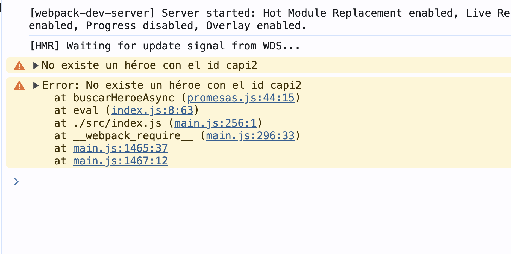

## Promesas
Las promesas proporcinan una forma de manejar operaciones asíncronas de manera más manejable y predecible, evitando los problemas de "callback hell".

Una promesa se crea utilizando el constructor `Promise`, que acepta una función ejecutora como argumento. Esta función recibe dos funciones como parámetros: `resolve` y `reject`

```js
//promesas.js
const heroes = {
    capi: {
        nombre: 'Capitán América',
        poder: 'Aguantar inyecciones sin morir'
    },
    iron: {
        nombre: 'Ironman',
        poder: 'Absurda cantidad de dinero'
    },
    spider: {
        nombre: 'Spiderman',
        poder: 'La mejor reacción alérgica a las picaduras de araña'
    }
}
export const buscarHeroe = (id) => {
    const heroe = heroes[id];
    return new Promise( ( resolve, reject ) => {
        if( heroe ) {
            resolve( heroe );
        } else {
            reject( `No existe un héroe con el id ${id}`);
        }
    }); 
}
```

```js
//main.js
const heroeId1 = 'capi';

buscarHeroe( heroeId1 ).then( heroe => {
    console.log(`Enviando a ${heroe.nombre} a la misión`);
})
```


### Estados de las promesas
Las promesas pueden estar en los siguientes estados:
- **Pendiente (pending)**: estado inicial, la promesa aún no se ha cumplido ni ha sido rechazada.
- **Cumplida (fullfilled)**: la operación se completó con éxito y se resuelve la promesa.
- **Rechazada (rejected)**: la operación falló y la promesa fue rechazada.
  
### `Promise.all`

```js
//main.js
const heroeId2 = 'iron';

//No se ejecuta el código hasta que no se resuelve todo lo que está dentro
Promise.all([buscarHeroe(heroeId1), buscarHeroe(heroeId2)])
    .then( ([heroe1, heroe2]) => {
        console.log(`Enviando a ${heroe1.nombre} y ${heroe2.nombre} a la misión`);
    });
console.log("Fin del programa");
```


### `Promise.catch`


```js
//main.js
const heroeId1 = 'capi2';
const heroeId2 = 'iron';

//No se ejecuta el código hasta que no se resuelve todo lo que está dentro
Promise.all([buscarHeroe(heroeId1), buscarHeroe(heroeId2)])
    .then( ([heroe1, heroe2]) => {
        //sólo se ejecuta si todas las promesas se han ejecutado satisfactoriamente
        console.log(`Enviando a ${heroe1.nombre} y ${heroe2.nombre} a la misión`);
}).catch( err => {
    alert(err);
}).finally(() => {
    console.log('Se termino el promise.all');
});
console.log("Fin del programa");
```


### `Promice.race`

```js
//uso-call-prom.back.js
import {buscarHeroe as buscarHeroeCallbacks} from './js/callbaks';
import {buscarHeroe} from './js/promesas';
import './styles.css';

const heroeId1 = 'capi2';
const heroeId2 = 'iron';

//No se ejecuta el código hasta que no se resuelve todo lo que está dentro
Promise.all([buscarHeroe(heroeId1), buscarHeroe(heroeId2)])
    .then( ([heroe1, heroe2]) => {
        //sólo se ejecuta si todas las promesas se han ejecutado satisfactoriamente
        console.log(`Enviando a ${heroe1.nombre} y ${heroe2.nombre} a la misión`);
}).catch( err => {
    alert(err);
}).finally(() => {
    console.log('Se termino el promise.all');
});
console.log('Fin del programa');
```

```js
//promesas.js
const heroes = {
    capi: {
        nombre: 'Capitán América',
        poder: 'Aguantar inyecciones sin morir'
    },
    iron: {
        nombre: 'Ironman',
        poder: 'Absurda cantidad de dinero'
    },
    spider: {
        nombre: 'Spiderman',
        poder: 'La mejor reacción alérgica a las picaduras de araña'
    }
}

export const buscarHeroe = (id) => {
    const heroe = heroes[id];

    return new Promise( ( resolve, reject ) => {
        if( heroe ) {
            resolve( heroe );
        } else {
            reject( `No existe un héroe con el id ${id}`);
        }
    }); 
}
const promesaLenta = new Promise((resolve, reject) => {
    setTimeout(() => resolve('Promesa lenta'),2000);
});
const promesaMedia = new Promise((resolve, reject) => {
    setTimeout(() => resolve('Promesa media'),1500);
});
const promesaRapida = new Promise((resolve, reject) => {
    setTimeout(() => resolve('Promesa rápida'),1000);
});
export {
    promesaLenta,
    promesaMedia,
    promesaRapida
}
```

```js
//main.js
import { promesaLenta, promesaRapida, promesaMedia } from './js/promesas';

//Se intentan ejecutar todas las promesas y la única que se muestra es la más
//rápida. Si alguna da un error, se ignora.
Promise.race([promesaLenta, promesaMedia, promesaRapida])
    .then( console.log);

```


### `async`


```js
//promesas.js
const heroes = {
    capi: {
        nombre: 'Capitán América',
        poder: 'Aguantar inyecciones sin morir'
    },
    iron: {
        nombre: 'Ironman',
        poder: 'Absurda cantidad de dinero'
    },
    spider: {
        nombre: 'Spiderman',
        poder: 'La mejor reacción alérgica a las picaduras de araña'
    }
}

//async transforma mi función en una función asíncrona... sin hacer el 
//return promise
export const buscarHeroeAsync = async(id) => {
    const heroe = heroes[id];
    if( heroe ) {
        return heroe; //Se corresponde con el resolve
    } else {
        throw Error(`No existe un héroe con el id ${id}`);
    }
}

const promesaLenta = new Promise((resolve, reject) => {
    setTimeout(() => resolve('Promesa lenta'),2000);
});
const promesaMedia = new Promise((resolve, reject) => {
    setTimeout(() => resolve('Promesa media'),1500);
});
const promesaRapida = new Promise((resolve, reject) => {
    setTimeout(() => resolve('Promesa rápida'),1000);
});
export {
    promesaLenta,
    promesaMedia,
    promesaRapida
}
```

```js
//main.js
import { buscarHeroe, buscarHeroeAsync } from './js/promesas';

buscarHeroe('capi2')
    .then(console.log)
    .catch(console.warn);
buscarHeroeAsync('capi2')
    .then(console.log)
    .catch(console.warn);

```



### Falso positivo. Problema sin `await`

```js
//await.js
import { buscarHeroeAsync } from './promesas'
const heroesIds = ['capi', 'iron', 'spider'];

export const obtenerHeroesArr = () => {
    const heroesArr = [];
    for (const id of heroesIds) {
        
        buscarHeroeAsync(id).then(heroe => heroesArr.push(heroe));
    }
    return heroesArr;
}
```
```js
//main.js
import { obtenerHeroesArr } from "./js/await";

const heroes = obtenerHeroesArr();
console.log(heroes);
console.table(heroes);

```


### Array de promesas. Sin `await`
```js
//await.js
import { buscarHeroeAsync } from './promesas'
const heroesIds = ['capi', 'iron', 'spider'];

export const obtenerHeroesArr = () => {
    const heroesArr = [];
    for (const id of heroesIds) {
        const heroe = buscarHeroeAsync(id);
        heroesArr.push(heroe); //Ahora tengo un array con promesas
    }
    return heroesArr;
}
```


### `await`

```js
//await.js
import { buscarHeroeAsync } from './promesas'
const heroesIds = ['capi', 'iron', 'spider'];

export const obtenerHeroesArr = async () => {
    const heroesArr = [];
    for (const id of heroesIds) {
        const heroe = await buscarHeroeAsync(id); //Await debe insertarse dentro de una función asíncrona
        //Cuando se resuelve la promesa, el resultado que devuelve lo almacena en heroe. Await espera que la promesa se resuelva. 
        heroesArr.push(heroe); //Ahora tengo un array con promesas
    }

    return heroesArr;
}
```
```js
//main.js
import { obtenerHeroesArr } from "./js/await";

const heroes = obtenerHeroesArr().then(console.table);

```


### `await`. Bloqueo de la ejecución.
```js
//promesas.js
const heroes = {
    capi: {
        nombre: 'Capitán América',
        poder: 'Aguantar inyecciones sin morir'
    },
    iron: {
        nombre: 'Ironman',
        poder: 'Absurda cantidad de dinero'
    },
    spider: {
        nombre: 'Spiderman',
        poder: 'La mejor reacción alérgica a las picaduras de araña'
    }
}

export const buscarHeroe = (id) => {
    const heroe = heroes[id];

    return new Promise( ( resolve, reject ) => {
        if( heroe ) {
            setTimeout(()=> resolve( heroe ), 1000);
        } else {
            reject( `No existe un héroe con el id ${id}`);
        }
    }); 
}

//async transforma mi función en una función asíncrona... sin hacer el 
//return promise
export const buscarHeroeAsync = async(id) => {
    const heroe = heroes[id];

    if( heroe ) {
        return heroe; //Se corresponde con el resolve
    } else {
        throw Error(`No existe un héroe con el id ${id}`);
    }
}

const promesaLenta = new Promise((resolve, reject) => {
    setTimeout(() => resolve('Promesa lenta'),2000);
});

const promesaMedia = new Promise((resolve, reject) => {
    setTimeout(() => resolve('Promesa media'),1500);
});

const promesaRapida = new Promise((resolve, reject) => {
    setTimeout(() => resolve('Promesa rápida'),1000);
});

export {
    promesaLenta,
    promesaMedia,
    promesaRapida
}
```


```js
//await.js
import { buscarHeroe } from './promesas'

const heroesIds = ['capi', 'iron', 'spider'];

export const obtenerHeroesArr = async () => {
    const heroesArr = [];
    for (const id of heroesIds) {
        const heroe = await buscarHeroe(id); //Await debe insertarse dentro de una función asíncrona
        //Cuando se resuelve la promesa, el resultado que devuelve lo almacena en heroe. Await espera que la promesa se resuelva. 
        heroesArr.push(heroe); //Ahora tengo un array con promesas
    }

    return heroesArr;
}
```
Se muestra el resultado más tarde porque bloquea la ejecución.


### `await`. Mejora

```js
//await.js
import { buscarHeroe } from './promesas'

const heroesIds = ['capi', 'iron', 'spider'];

export const obtenerHeroesArr = async () => {
    // const heroesArr = [];
    // //Si quiero hacer promesas consecutivamente no se recomienda hacerlo así dentro de un ciclo for
    // for (const id of heroesIds) {
    //      heroesArr.push(buscarHeroe(id)); //Esto es un array de promesas
    // }

    // return await Promise.all(heroesArr); //Evitamos usar await fuera del ciclo for

    //Vamos a hacerlo más elegante
    //Se resuelve desdel el parénteis más interno hacia fuera
    return await Promise.all(heroesIds.map( buscarHeroe ));
}
```
### `await`. Manejar errores

```js
//await.js
import { buscarHeroe, buscarHeroeAsync } from './promesas'

const heroesIds = ['capi', 'iron', 'spider'];

export const obtenerHeroesArr = async () => {
    // const heroesArr = [];
    // //Si quiero hacer promesas consecutivamente no se recomienda hacerlo así dentro de un ciclo for
    // for (const id of heroesIds) {
    //      heroesArr.push(buscarHeroe(id)); //Esto es un array de promesas
    // }

    // return await Promise.all(heroesArr); //Evitamos usar await fuera del ciclo for

    //Vamos a hacerlo más elegante
    //Se resuelve desdel el parénteis más interno hacia fuera
    return await Promise.all(heroesIds.map( buscarHeroe ));
}

export const obtenerHeroesAwait = async (id) => {
    try {
        const heroe = await buscarHeroeAsync( id );
        return heroe;
    }catch(err){
        //Si aquí pongo un return, irá al then de la función que llama a esta
        throw err;
    }       
}
```

```js
//main.js
import { obtenerHeroesAwait } from "./js/await";

console.time('await')
obtenerHeroesAwait('capi2').then( heroe => {
    console.log(heroe);
    console.timeEnd('await');
}).catch(console.warn);


```


### `for await`

```js
//await.js
import { buscarHeroe, buscarHeroeAsync } from './promesas'

const heroesIds = ['capi', 'iron', 'spider'];
//const heroesPromesas = heroesIds.map( id => buscarHeroe(id));
const heroesPromesas = heroesIds.map( buscarHeroe ); //Array de promesas


export const obtenerHeroesArr = async () => {
    // const heroesArr = [];
    // //Si quiero hacer promesas consecutivamente no se recomienda hacerlo así dentro de un ciclo for
    // for (const id of heroesIds) {
    //      heroesArr.push(buscarHeroe(id)); //Esto es un array de promesas
    // }

    // return await Promise.all(heroesArr); //Evitamos usar await fuera del ciclo for

    //Vamos a hacerlo más elegante
    //Se resuelve desdel el parénteis más interno hacia fuera
    return await Promise.all(heroesIds.map( buscarHeroe ));
}

export const obtenerHeroesAwait = async (id) => {
    try {
        const heroe = await buscarHeroeAsync( id );
        return heroe;
    }catch(err){
        //Si aquí pongo un return, irá al then de la función que llama a esta
        throw err;
    }       
}

export const heroesCiclo = async() => {
    console.time('HeroesCiclo');

    // const heroes = await Promise.all(heroesPromesas);
    // heroes.forEach( heroe => console.log(heroe) );

    for await (const heroe of heroesPromesas ) {
        console.log(heroe);
    }

    console.timeEnd('HeroesCiclo');
}
```

```js
//main.js
import { heroesCiclo } from './js/await';

heroesCiclo();
```

### `await` dentro de un `if`

```js
//await.js
import { buscarHeroe, buscarHeroeAsync } from './promesas'

const heroesIds = ['capi', 'iron', 'spider'];
//const heroesPromesas = heroesIds.map( id => buscarHeroe(id));
const heroesPromesas = heroesIds.map( buscarHeroe ); //Array de promesas


export const obtenerHeroesArr = async () => {
    // const heroesArr = [];
    // //Si quiero hacer promesas consecutivamente no se recomienda hacerlo así dentro de un ciclo for
    // for (const id of heroesIds) {
    //      heroesArr.push(buscarHeroe(id)); //Esto es un array de promesas
    // }

    // return await Promise.all(heroesArr); //Evitamos usar await fuera del ciclo for

    //Vamos a hacerlo más elegante
    //Se resuelve desdel el parénteis más interno hacia fuera
    return await Promise.all(heroesIds.map( buscarHeroe ));
}

export const obtenerHeroesAwait = async (id) => {
    try {
        const heroe = await buscarHeroeAsync( id );
        return heroe;
    }catch(err){
        //Si aquí pongo un return, irá al then de la función que llama a esta
        throw err;
    }       
}

export const heroesCiclo = async() => {
    console.time('HeroesCiclo');

    // const heroes = await Promise.all(heroesPromesas);
    // heroes.forEach( heroe => console.log(heroe) );

    for await (const heroe of heroesPromesas ) {
        console.log(heroe);
    }

    console.timeEnd('HeroesCiclo');
}

export const heroeIfAwait = async(id) => {
    if ( (await buscarHeroeAsync(id)).nombre === 'Ironman') {
        console.log('Es el mejor de todos');
    } else {
        console.log('Nada');
    }
}
```
```js
//main.js
import { heroeIfAwait } from './js/await';

heroeIfAwait('iron');
```
