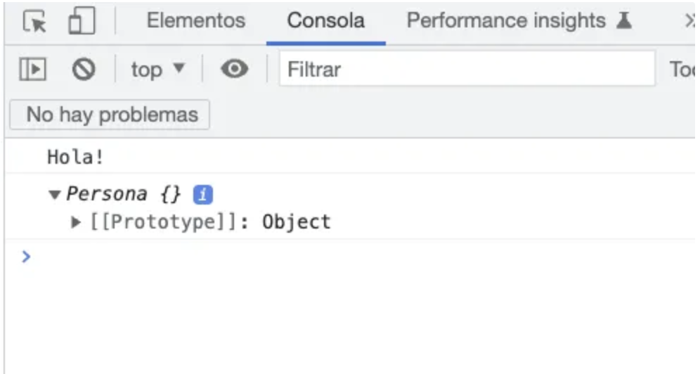
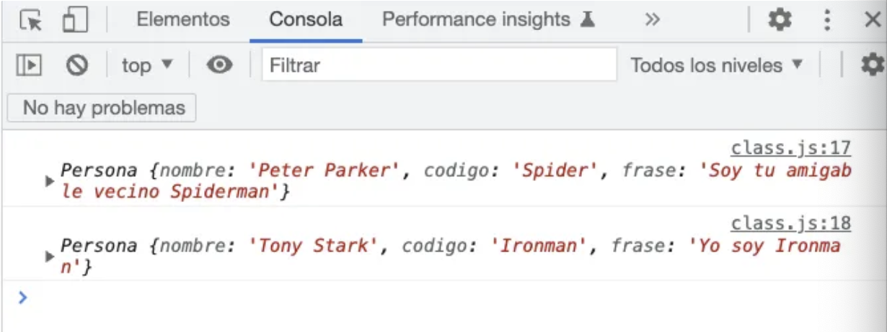
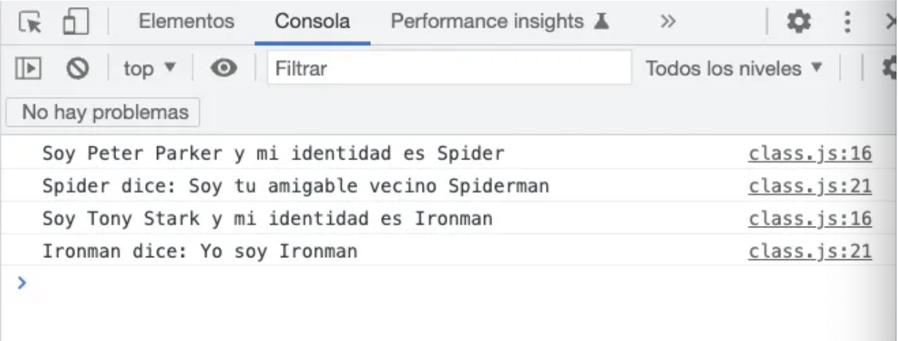
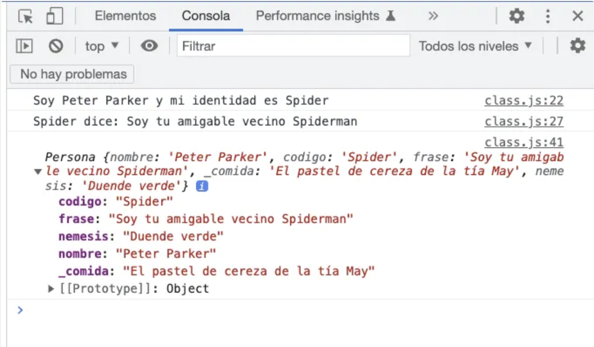
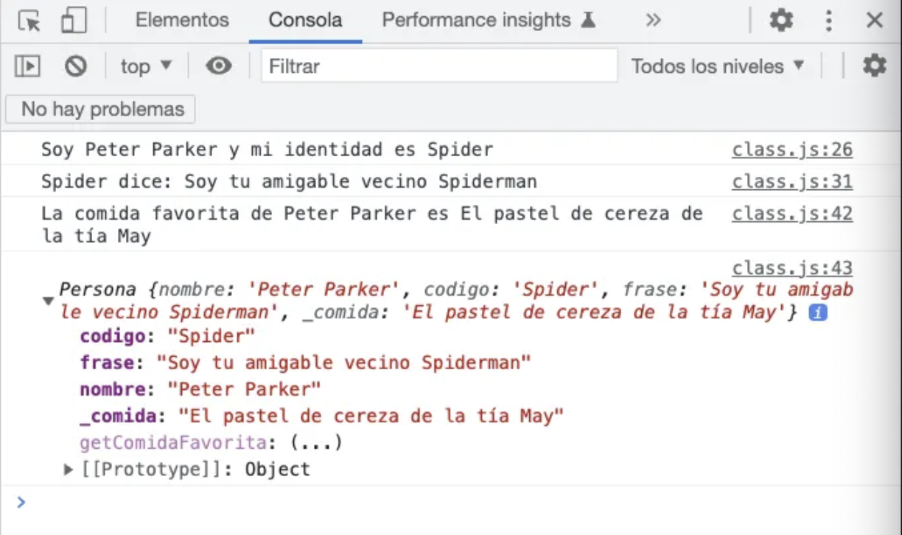
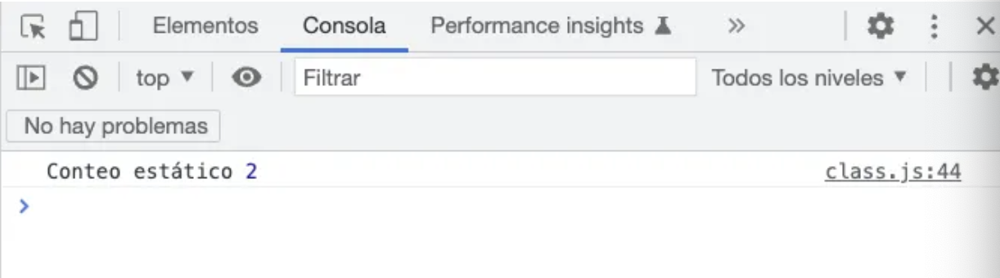
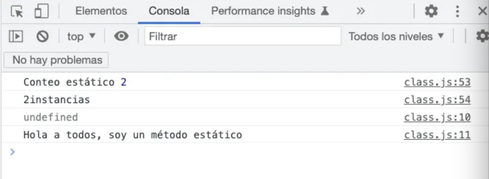
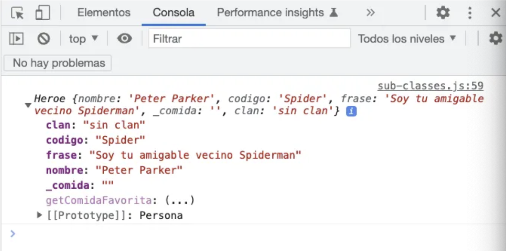
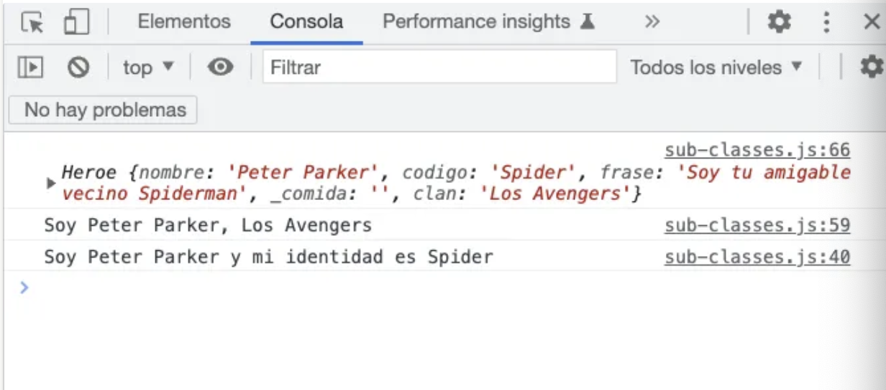
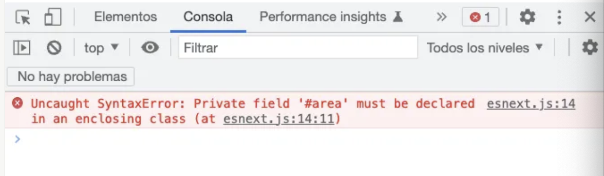

# Programación orientada a objetos en JavaScript
## Objetos en JS
En JS siempre hemos tenido objetos, aunque la implementación no ha seguido el curso de la forma en la que se implementa con otros lenguajes orientados a objetos.
Un objeto en JavaScript es similar a un diccionario en Python o un array asociativo en PHP. Los objetos permiten almacenar colecciones de datos y funcionalidades relacionadas.

Se puede acceder a los atributos de un objeto utilizando la notación del `.` o corchetes `[]`.

```js
let persona = {
    nombre: ['Bob', 'Smith'],
    edad: 32,
    genero: 'masculino',
    intereses: ['música', 'esquí'],
    bio: function () {
        alert(this.nombre[0] + ' ' + this.nombre[1] + ' tiene ' + this.edad + ' años. Le gusta ' + this.intereses[0] + ' y ' + this.intereses[1] + '.');
    }
};
```
```js
function Persona(nombre, edad){
    this.nombre = nombre;
    this.edad = edad;
    this.bio = function() {
        lert(this.nombre[0] + ' ' + this.nombre[1] + ' tiene ' + this.edad + ' años. Le gusta ' + this.intereses[0] + ' y ' + this.intereses[1] + '.');
    }
}
```
```{warning}
**FORMA ANTIGUA**
En este caso la función `Persona` me permite crear instancias y por eso la ponemos en mayúscula. 
```

```js
const maria = new Persona('María', 15);
const melissa = new Persona('Melissa', 35);
maria.bio();
melissa.bio();
```
Se puede acceder a las propiedades de un objeto dentro de otro objeto encadenando los puntos o los corchetes:

```js
let descripcion = maria.ciclo?.descripcion;
```

En el ejemplo, hemos usado `?` para evitar el error de intentar acceder a un atributo dentro de uno que no existe. El resultado sería `undefined`.

## Clases

Antes de ES6, las clases de JS se creaban utilizando las funciones como la que hemos visto en el punto anterior. Aún se utiliza esta técnica, pero con la versión ES6, se incorporó la palabra clave `class`, que se asemeja más a la sintaxis de otros lenguajes de POO. 

```{nota}
Es importante entender, que JS no funciona exactamente con clases en el sentido tradicional, sino con prototipos (hablaremos de esto después). En JS, las clases son más una técnica de programación que una funcionalidad del lenguaje.
```
```js
class Persona {
    constructor() {
        console.log('Hola!');
    }
}

const spiderman = new Persona();
```


El constructor es el único que devuelve la instancia de un objeto, nunca `undefined`aunque pongamos `undefined`.

```js
class Persona {
    //Por defecto, todas las clases JS tienen el use strict implementado
    nombre = '';
    codigo = '';
    frase  = '';
    
    constructor( nombre, codigo, frase ) {
        if(!nombre) throw Error('Necesitamos el nombre');
        if(!codigo) throw Error('Necesitamos el código');
        if(!frase) throw Error('Necesitamos la frase');

        this.nombre = nombre;
        this.codigo = codigo;
        this.frase  = frase;
    }
}

const spiderman = new Persona('Peter Parker', 'Spider', 'Soy tu amigable vecino Spiderman');
console.log(spiderman);
```

```js
class Persona {
    //Por defecto, todas las clases JS tienen el use strict implementado
    nombre = '';
    codigo = '';
    frase  = '';
    
    constructor( nombre = 'Sin nombre', codigo = 'Sin código', frase = 'Sin frase') {

        this.nombre = nombre;
        this.codigo = codigo;
        this.frase  = frase;
    }
}

const spiderman = new Persona('Peter Parker', 'Spider', 'Soy tu amigable vecino Spiderman');
const ironman = new Persona('Tony Stark', 'Ironman', 'Yo soy Ironman');
console.log(spiderman);
console.log(ironman);
```


### Métodos
```js
class Persona {
    //Por defecto, todas las clases JS tienen el use strict implementado
    nombre = '';
    codigo = '';
    frase  = '';
    
    constructor( nombre = 'Sin nombre', codigo = 'Sin código', frase = 'Sin frase') {

        this.nombre = nombre;
        this.codigo = codigo;
        this.frase  = frase;
    }


    quienSoy() {
        console.log(`Soy ${this.nombre} y mi identidad es ${this.codigo}`);
    }

    miFrase() {
        this.quienSoy();
        console.log(`${this.codigo} dice: ${this.frase}`);
    }
}

const spiderman = new Persona('Peter Parker', 'Spider', 'Soy tu amigable vecino Spiderman');
const ironman = new Persona('Tony Stark', 'Ironman', 'Yo soy Ironman');

spiderman.miFrase();
ironman.miFrase();
```


### Sets y Gets

```{warning}
Los set no pueden tener el mismo nombre que la propiedad que modifican porque si no entrarían en una recursividad infinita
```

```js
class Persona {
    //Por defecto, todas las clases JS tienen el use strict implementado
    nombre  = '';
    codigo  = '';
    frase   = '';
    _comida  = '';
    
    constructor( nombre = 'Sin nombre', codigo = 'Sin código', frase = 'Sin frase') {

        this.nombre = nombre;
        this.codigo = codigo;
        this.frase  = frase;
    }

    //No pueden tener el mismo nombre que la propiedad que modifican porque 
    //si no entran en bucle infinito
    set comida( com ) {
        this._comida = com;
    }

    quienSoy() {
        console.log(`Soy ${this.nombre} y mi identidad es ${this.codigo}`);
    }

    miFrase() {
        this.quienSoy();
        console.log(`${this.codigo} dice: ${this.frase}`);
    }
}

const spiderman = new Persona('Peter Parker', 'Spider', 'Soy tu amigable vecino Spiderman');
const ironman = new Persona('Tony Stark', 'Ironman', 'Yo soy Ironman');

spiderman.miFrase();

spiderman.comida = 'El pastel de cereza de la tía May';
//Esto añade propiedades sin dar error y también permite modificarlas si no las establecemos como
//privadas... CUIDADO!
spiderman.nemesis = 'Duende verde';

console.log(spiderman);
```


Otro ejemplo:

```js
class Persona {
    //Por defecto, todas las clases JS tienen el use strict implementado
    nombre  = '';
    codigo  = '';
    frase   = '';
    _comida  = '';
    
    constructor( nombre = 'Sin nombre', codigo = 'Sin código', frase = 'Sin frase') {

        this.nombre = nombre;
        this.codigo = codigo;
        this.frase  = frase;
    }

    //No pueden tener el mismo nombre que la propiedad que modifican porque 
    //si no entran en bucle infinito
    set setComidaFavorita( comida ) {
        this._comida = comida.toUpperCase();
    }

    get getComidaFavorita() {
        return `La comida favorita de ${this.nombre} es ${this._comida}`;
    }

    quienSoy() {
        console.log(`Soy ${this.nombre} y mi identidad es ${this.codigo}`);
    }

    miFrase() {
        this.quienSoy();
        console.log(`${this.codigo} dice: ${this.frase}`);
    }
}

const spiderman = new Persona('Peter Parker', 'Spider', 'Soy tu amigable vecino Spiderman');
const ironman = new Persona('Tony Stark', 'Ironman', 'Yo soy Ironman');

spiderman.miFrase();

spiderman.setComidaFavorita = 'El pastel de cereza de la tía May';

console.log(spiderman.getComidaFavorita);
console.log(spiderman);
```


### Estáticos
```js
class Persona {

    static _conteo = 0;

    //Por defecto, todas las clases JS tienen el use strict implementado
    nombre  = '';
    codigo  = '';
    frase   = '';
    _comida  = '';
    
    constructor( nombre = 'Sin nombre', codigo = 'Sin código', frase = 'Sin frase') {

        this.nombre = nombre;
        this.codigo = codigo;
        this.frase  = frase;

        Persona._conteo++; 
    }

    //No pueden tener el mismo nombre que la propiedad que modifican porque 
    //si no entran en bucle infinito
    set setComidaFavorita( comida ) {
        this._comida = comida.toUpperCase();
    }

    get getComidaFavorita() {
        return `La comida favorita de ${this.nombre} es ${this._comida}`;
    }

    quienSoy() {
        console.log(`Soy ${this.nombre} y mi identidad es ${this.codigo}`);
    }

    miFrase() {
        this.quienSoy();
        console.log(`${this.codigo} dice: ${this.frase}`);
    }
}

const spiderman = new Persona('Peter Parker', 'Spider', 'Soy tu amigable vecino Spiderman');
const ironman = new Persona('Tony Stark', 'Ironman', 'Yo soy Ironman');


console.log('Conteo estático', Persona._conteo );
```


```js
class Persona {

    static _conteo = 0;

    static get conteo() {
        return Persona._conteo + 'instancias';
    }

    //Por defecto, todas las clases JS tienen el use strict implementado
    nombre  = '';
    codigo  = '';
    frase   = '';
    _comida  = '';
    
    constructor( nombre = 'Sin nombre', codigo = 'Sin código', frase = 'Sin frase') {

        this.nombre = nombre;
        this.codigo = codigo;
        this.frase  = frase;

        Persona._conteo++; 
    }

    //No pueden tener el mismo nombre que la propiedad que modifican porque 
    //si no entran en bucle infinito
    set setComidaFavorita( comida ) {
        this._comida = comida.toUpperCase();
    }

    get getComidaFavorita() {
        return `La comida favorita de ${this.nombre} es ${this._comida}`;
    }

    quienSoy() {
        console.log(`Soy ${this.nombre} y mi identidad es ${this.codigo}`);
    }

    miFrase() {
        this.quienSoy();
        console.log(`${this.codigo} dice: ${this.frase}`);
    }
}

const spiderman = new Persona('Peter Parker', 'Spider', 'Soy tu amigable vecino Spiderman');
const ironman = new Persona('Tony Stark', 'Ironman', 'Yo soy Ironman');


console.log('Conteo estático', Persona._conteo );
console.log(Persona.conteo); //Get estático
```
```js
class Persona {

    static _conteo = 0;

    static get conteo() {
        return Persona._conteo + 'instancias';
    }

    static mensaje() {
        console.log(this.nombre); //undefined porque no es sobre la instancia.
        console.log('Hola a todos, soy un método estático');
    }

    //Por defecto, todas las clases JS tienen el use strict implementado
    nombre  = '';
    codigo  = '';
    frase   = '';
    _comida  = '';
    
    constructor( nombre = 'Sin nombre', codigo = 'Sin código', frase = 'Sin frase') {

        this.nombre = nombre;
        this.codigo = codigo;
        this.frase  = frase;

        Persona._conteo++; 
    }

    //No pueden tener el mismo nombre que la propiedad que modifican porque 
    //si no entran en bucle infinito
    set setComidaFavorita( comida ) {
        this._comida = comida.toUpperCase();
    }

    get getComidaFavorita() {
        return `La comida favorita de ${this.nombre} es ${this._comida}`;
    }

    quienSoy() {
        console.log(`Soy ${this.nombre} y mi identidad es ${this.codigo}`);
    }

    miFrase() {
        this.quienSoy();
        console.log(`${this.codigo} dice: ${this.frase}`);
    }
}

const spiderman = new Persona('Peter Parker', 'Spider', 'Soy tu amigable vecino Spiderman');
const ironman = new Persona('Tony Stark', 'Ironman', 'Yo soy Ironman');


console.log('Conteo estático', Persona._conteo );
console.log(Persona.conteo); //Get estático
Persona.mensaje();
```


```{warning}
No es recomendable, pero en JS se pueden realizar métodos estáticos fuera de la clase. 
`Persona.propiedadExterna = 'Hola mundo';`
Esto crearía una propiedad estática fuera de la clase.
```

### Herencia
```js
class Heroe extends Persona{
    
    clan = 'sin clan';


}

const spiderman = new Heroe('Peter Parker', 'Spider', 'Soy tu amigable vecino Spiderman');

console.log(spiderman);
```


```{note}
Puedo llamar a los métodos del padre
```
```js
class Heroe extends Persona{
    
    clan = 'sin clan';

    constructor( nombre, codigo, frase ) {
        super( nombre, codigo, frase ); //siempre al principio, porque no se puede utilizar la instancia antes
        this.clan = 'Los Avengers';
    }

    quienSoy() {
        console.log(`Soy ${this.nombre}, ${this.clan}`);
        super.quienSoy();
    }
}

const spiderman = new Heroe('Peter Parker', 'Spider', 'Soy tu amigable vecino Spiderman');

console.log(spiderman);
spiderman.quienSoy();
```


### Propiedades privadas
Puedo cambiar las propiedades de forma intencionada o accidental.

```js
class Rectangulo {
    area = 0;

    constructor(base = 0, altura = 0) {
        this.base = base;
        this.altura = altura;

        this.area = base * altura;
    }

}

const rectangulo = new Rectangulo(10, 15);
rectangulo.area = 100; //NO DEBERÍAMOS PODER MODIFICARLA DIRECTAMENTE. DEBERÍA SER PRIVADA
console.log(rectangulo);
```
```{note}
Con el carácter `#` se establece como privada
```

 ```js
 class Rectangulo {
    #area = 0;

    constructor(base = 0, altura = 0) {
        this.base = base;
        this.altura = altura;

        this.#area = base * altura;
    }

}

const rectangulo = new Rectangulo(10, 15);
rectangulo.#area = 100; 
console.log(rectangulo);
```


```{warning}
Al igual que creamos campos privados con `#`, también tenemos métodos privados utilizando `#`
```

