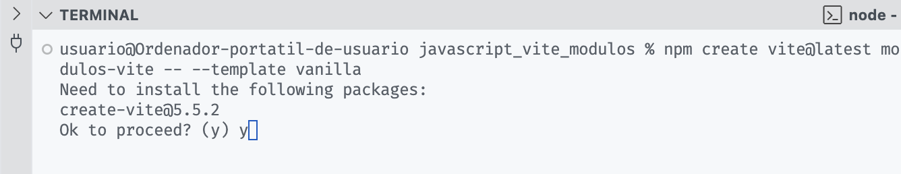
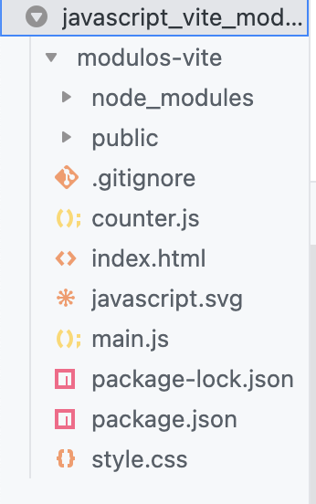
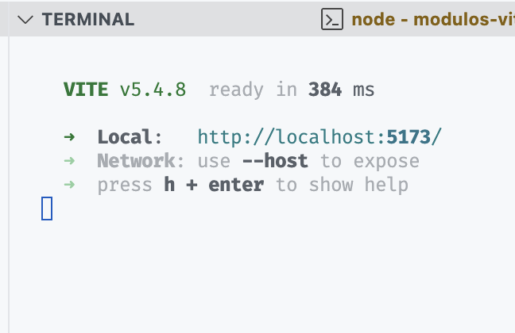
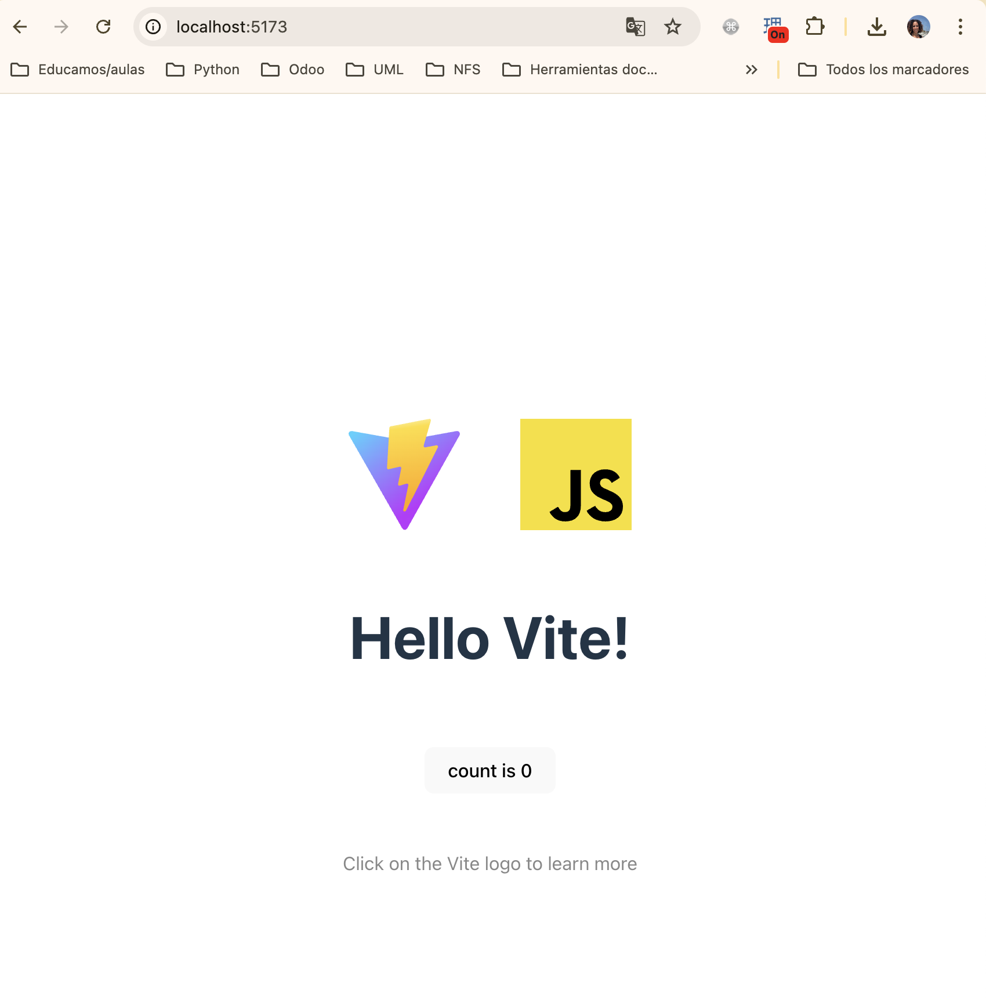

# Vite

## ¿Qué es y por qué lo usamos?
Los navegadores ejecutan JavaScript, por lo que no es necesario un paso de compilación en el desarrollo frontend. Entonces... ¿por qué utilizamos herramientas como Vite en el desarrollo frontend moderno?

**Vite** es una herramienta moderna de *build* y desarrollo web diseñada para mejorar el rendimiento en la creación de aplicaciones web, especialmente aquellas construidas con frameworks como **Vue.js**, **React**, **Svelte** o incluso proyectos vanilla. 
Fue creada por Evan You, el mismo creador de Vue.js, para resolver problemas de velocidad y complejidad que otras herramientas como Webpack enfrentaban en aplicaciones modernas.

Vite utiliza **ESModules nativos** en los navegadores durante el desarrollo, lo que permite tiempos de carga mucho más rápidos, ya que solo se cargan los módulos que son realmente necesarios. Además, Vite cuenta con un sistema de *build* altamente optimizado para la producción utilizando **Rollup** (herramienta de bundling de JavaScript, diseñada para empaquetar módulos (ESModules) en archivos más pequeños y optimizados que pueden ser utilizados en producción. A diferencia de otros bundlers como **Webpack**, Rollup se enfoca en aprovechar el sistema de módulos de ES6, lo que lo convierte en una opción más eficiente para empaquetar bibliotecas y aplicaciones modernas).

Los sistemas de construcción frontend como este, genrealmente incluyen tres pasos: *transpilación, empaquetado y minificación*.

## Transpilación
La transpilación convierte el JavaScript moderno a una versión más antigua para resolver problemas de compatibilidad con navegadores. Un objetivo común es ES6/ES2015.

Herramientas y frameworks pueden agregar pasos de transpilación. Por ejemplo, JSX (JavaScript XML) debe transpilarse a JavaScript.
Además, lenguajes como TypeScript, CoffeScript (lenguaje que se compila a JS que añade azúcar sintáctico basado en Ruby, Python...) y Elm (lenguaje para crear interfaces gráficas) deben transpilarse a JavaScript.

Se puede omitir la transpilación si el código es JavaScript puro y usa ES6 Modules.

Una alternativa para características no soportadas es el uso de polyfills, que se ejecutan en tiempo de ejecución para implementar características faltantes, aunque esto tiene un coste en rendimiento y no todas las características pueden ser polyfilled.

```{note}
Todos los empaquetadores también son transpiladores, ya que analizan múltiples archivos fuente JavaScript y emiten un nuevo archivo empaquetado.  Algunos pueden analizar TypeScript y JSX, eliminando la necesidad de un transpilador separado para necesidades de transpilación sencillas.
```

## Empaquetado (bundle)

El empaquetado resuelve la necesidad de múltiples solicitudes de red y el problema de cascada. Los empaquetadores combinan múltiples archivos fuente JavaScript en un único archivo, llamado bundle, que se carga eficientemente en una sola solicitud de red.

Los empaquetadores más usados hoy en día son **Webpack**, **Rollup**, **Parcel**, **esbuild**, **Turbopack**.

Se puede omitir el empaquetado si se tienen pócos módulos o baja latencia de red (e.g. localhost).

Un bundle, se compone de múltiples módulos, cada uno con una o más exportaciones. A menudo, un bundle solo utiliza un conjunto de estas exportaciones. El proceso de "tree shaking" elimina las exportaciones no tuilizadas, optimizando el tamaño del bundle y mejorando los tiempos de carga y análisis.

### Recursos estáticos
Los recursos estáticos como CSS, imágenes y fuentes se añaden al distribuidor durante la etapa de agrupamiento y pueden ser optimizados en la etapa de minificación.

Antes de Webpack, los recursos estáticos se construían por separado del código fuente como una tarea independiente. La aplicación tenía que referenciar estos recursos mediante su ruta final en el distribuidor, organizándolos cuidadosamente alrededor de una convención de URL (e.g `/assets/css/banner.jpg` y `/assets/fonts/Inter.woff2`).

Los "loaders" de Webpack permitieron importar recursos estáticos desde JavaScript, unificando código y recursos estáticos en un solo grafo de dependencias. Durante el agrupamiento, Webpack reemplaza la importación del recurso estático con su ruta final en el distribuidor, permitiendo que los recursos se organicen junto con sus componentes asociados en el código fuente y habilitando nuevos análisis estáticos, como la detección de recursos inexistentes.

Afortunadamente, los agrupadores posteriores a Webpack también adoptaron el patrón "loaders", haciendo común esta característica.

## Minificación
La minificación resuelve el problema de archivos innecesariamnte grandes. Los minificadores reducen el tamaño de los archivos sin afectar su funcionamiento. Para el código JavaScript y los recursos CSS, los minificadores pueden acortar variables, eliminar espacios en blanco, comentarios, eliminar código muerto y optimizar el uso de las características del lenguaje. Para otros recursos estáticos, los minificadores pueden realizar optimización del tamaño del archivo. Los minificadores generalmente se ejecutan en un paquete al final del proceso de construcción.

## Más herramientas
El pipeline básico de construcción de frontend descrito anteriormente es suficiente para crear una distribución de producción optimizada. Sin embargo, existen varias clases de herramientas que mejoran la experiencia del desarrollador:

- **Meta-frameworks**: 
El espacio de frontend es conocido por la dificultad de elegir los paquetes “correctos” para usar. Los meta-frameworks ofrecen conjuntos de paquetes ya seleccionados que se complementan y permiten paradigmas de aplicación especializados. En el caso de Vite, este proporciona sistemas de construcción tanto de desarrollo como para producción y no fuerza a un paradigma concreto, como en el caso de Angular.

- **Sourcemaps**:
Los sourcemaps resuelven el problema de depurar código ilegible en la distribución de producción, al mapear el código distribuido a su ubicación original en el código fuente.

- **Recarga en caliente**:
Los servidores de desarrollo a menudo ofrecen la función de recarga en caliente, que reconstruye automáticamente un nuevo paquete al cambiar el código fuente y recarga el navegador.

## ¿Por qué un Dev Server?
Un servidor de desarrollo (Dev Server) es fundamental para mejorar la experiencia de desarrollo. Algunas de las ventajas clave incluyen:

🚀 **Mejora en la Experiencia de Desarrollo:** Proporciona una experiencia de desarrollo fluida y rápida.

🔄 **Carga de Módulos en Tiempo Real:** Permite la recarga de módulos sin necesidad de recargar toda la página.

🌐 **Soporte ESM (ECMAScript Modules)**: Facilita el uso de módulos ECMAScript nativos.

🛠️ **Entorno de Desarrollo Rápido:** Acelera el ciclo de desarrollo con herramientas modernas y eficientes.

Los bundlers, como Vite, agrupan y gestionan múltiples archivos JavaScript, CSS y otros recursos, permitiendo una mejor organización y mantenimiento. Vite utiliza Rollup, en comparación con otra alternativa famosa como esbuild.

Vite reduce el tamaño total de los archivos mediante técnicas como la minificación y la compresión.

Ofrece soporte para funcionalidades modernas con compatibilidad en navegadores antiguos.

Automatiza tareas como la transpilación de TypeScript a JavaScript, la transpilación de SCSS o SASS a CSS, minificación, ofuscación y la generación de rutas de archivos.

## Configuración

- **Crear un nuevo proyecto**
  ```bash
  $ npm create vite@latest my-app -- --template vanilla
  ```

- **Instalar dependencias**
```bash
$ cd my-app
$ npm install
```


- **Ejecutamos el servidor de desarrollo**
```bash
$ npm run dev
```

```{warning}
En equipos con **MacOS** puede que nos de un error porque necesita un paquete adicional, sobre todo en aquellos con arquitectura ARM, si es así, leer el paquete necesario e instalarlo con **npm**.
```

Una vez instalado y ejecutado debe aparecer esto:




## Importación de bibliotecas

Para importar bibliotecas en Vite, se usa `npm install`:
```bash
npm install lodash
```

Luego, en su archivo JavaScript:

```js
import _ from "lodash";
_.join([1,2]);
```

La instalación de la librería se produce en el directorio `node_modules`

```{note}
**Lodash** es una librería de referencia en JavaScript. Además, es el sucesor más famoso de otra muy conocida que es **underscore.js**.
Se usa para simplificar el manejo y edición de objetos, arrays, etc ya que proporciona muchos métodos de utilidad para hacerlo.
```

```{warning}
Vite utiliza una técnica llamada **bare module imports**, que funciona también en TypeScript y Angular, lo cual elimina la necesidad de importar desde `../node_modules` y de añadir `.js`al final del archivo.
```

## Importar CSS e imágenes
Para importar CSS y trabajar con imágenes en Vite:

```js
import './style.css';
import javascriptLogo from './javascript.svg';
import viteLogo from '/vite.svg';

const logoHtml = ``;
document.body.innerHTML += logoHtml;
```
El CSS se incluye directamente en el bundle, mientras que las imágenes no se importan directamente, pero sus nombres son modificados en el build. Trabajar con variables, permite modificar dinámicamente el nombre de las imágenes.

Vite también permite importar JSON y otros tipos de archivos.

## Vite + Bootstrap

```{warning}
Para usar **Bootstrap** con Vite, seguiremos los pasos de:

https://getbootstrap.com/docs/5.2/getting-started/vite/

```
## Build for Production
Para crear una versión de producción del proyecto:

```bash
npm run build
```

```{warning}
Si queremos modificar las opciones de ejecución o de generación de la build, todo está configurado en el archivo `package.json`
```

## Ejemplo primeros pasos con Vite

```{note}
Aquí https://github.com/igijon/javascript_vite_modulos tenéis un repositorio para analizar los primeros pasos de Vite.
```

## Referencias

Apuntes personales, experiencia en el sector y referencias del siguiente material:

{cite}`mdn`
{cite}`jcastillo`