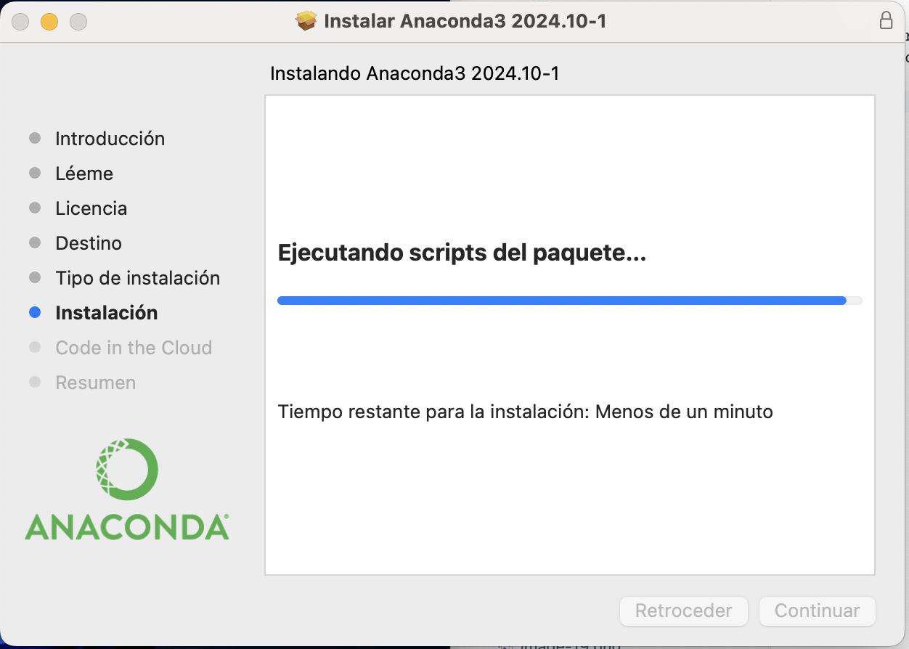
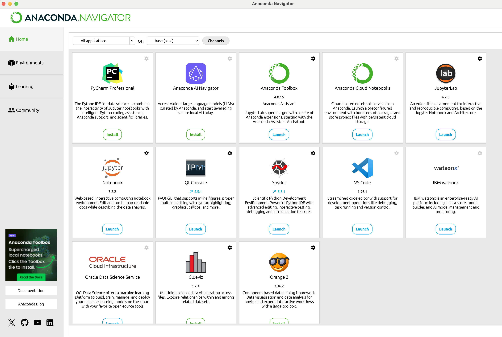
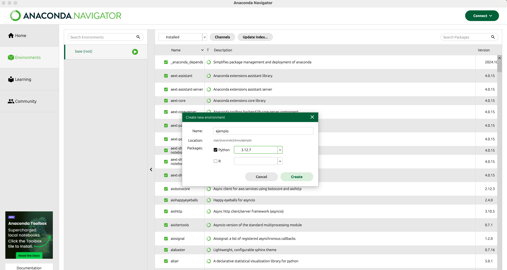
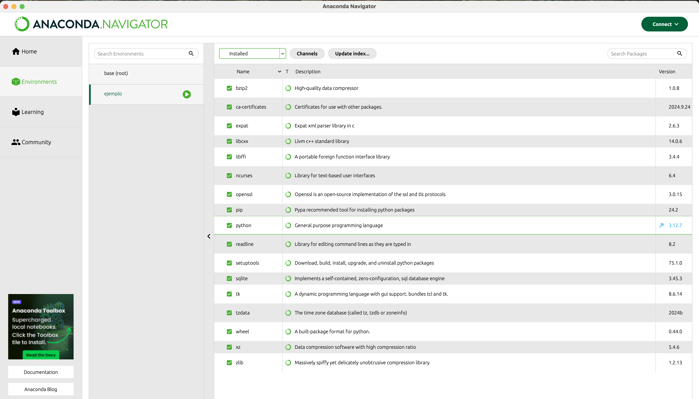
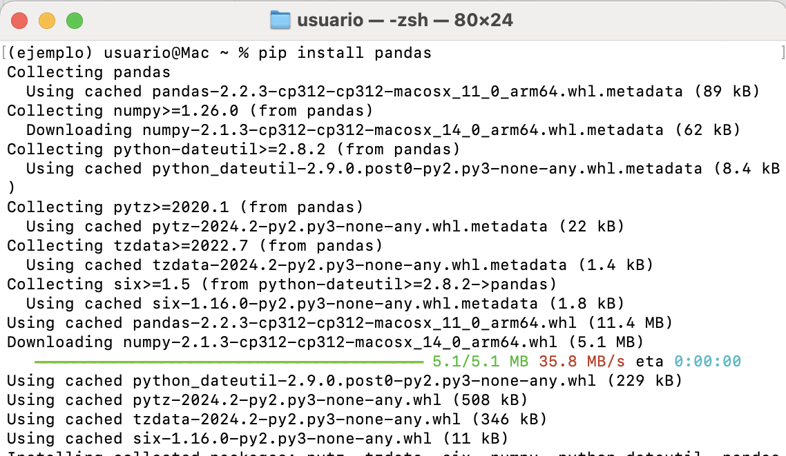
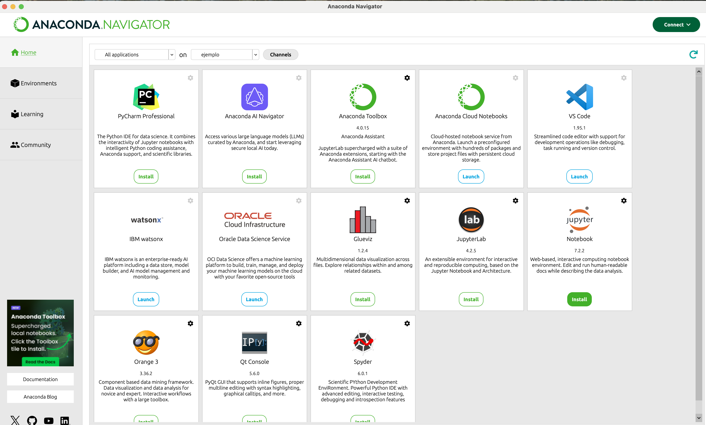
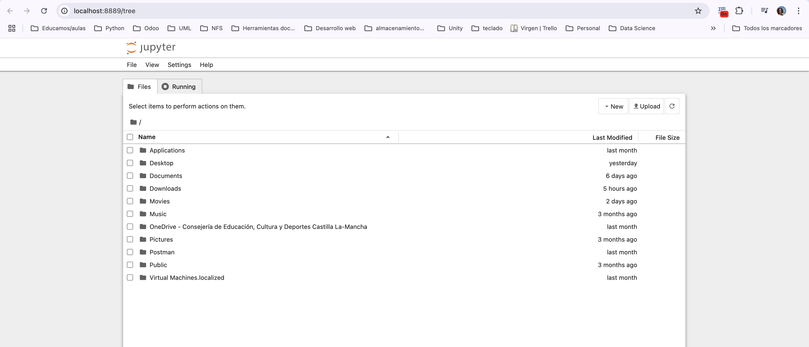

# Preparación entorno offline
Vamos a utilizar una distribución de Python y R para ciencia de datos que se llama **Anaconda**.

https://www.anaconda.com/download


**Anaconda** tiene las siguientes características:
- Incorpora varios paquetes relacionados con algoritmos de ML y preparación de datos.
- Incorpora herramientas para implementación en Python, como **Jupyter Notebook**.
- Creación y gestión de entornos virtuales.





## Home
Veremos distintas aplicaciones que podemos instalar o lanzar desde el entorno de **Anaconda**

## Environments
Gestión de entornos virtuales.

```{note}
Un **entorno virtual**, como ya vimos en su momento, permite tener distintos paquetes con versiones concretas instaladas, sin interferir en la instalación general o en otros entornos virtuales
```
Lo mejor es que cada proyecto tenga su entorno virtual.





Si pulsamos, podemos abrir un terminal e instalar librerías para ese entorno únicamente.



```{note}
**Pandas** es una librería de manipulación y análisis de datos de código abierto, flexible y fácil de usar, escrita para Python. La veremos más adelante.
```
## Jupyter Notebook

Es una aplicación web de código abierto que se ha convertido en un estándar entre los científicos de datos debido a su capacidad para combinar código, texto y visualizaciones en un solo documento interactivo.

Su popularidad ha crecido exponencialmente gracias a su flexibilidad y a la facilidad con la que puede integrarse con diversas tecnologías y lenguajes de programación incluyendo Python, R y Julia.



Si lo instalamos y ejecutamos desde **Anaconda**:


```{note}
Todo lo que estamos instalando, incluído Jupyter Notebook, se está instalando en el entorno virtual que tenemos activo.
```

