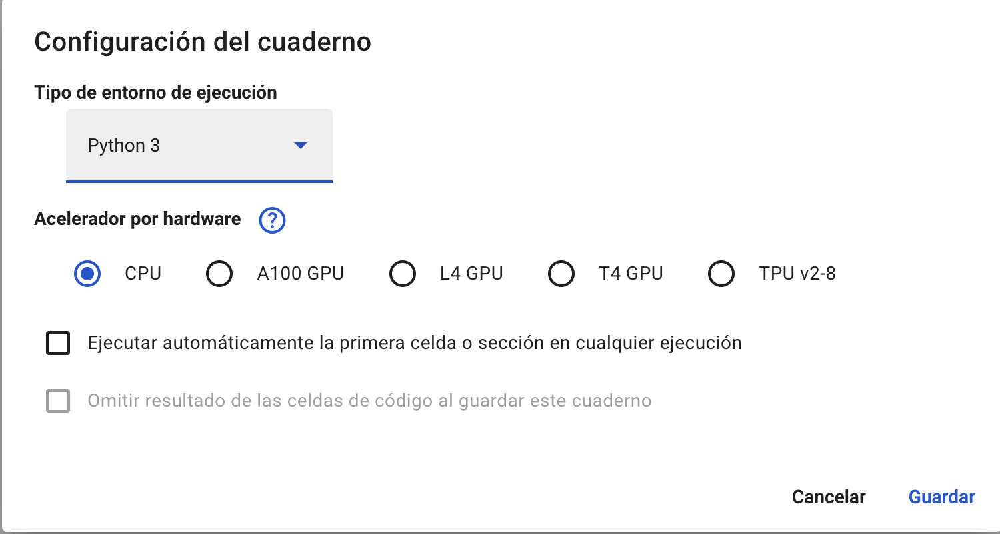

# Google Colab

```{note}
https://colab.research.google.com/
```

Tiene una interfaz similar a **Jupyter Notebook** y nos evita tener que instalar un entorno en local.

## Recorrido básico

No vamos a necesitar descargar los ejercicios para probarlos en **Google Colab**, podemos abrirlos directamente desde:
- Repositorio **Github**
- **Google Drive**
- De nuestro directorio **local**

```{note}
Para la mayor parte de las funcionalidades, necesitamos iniciar sesión dentro de Google.
```

En el menú, tenemos **Entorno de ejecución** que es similiar a **Kernel** en **Jupyter Notebook**.

En `Editar -> Configuración del cuaderno` accedemos a:


En esta parte podemos configurar el hardware con el que queremos ejecutar y el tipo de entorno de ejecución. Esta configuración la veremos en detalle cuando tratemos la parte de **deep learning**.

```{note}
**Shift+Enter** permite ejecutar celdas.
```

### Datasets

A la izquierda podemos ver entre otras cosas el **índice** de nuestro cuaderno y también tenemos una **carpeta** dónde podemos cargar nuestros **datasets** de distintos modos, por ejemplo arrastrando a dicha carpeta.

```{note}
También se puede asociar la cuenta de **Google Drive** con la cuenta de **Google Colab** y sería mucho más sencillo.
```


