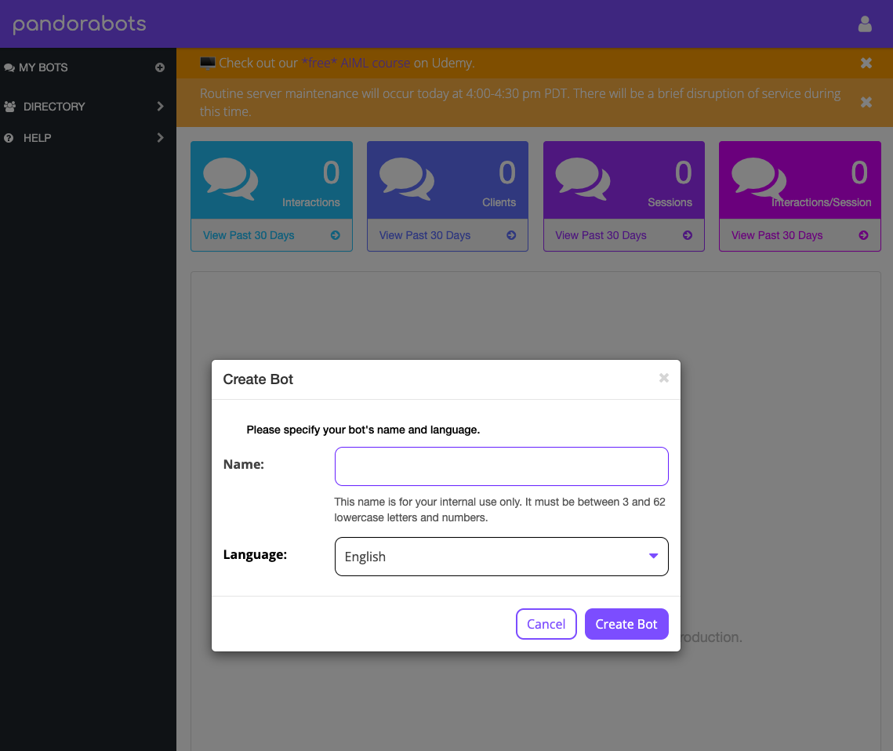
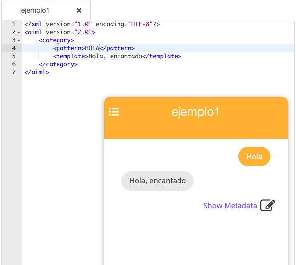
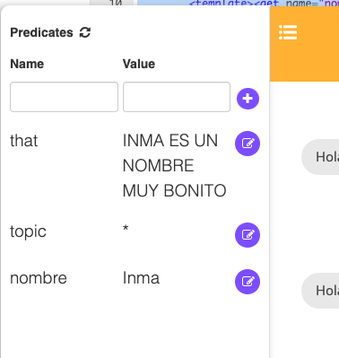
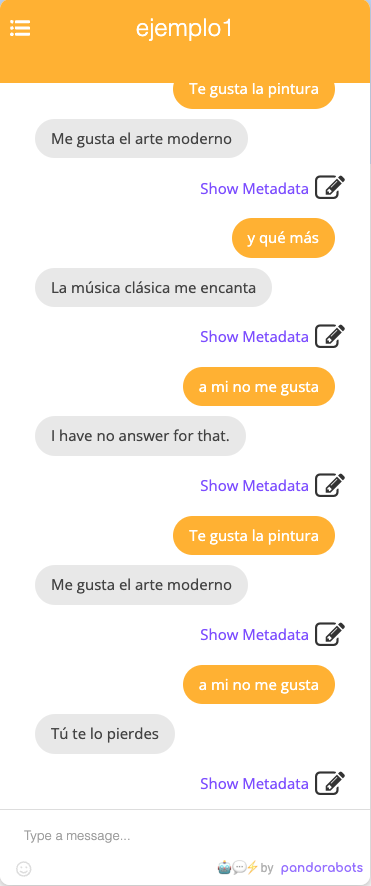

# Agentes conversacionales con AIML

Permiten crear chatbots, es decir, sistemas software con los que podemos interactuar en lenguaje natural.

AIML es un lenguaje de marcas basado en XML.

```{note}
http://www.aiml.foundation/
```
```{note}
https://www.pandorabots.com/docs/aiml-reference/
```
Para crear este software existen distintos entornos, como el de **pandorabots**, el cual es muy útil para prototipado rápido: 
https://home.pandorabots.com/home.html

Nos tenemos que registrar y seleccionar la opción gratuita.


Ofrece capas de pago para integrar estos chatbots en páginas web como si fuesen chats de soporte técnico...

Indicamos el nombre y el lenguaje del chatbot.
Si entramos en el **editor->AIML->udc**, este es un fichero AIML donde podemos poner nuestro ejemplo de chatbot... también podemos crear tantos ficheros AIML que se utilizarán como base de conocimiento para el chatbot.

## Ejemplo 1

Tenemos que añadir distintas categorías que corresponderán a los distintos patrones a los que responderá nuestro bot.



```{warning}
Para diferenciar, a nivel estructural, los patrones que introducimos de los mensajes que él saca, los patrones los añadimos en mayúsculas.
```
```xml
<?xml version="1.0" encoding="UTF-8"?>
<aiml version="2.0">
    <category>
        <pattern>HOLA</pattern>
        <template>Hola, encantado</template>
    </category>
    <category>
        <pattern>ADIOS</pattern>
        <template>Adios 😞</template>
    </category>
    <category>
        <pattern>HOLA, ME LLAMO *</pattern>
        <template>Hola <star/>, encantado </template>
    </category>
</aiml>
```

Todas las categorías de los distintos ficheros se cargan para entrenar el comportamiento.

## Ejemplo 2

```xml
<?xml version="1.0" encoding="UTF-8"?>
<aiml version="2.0">
	<category>
	    <pattern>HOLA, ME LLAMO *</pattern>
	    <template>Hola <set name="nombre"><star/></set>, encantado de conocerte</template>
    </category>
    
    <category>
	    <pattern>TE GUSTA MI NOMBRE</pattern>
	    <template><get name="nombre"></get> es un nombre muy bonito</template>
    </category>
    
    <category>
	    <pattern>EN SERIO</pattern>
	    <that>* ES UN NOMBRE MUY BONITO</that>
	    <template>Por supuesto</template>
    </category>
</aiml>
```

```{note}
Con `that` él mantiene el contexto, en base de lo último que ha dicho el bot para que mantenga el contexto
```

Puedo acceder a las variables que va tomando el chatbot pulsando el menú de la izquierda del chatbot:


## Ejemplo 3

```xml
<?xml version="1.0" encoding="UTF-8"?>
<aiml version="2.0">
	<category>
	    <pattern>TE GUSTA LA PINTURA</pattern>
	    <template>Me gusta el arte moderno</template>
    </category>
    <category>
        <pattern>Y QUE MAS</pattern>
        <template><srai>Y QUÉ MÁS</srai></template>
    </category>
    <category>
        <pattern>Y QUÉ MÁS</pattern>
        <that>ME GUSTA EL ARTE MODERNO</that>
        <template>La música clásica me encanta</template>
    </category>
    <category>
        <pattern>A MI NO ME GUSTA</pattern>
        <that>ME GUSTA EL ARTE MODERNO</that>
        <template>Tú te lo pierdes</template>
    </category>
</aiml>
```



```{warning}
En AIML no distingue entre mayúsculas y minúsculas pero sí entre caracteres acentuados o no... para ello, podemos crear redirecciones con `<srai>`
```
