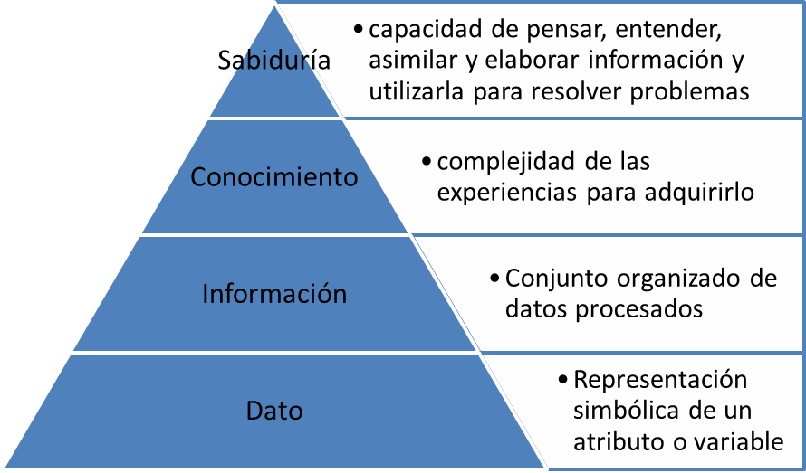

# Conceptos básicos de IA
## Qué es la inteligencia

```{note}
Podríamos definir la inteligencia humana como una combinación de habilidades cognitivas que nos permiten comprender, aprender y adaptarnos al mundo que nos rodea.
```
## Qué es la inteligencia artificial

```{note}
Podríamos definir la inteligencia artificial como la tecnología que amplía las capacidades de las máquinas, permitiéndoles **aprender** y tomar decisiones autónomas.
```

Algunas claves sobre la IA:
- **Simulación de la inteligencia humana**: puede realizar tareas que requieren normalmente intervención humana, como asistentes digitales, GPS, vehículos autónomos y herramientas de **inteligencia artificial generativa** (como ChatGPT de OpenAI).
- **Aprendizaje y predicción**: la IA puede sintetizar y automatizar tareas intelectuales, como el procesamiento del lenguaje natural, la visión por computador...Para ello se basa en disciplinas como el **aprendizaje automático** y **aprendizaje profundo**.
- **Ética y responsabilidad**: esto implica considerar el impacto social, la equidad, la privacidad y la responsabilidad en el desarrollo y uso de sistemas inteligentes. Es un campo en constante evolución y por tanto requiere colaboración de científicos, legisladores y sociedad en general.

## Pirámide DIKW (Data, Information, Knowledge, Wisdom)

Los conceptos de **datos, información, conocimiento y sabiduría** forman una jerarquía conocida como la **Pirámide DIKW**, la cual describe cómo los datos se transforman en sabiduría a medida que son procesados y comprendidos.
- **Datos**: Hechos y observaciones crudas, sin procesar. Por sí solos no tienen un significado directo o contexto.
- **Información**: Resultado de procesar, organizar y estructurar los datos para darles un significado. La información surge cuando los datos están contextualizados o presentados de una manera que hace que sean comprensibles o útiles.
- **Conocimiento**: Capacidad de interpretar información y aplicarla. Se adquiere cuando la información se comprende y se combina con la experiencia, habilidades o criterios para poder tomar decisiones.
- **Sabiduría**: Capacidad de tomar decisiones acertadas basadas en el conocimiento profundo y la experiencia. Implica no solo tener conocimiento, sino también cómo y cuándo aplicarlo de manera efectiva para lograr los resultados deseados.



```{note}
La sociedad, desde el siglo XIX, ha navegado a lo largo del tiempo por fases que pueden correlacionarse con los conceptos de datos, información y conocimiento.
```
## Tipos de IA

Existen varios tipos de inteligencia artificial, clasificados según su capacidad, funcionalidad y aplicaciones.

**1. Clasificación según la funcionalidad**

- **IA Débil o Estrecha (Narrow AI)**
Diseñada para realizar tareas específicas. No tiene conciencia ni razonamiento general como los humanos, sino que se enfoca en resolver problemas concretos. 
Dentro de este tipo, podemos encontrar: asistentes virtuales como *Siri*, *Alexa* y *Google Assistant*. Algoritmos de recomendación en plataformas como *Netflix* o *Amazon*. Sistemas de *reconocimiento de imágenes o voz*.

- **IA Fuerte o General (Artificial General Intelligence, AGI)**
Este tipo está aún en desarrollo. Se pretende que tenga la capacidad de entender, aprender y realizar tareas de manera similar a la inteligencia humana en cualquier campo, no solo en tareas específicas. Una AGI sería capaz de razonar, tomar decisiones complejas aprendiendo por sí mismo.

- **Superinteligencia Artificial (Artificial Superintelligence, ASI)**
Este es un concepto teórico aún. Es el concepto que imagina una IA que supera la inteligencia humana en todos los aspectos: creatividad, toma de decisiones, razonamiento, entre otros. Este nivel de IA podría transformar radicalmente la civilización, pero también plantea riesgos y dilemas éticos significativos.

**2.  Clasificación según su capacidad de aprendizaje**
- **IA Reactiva**
  Este tipo de IA es la más básica. Solo reacciona a estímulos específicos y no tiene la capacidad de aprender de experiencias pasadas. Un ejemplo clásico es *Deep Blue*, la computadora de ajedrez de IBM que venció a Garry Kasparov.

- **IA con Memoria Limitada**
  Puede aprender de datos pasados para tomar decisiones futuras. Un ejemplo son los autos autónomos, que utilizan información previa para detectar obstáculos o seguir rutas.

- **Teoría de la Mente**
  Este tipo de IA, aún en desarrollo, sería capaz de entender pensamientos y emociones humanas, es decir, tendría la capacidad de interactuar y empatizar con humanos.

- **Autoconciencia**
  Este es el tipo de IA más avanzado y teórico, que tendría conciencia de sí misma y de sus emociones. Sería capaz de tener una comprensión profunda de su existencia, similar a los humanos.

**3. Clasificación según la técnica de desarrollo**
- **IA Basada en Reglas (Sistemas Expertos)**
  Se basa en conjuntos de reglas y lógica predefinidas. Los sistemas expertos son un ejemplo, donde se simula la toma de decisiones humanas mediante reglas estructuradas.

- **IA Basada en Aprendizaje Automático (Machine Learning, ML)**
  Aquí, la IA no está limitada a reglas, sino que aprende a través de patrones y datos. 
  El aprendizaje automático puede subdividirse en:

    - **Aprendizaje Supervisado**: La IA aprende a partir de ejemplos etiquetados.
    - **Aprendizaje No Supervisado**: La IA busca patrones en datos no etiquetados.
    - **Aprendizaje por Refuerzo**: La IA aprende mediante prueba y error, como en el caso de los robots autónomos o los algoritmos de desarrollo de videojuegos.
  
- **Redes Neuronales y Deep Learning**
  Estas técnicas simulan la estructura del cerebro humano a través de redes neuronales artificiales. Deep Learning es una subárea del aprendizaje automático que utiliza grandes redes neuronales para tareas como el reconocimiento de imágenes o el procesamiento de lenguaje natural.

**4. Clasificación según su aplicación**
- **IA Conversacional**
Utilizada en chatbots, asistentes virtuales o agentes de servicio al cliente, capaz de mantener conversaciones con humanos. Ejemplos son *GPT-4*, *Google Assistant* o *Cortana*.

- **IA en Robótica**
  Se aplica en robots industriales, drones o robots autónomos, capaces de interactuar con el entorno físico. Los robots quirúrgicos y los vehículos autónomos son ejemplos clave.

- **IA en Visión por Computador**
  Esta IA es capaz de interpretar imágenes o videos. Se usa en sistemas de reconocimiento facial, diagnóstico médico por imágenes o en la conducción autónoma.

- **IA en Procesamiento de Lenguaje Natural (NLP)**
  Se enfoca en la interpretación y generación de lenguaje humano, siendo utilizada en traductores automáticos, asistentes virtuales, chatbots y sistemas de análisis de texto.


```{nota}
Las **IAs generativas** se enmarcan principalmente dentro de la categoría de aprendizaje automático (Machine Learning), específicamente en el ámbito del Deep Learning y el procesamiento de lenguaje natural (NLP). Además, podrían estar vinculadas a las subcategorías de IA débil o estrecha (Narrow AI), ya que están diseñadas para tareas específicas de generación de contenido, aunque de manera flexible y creativa.
```

Cada tipo de IA tiene diferentes aplicaciones y desafíos, lo que impulsa su desarrollo continuo en diversas áreas como la salud, la industria, la educación y los servicios públicos.

## Trabajar en IA

Los perfiles más relacionados con la Inteligencia Artificial se centran en el desarrollo, aplicación y optimización de modelos y algoritmos de este campo y podríamos destacar los siguientes.

- **Ingeniero de Aprendizaje Automático (Machine Learning Engineer)**
Se encarga de diseñar y desarrollar modelos de aprendizaje automático (machine learning). Implementa algoritmos de IA que permiten que los sistemas aprendan de los datos y mejoren con el tiempo.
Tecnologías clave: *TensorFlow, PyTorch, Scikit-learn, Keras*.

- **Científico de Datos (Data Scientist)**
Especialista en analizar grandes volúmenes de datos, encontrar patrones y extraer insights valiosos para ayudar a la toma de decisiones. También implementa algoritmos de aprendizaje automático para predecir resultados futuros.
Tecnologías clave: *Python, R, SQL, Hadoop, Spark.*

- **Ingeniero de IA (AI Engineer)**
Desarrolla aplicaciones y soluciones que utilizan inteligencia artificial. Puede trabajar con aprendizaje profundo (deep learning), procesamiento de lenguaje natural (NLP) o visión por computador.
Tecnologías clave: *TensorFlow, PyTorch, Keras, OpenCV, Natural Language Toolkit (NLTK)*.

- **Investigador en IA (AI Researcher)**
Se dedica a la investigación y desarrollo de nuevos algoritmos y modelos de IA. Busca avances teóricos y prácticos en el campo de la inteligencia artificial.
Tecnologías clave: Algoritmos avanzados, teoría matemática, frameworks de IA.
   
- **Ingeniero de Procesamiento de Lenguaje Natural (NLP Engineer)**
Especialista en desarrollar aplicaciones que permiten a las máquinas procesar y entender el lenguaje humano. Trabajan en asistentes virtuales, chatbots, traducción automática y análisis de texto.
Tecnologías clave: *NLTK, SpaCy, GPT, BERT, Transformers*.

- **Ingeniero de Visión por Computador (Computer Vision Engineer)**
Desarrolla aplicaciones que permiten a las máquinas interpretar y comprender imágenes y videos. Trabajan en reconocimiento facial, sistemas de conducción autónoma y análisis de imágenes médicas.
Tecnologías clave: *OpenCV, TensorFlow, PyTorch, CNNs (redes neuronales convolucionales)*.

- **Ingeniero de Robótica e IA (Robotics Engineer with AI focus)**
Desarrolla robots que utilizan algoritmos de inteligencia artificial para realizar tareas de manera autónoma. Utiliza IA para mejorar la toma de decisiones y la interacción con el entorno.
Tecnologías clave: *ROS (Robot Operating System), LIDAR, redes neuronales, algoritmos de control*.
- **Ingeniero de Datos (Data Engineer)**
Aunque este perfil está más vinculado a la parte de Big Data, es esencial para la IA. Se encarga de preparar y gestionar las infraestructuras y los datos que utilizan los algoritmos de inteligencia artificial.
Tecnologías clave: *SQL, NoSQL, Hadoop, Apache Kafka.*