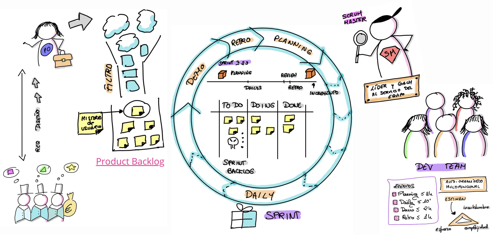
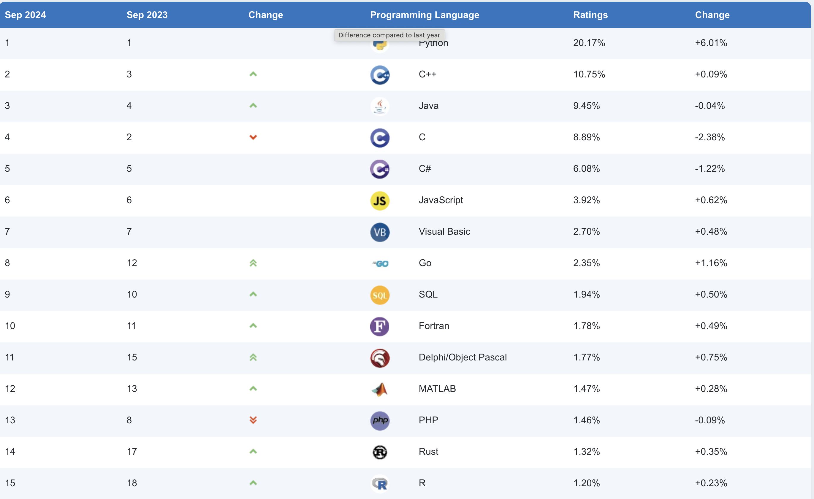
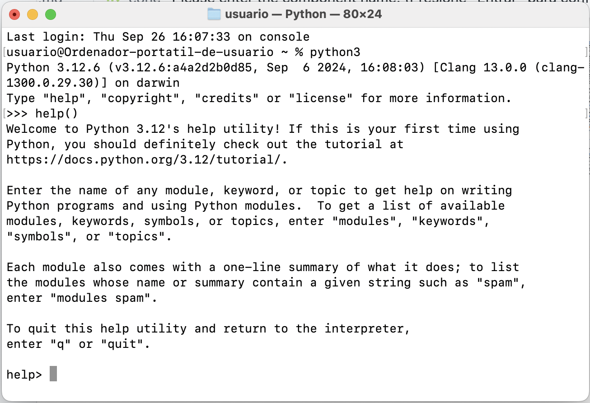
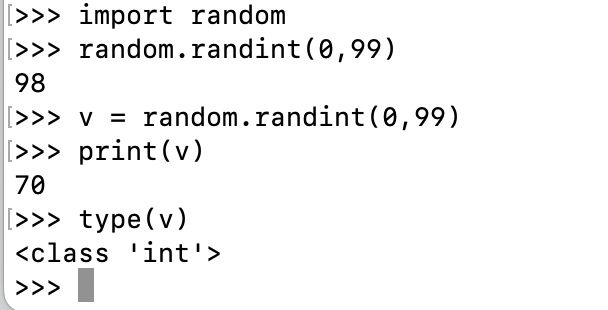

# Lenguajes de programación en el contexto de la IA
## Fases de construcción del software
- **Definición del problema**
- **Especificación de requisitos**: aquí englobaríamos los funcionales (ejm: registro de un usuario) y los no funcionales (ejm: sea accesible desde dispositivos móviles).
  Esta fase está guiada por el usuario final.
- **Planificación de desarrollo**
- **Diseño de alto nivel (arquitectura)**: esto sería un mapa global de la arquitectura sofware del proyecto.
- **Diseño detallado**: por ejemplo, si utilizamos programación orientada a objetos, entrarían dentro de este tipo de diseño los diagramas de clases.
- **Codificación**: aquí entraría en juego la elección del paradigma de programación (estructurada, programación orientada a objetos, programación funcional) y el lenguaje de programación elegido.
- **Pruebas**: aquí entrarían en juego las pruebas unitarias, de integración y de sistema.
- **Mantenimiento**: dependiendo de la forma en la que se desarrolla un producto software se generará más o menos *deuda técnica*, es recomendable reducirla para que no se desborden los costes.

```{warning}
Estas fases de desarrollo no se realizan secuencialmente. Dependerá de la metodología de desarrollo a utilizar, la forma en la que se organicen en el tiempo. 
Por ejemplo, en metodologías ágiles como SCRUM, las fases se organizan como puedes ver en la imagen.
```


## Lenguajes de programación más populares

Según el índice TIOBE: https://www.tiobe.com/tiobe-index/



## Tipos de lenguajes de programación
### Compilados
El compilador genera código máquina para una máquina concreta y nos permite utilizar sentencias de alto nivel.
```c
#include <stdio.h>
int main(int argc, char *argv[])
{
    printf("Hola mundo\n");
    return 0;
}
```
```bash
gcc -Wall -ansi -o test test.c
./test
```

```{note}
Si hacemos cambios luego habría que volver a compilar.
```

### Interpretados
La sentencia se lee y se ejecuta por el intérprete, escrito en el lenguaje de la máquina destino. 

Todo se resuelve en tiempo de ejecución.

Más orientados a la IA.

Si abrimos el intérprete de python, para lo cual debemos tener instalado Python:

https://www.python.org/downloads/



```{note}
Para salir del modo help pulsar `q`
```


```{note}
Podemos implementar cualquier funcionalidad realmente en cualquier lenguaje. Elegiremos un lenguaje interpretado como primera opción pero si el rendimiento es un problema se podrían sustituir parcialmente por código compilado por ejemplo en C++.
```
## Entornos de desarrollo

Yo suelo utilizar **VSCode**: https://code.visualstudio.com/
Es bastante ligero. 

Otro bastante utilizado es **PyCharm** de JetBrains: https://www.jetbrains.com/es-es/pycharm/
Este tiene una versión Comunity que se puede utilizar y también tiene una versión Professional.

## Elección del lenguaje de programación
Elegiremos el lenguaje de programación en base a:
- Simplicidad en el lenguaje
- Capacidad de prototipado rápido
- Legibilidad
- Existencia de bibliotecas para IA: en Python por ejemplo tenemos múltiples librerías para redes neuronales, aprendizaje supervisado y no supervisado, procesamiento del lenguaje natural, procesamiento de textos, modelado y caracterización de sistemas expertos, procesamiento matemático, visión por computador, simulación física...
- Comunidad de desarrollo: Stackoverflow, Reddit, X...

## Otros lenguajes de programación en IA

- **LISP**: utilizado para programación declarativa, lógica...
- **PROLOG**: utilizado para programación declarativa y NLP (procesamiento del lenguaje natural) 
- **R**: tiene facilidad para tratar y visualizar datos. Utilizado por data scientist.
- **Haskell**: utilizado en aplicaciones militares o aeroespaciales.
- **Java, C++**: por tradición histórica :blush:

## Python como lenguaje de referencia en IA
- Simple y accesible
- Intérprete interactivo
- Gestor de paquetes de terceros: **pip/pip3**
- Multiplataforma: soporte para POO y estructurado principalmente.
- Tipado fuerte y dinámico que se resuelve en tiempo de ejecución.
- Sintaxis sencilla y elegante
- Facilidad de uso (ideal para prototipado rápido)
- Versatilidad ya que tiene mucha funcionalidad estándar y librerías de terceros.
- Lenguaje "pegamento" ya que permite integrar servicios no necesariamente implementados en Python.
- Portable y Open Source
- Curva de aprendizaje poco pronunciada comparada con otros lenguajes de programación
- Página oficial con guía para principiantes y distintos niveles (también moderado y avanzado)
  
  https://wiki.python.org/moin/BeginnersGuide

- También adjunto la guía de desarrollo:

    https://devguide.python.org/

