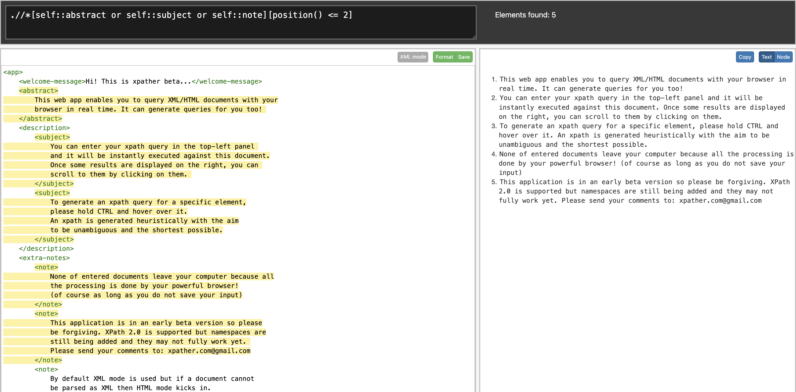
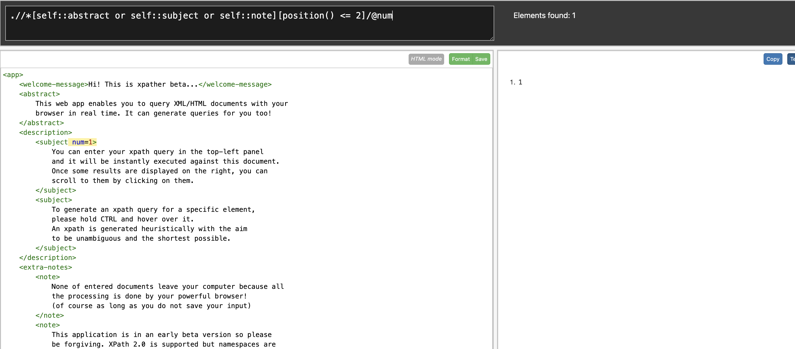
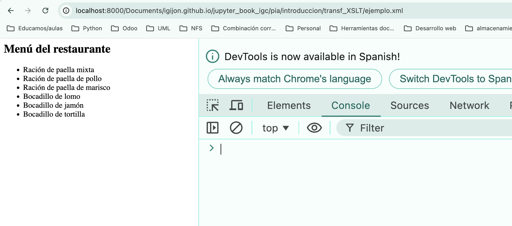
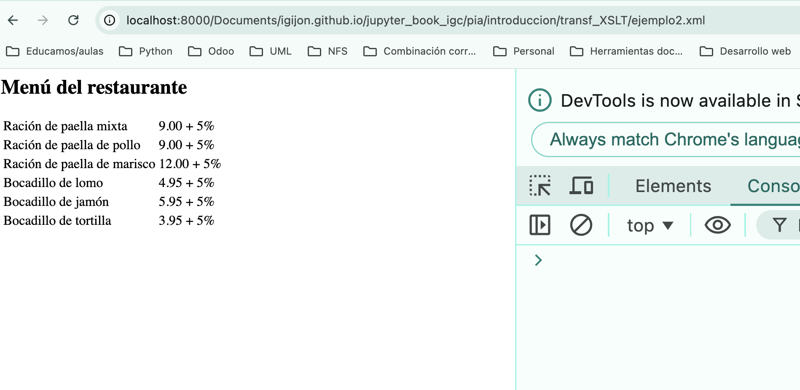
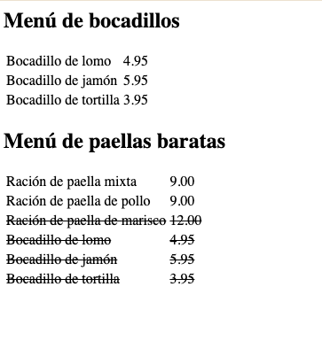

# Transformaciones XML con XSLT

## Introducción a XSLT

**XSLT** es un transformador de documentos XML.
- Está incorporado en navegadores web.

```xml
<xsl:stylesheet
    version="1.0"
    xmlns:xsl="http://www.w3.org/1999/XSL/Transform"/>
```

- Se puede lanzar sobre un proceso externo, sobre un servidor web o directamente sobre un navegador web.

- Las transformaciones se incorporan en un documento `xsl`, el cual no deja de ser un documento xml pero con una cabecera específica enlazando con el documento xsl.

```xml
<?xml-stylesheet
    type="text/xsl"
    href="documento.xsl"?>
```
- Por políticas de seguridad no se puede ejecutar desde el fichero local, por lo que podemos hacer:

```bash
python -m http.server
```
Y ya en el navegador web:

http://localhost:8000/mi_doc.xml

Para explorar el árbol de documentos de un XML podemos utilizar la extensión XPATH de XSLT y nos permitirá explorar el documento como si estuviésemos navegando por un árbol de archivos. Con la `/` navegamos por los elementos y con `@` por sus atributos.

http://xpather.com/





## Instrucciones de XSLT

- Realizar transformaciones a los nodos coincidentes por XPath.
  - Definir plantillas: aplica transformaciones cuando coincidan con el XPath que se introduce.
  ```xml
  <xsl:template match="">
  ```
  - Insertar plantillas: inserta las plantillas en el punto donde se encuentra la instrucción y con select podemos indicar qué plantillas se insertan.
  ```xml
  <xsl:apply-templates select="">
  ```

```{note}
Ejemplo
```

  ```xml
<?xml version="1.0" encoding="UTF-8"?>
<?xml-stylesheet type="text/xsl" href="ejemplo.xsl"?>
<!DOCTYPE menu [
<!ENTITY fechaActual "2021">
<!ENTITY cargo "5">
]>
<menu fecha="&fechaActual;">
    <comida>
        <nombre>Ración de paella mixta</nombre>
        <precio>9.00 + &cargo;%</precio>
    </comida>
    <comida>
        <nombre>Ración de paella de pollo</nombre>
        <precio>9.00 + &cargo;%</precio>
    </comida>
    <comida>
        <nombre>Ración de paella de marisco</nombre>
        <precio>12.00 + &cargo;%</precio>
    </comida>
    <comida>
        <nombre>Bocadillo de lomo</nombre>
        <precio>4.95 + &cargo;%</precio>
    </comida>
    <comida>
        <nombre>Bocadillo de jamón</nombre>
        <precio>5.95 + &cargo;%</precio>
    </comida>
    <comida>
        <nombre>Bocadillo de tortilla</nombre>
        <precio>3.95 + &cargo;%</precio>
    </comida>
</menu>
  ```
  ```xml
<?xml version ="1.0" encoding="UTF-8"?>
<xsl:stylesheet version="1.0"
    xmlns:xsl="http://www.w3.org/1999/XSL/Transform">

<xsl:template match="/">
    <html lang="es">
        <head>
            <meta charset="UTF-8"/>
            <meta name="viewport" content="width=device-width, initial-scale=1.0"/>
            <title>Ejemplo</title>
        </head>
        <body>
            <h2>Menú del restaurante</h2>
            <ul>
                <xsl:apply-templates />
            </ul>
        </body>
    </html>
</xsl:template>

<xsl:template match="/menu/comida">
    <li><xsl:value-of select="nombre"/></li>
</xsl:template>

</xsl:stylesheet>
  ```



- Transformaciones iterativas sobre nodos
```xml
  <xsl:for-each select="">
  ```
  - Ordenar elementos 
```xml
  <xsl:sort select="">
  ```

```{note}
Ejemplo
```
```xml
<?xml version ="1.0" encoding="UTF-8"?>
<xsl:stylesheet version="1.0"
    xmlns:xsl="http://www.w3.org/1999/XSL/Transform">

<xsl:template match="/">
    <html lang="es">
    <head>
        <meta charset="UTF-8"/>
        <meta name="viewport" content="width=device-width, initial-scale=1.0"/>
        <title>Ejemplo</title>
    </head>
    <body>
        <h2>Menú del restaurante</h2>
        <table>
            <xsl:for-each select="/menu/comida">
                <xsl:sort select="precio"
                          order = "descending"
                          data-type="number" />
                <tr>
                    <td><xsl:value-of select="nombre" /></td>
                    <td><xsl:value-of select="precio" /></td>
                </tr>
            </xsl:for-each>
        </table>
    </body>
    </html>
</xsl:template>

</xsl:stylesheet>
  ```


- Instrucciones condicionales
  - Condicional único
```xml
  <xsl:if test="">
  ```
  - Condicional múltiple
```xml
  <xsl:choose>
    <xsl:when test="">
    <xsl:otherwise>
  ```

```{note}
Ejemplo
```
```xml
<?xml version="1.0" encoding="UTF-8"?>
<?xml-stylesheet type="text/xsl" href="ejemplo3.xsl"?>
  <!DOCTYPE menu [
    <!ENTITY fechaActual "2021">
    <!ENTITY cargo "5">
  ]>
  <menu fecha="&fechaActual;">
    <comida>
        <nombre>Ración de paella mixta</nombre>
        <precio>9.00</precio>
    </comida>
    <comida>
        <nombre>Ración de paella de pollo</nombre>
        <precio>9.00</precio>
    </comida>
    <comida>
        <nombre>Ración de paella de marisco</nombre>
        <precio>12.00</precio>
    </comida>
    <comida>
        <nombre>Bocadillo de lomo</nombre>
        <precio>4.95</precio>
    </comida>
    <comida>
        <nombre>Bocadillo de jamón</nombre>
        <precio>5.95</precio>
    </comida>
    <comida>
        <nombre>Bocadillo de tortilla</nombre>
        <precio>3.95</precio>
    </comida>
  </menu>
```
```xml
<?xml version ="1.0" encoding="UTF-8"?>
<xsl:stylesheet version="1.0"
    xmlns:xsl="http://www.w3.org/1999/XSL/Transform">

<xsl:template match="/">
    <html lang="es">
    <head>
        <meta charset="UTF-8"/>
        <meta name="viewport" content="width=device-width, initial-scale=1.0"/>
        <title>Ejemplo</title>
    </head>
    <body>
        <h2>Menú de bocadillos</h2>
        <table>
            <xsl:for-each select="/menu/comida">
                <xsl:if test="precio &lt; 6">
                <tr>
                    <td><xsl:value-of select="nombre" /></td>
                    <td><xsl:value-of select="precio" /></td>
                </tr>
                </xsl:if>
            </xsl:for-each>
        </table>
        <h2>Menú de paellas baratas</h2>
        <table>
            <xsl:for-each select="/menu/comida">
                <xsl:choose>
                    <xsl:when test="precio &gt;= 9 and precio &lt; 10">
                        <tr>
                            <td><xsl:value-of select="nombre" /></td>
                            <td><xsl:value-of select="precio" /></td>
                        </tr>
                    </xsl:when>
                    <xsl:otherwise>
                        <tr>
                            <td><del><xsl:value-of select="nombre" /></del></td>
                            <td><del><xsl:value-of select="precio" /></del></td>
                        </tr>
                    </xsl:otherwise>
                </xsl:choose>
            </xsl:for-each>
        </table>
    </body>
    </html>
</xsl:template>
</xsl:stylesheet>
```



