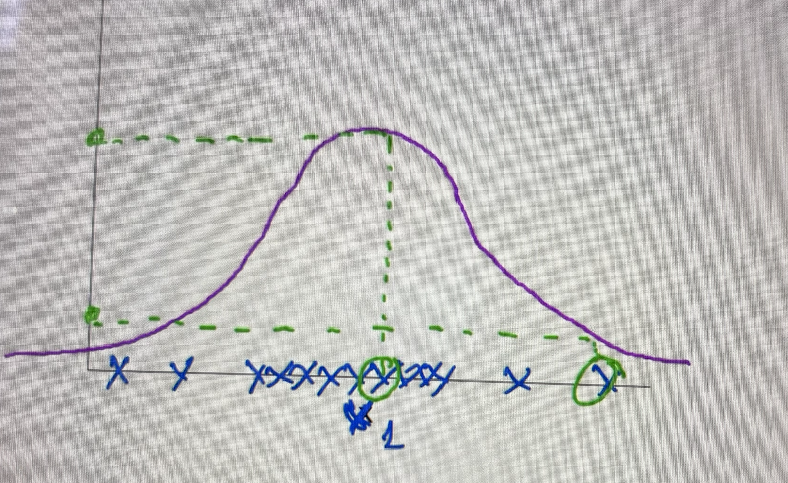
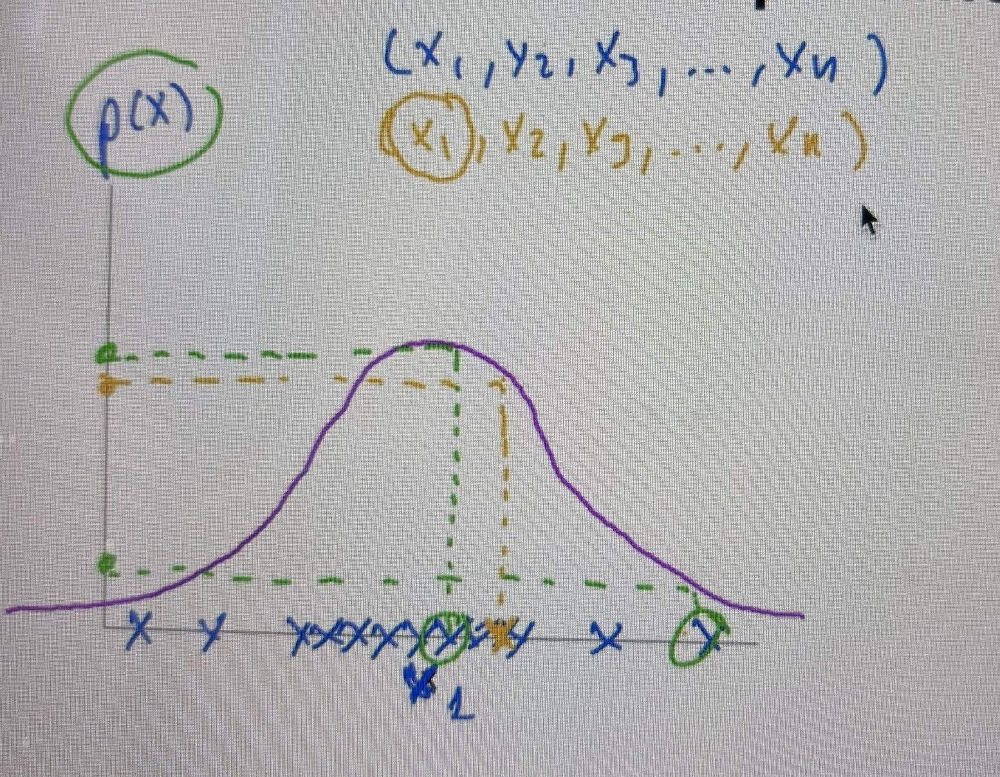
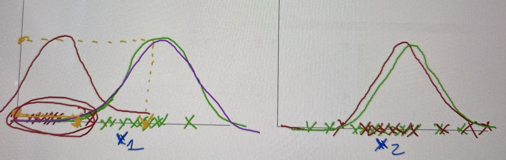

# Distribución Gaussiana

Distribución normal.
Esta distribución se encuentra parametrizada por dos parámetros: la **media** y la **varianza**.

La varianza es la desviación típica al cuadrado. La desviación típica nos permite medir la variación o la dispersión de un conjunto de datos numéricos.

Cuando decimos que una distribución está parametrizada por la media y la varianza lo que queremos decir es que la media va a delimitar la parte alta de la campana de Gauss y la desviación típica nos va a decir cómo de ancha es la campana.


La parte más alta de la campana de Gauss está determinada por la zona de más densidad  de ejemplos, por tanto, un ejemplo de una zona más densa tendrá una probabilidad más alta.



Y yo puedo utilizar esto para evaluar un nuevo ejemplo.



Para ser capaces de calcular esta probabilidad hay que computar la fórmula y para eso necesito los parámetros de media y desviación típica de la distribución.

## Funcionamiento del algoritmo

- Se seleccionan las características que determinan que un ejemplo es anómalo.
  


- En el primer caso, X1 es una buena característica porque difiere la distribución de los ejemplos anómalos de los ejemplos que son normales... pero en el segundo caso X2, las dos coinciden por lo tanto no nos ayuda tanto.

- Una vez seleccionadas las características, se calculan los parámetros media y varianza para cada característica.
- Cuando se recibe un nuevo ejemplo x, se calcula p(x), es decir, la probabilidad.
- Se selecciona un *threshold* para identificar un ejemplo como normal o anómalo. Ese threshold lo trataremos como un hiperparámetro y tendremos que probar.

### Selección del threshold
- Se divide el conjunto de datos en subconjuntos de **entrenamiento, validación y pruebas**
- Se entrena el algoritmo (obtención de los parámetros **media** y **varianza**) con el **subconjunto de entrenamiento**
- Se realizan predicciones con el **subconjunto de validación** probando diferentes threshold (hiperparámetro) y se evalúa el resultado con diferentes métricas.
- Se selecciona el threshold que produce mejores resultados y se evalúa de nuevo con el **subconjunto de pruebas** para asegurar que no se produce *overfitting*.

## Limitaciones

El algoritmo de distribución Gaussiana se aplica de forma independiente para cada una de las características y no es capaz de ver las correlaciones entre las características.

La alternativa es la **Distribución Gaussiana Multivariante** que sí va a tener en cuenta las correlaciones entre variables y de este modo sí se podrán detectar mejor las anomalías en estos casos.

```{note}
https://github.com/igijon/ML_deteccion_anomalias
```
