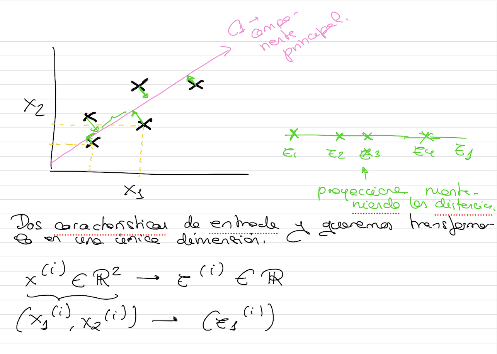
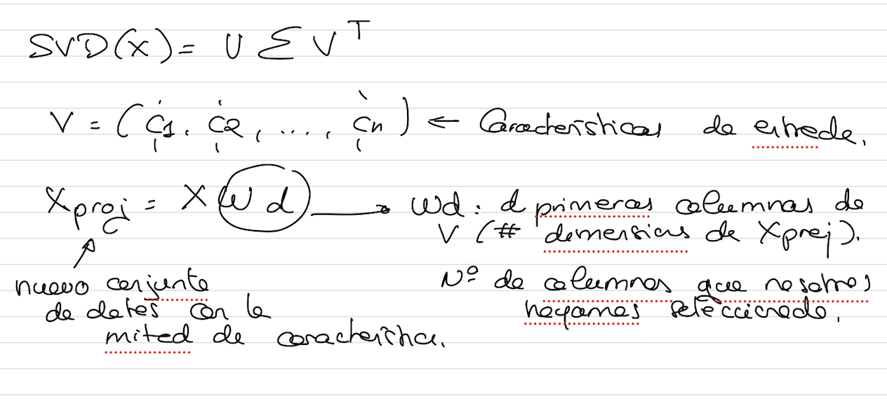

# Extracción de características

Existen diversos métodos de extracción de características (se extraen características y las que quedan están modificadas), dos de los más populares:
- **Principal Component Analysis (PCA)**: reducción de dimensionalidad lineal usando descomposición del valor singular de los datos para proyectarlo a un espacio dimensional inferior.
- **Singular Value Descomposition (SVD)**: es un método de descomposición para reducir una matriz a sus partes consituyentes con el fin de hacer ciertos cálculos posteriores de matrices más simples.
  
## Principal Component Analysis (PCA)
- Se selecciona el eje que minimiza la distancia medida como el error de cuadrados entre el conjunto de datos original y su proyección.
- El vector que define el eje se conoce como **Componente Principal**

## Singular Value Descomposition (SVD)

- Permite descomponer una matriz que compone el conjunto de datos X en la multiplicación de tres matrices. U E V^T
- La matriz V contiene los Componentes principales quie se ejecutan en el algoritmo PCA

