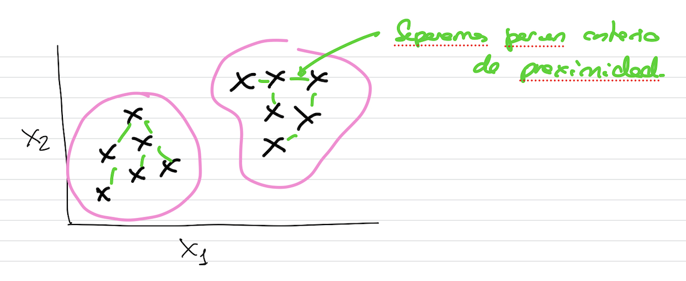

# Algoritmos de Clustering

Técnicas de aprendizaje no supervisado, es decir, reciben un conjunto de datos de entrenamiento sin etiquetar, sin variable de salida.

Características:
- Aprendizaje **no supervisado**.
- **Objetivo**: agrupar de manera coherente un conjunto de datos sin etiquetar en subconjutnos o clusters.
- Agrupación de los datos mediante el **concepto de proximidad** entre ellos.
  - **Métrica**: método concreto con el que se evalúa la cercanía entre los puntos.
  - Ejemplo rudimentario de clustering: escoger una o varias dimensiones y definir cada cluster como el conjunto de elementos que comparten valores en esas dimensiones. Ejemplo: Imaginamos un conjuntto de logs generados por ejemplo con Apache. Si eliges la dirección IP de entre todas las características de entrada (es la dimensión elegida), se define un cluster por cada dirección IP (GROUP BY de SQL).


 
 ```{note}
 https://github.com/igijon/ML_Clustering
 ```
 