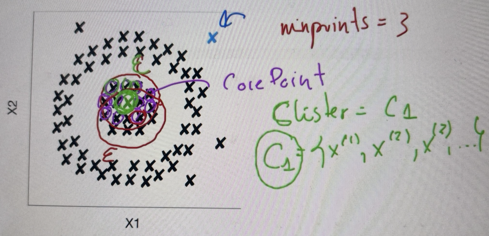

# Técnicas de clustering: DBSCAN

Se va a basar en lugar de en un concepto de distancia, en un concepto de densidad, que mejorará para los conjuntos de datos que no son esféricos.

Características:
- Algoritmo basado en **aprendizaje no supervisado**
- Algoritmo de *clustering* **basado en densidad, no en distancia**
- **Infiere** automáticamente el **número de clusters** a partir del conjunto de datos.
- Funciona correctamente con **distribuciones no esféricas**

## Funcionamiento del algoritmo DBSCAN

- DBSCAN recibe dos parámetros:
  - **epsilon**: define el radio alrededor de un ejemplo del conjunto de datos a partir del cual buscar ejemplos vecinos.
  - **minPoints**: mínimo número de vecinos necesarios para formar un *cluster*

- Cada ejemplo en el conjunto de datos es clasificado como:
  - **Core Point**: ejemplos que tienen al menos un número de *minPoints* de ejemplos dentro de epsilon.
  - **Border Points**: no son *core point* pero se encuentra en el radio de uno.
  - **Noise Points**: no son *core points* ni *border points*

- Seleccionamos un ejemplo de entrenamiento de manera aleatoria y evaluamos el tipo de punto con el que se corresponde: border, core o noise point

- Si el ejemplo seleccionado es un **Noise Point** o un **Border Point** marcamos ese punto como visitado y seleccionamos otro punto aleatorio

- Marcamos el punto como visitado y seleccionamos otro ejemplo. Si el ejemplo es un **Core Point** creamos un *clúster* y añadimos todos los ejemplos que se encuentren dentro del rango de epsilon. A continuación, se recorre cada ejemplo de manera recursiva añadiendo los *core points* y sus respectivos vecinos al mismo clúster.

- Cuando no se encuentren más *Core Points* entre los ejemplos vecinos, se comienza de nuevo con el proceso seleccionando otro ejemplo aleatorio

Todos los vecinos del anillo externo pertenecerán al cluster C2.

Los últimos ejemplos aislados los marcará como ejemplos de ruido y no se tendrán en cuenta.

## Limitaciones
- No funciona correctamente cuando los *clusters* del conjunto de datos tienen diferentes densidades.
- La selección de los parámetros *epsilon* y *minPoints* es muy importante para el correcto funcionamiento del algoritmo.
- No se comporta adecuadamente en conjuntos de datos con muchas dimensiones.
- No se deben alterar las densidades del conjunto de datos al dividirlo en subconjuntos (entrenamiento, validación y pruebas)