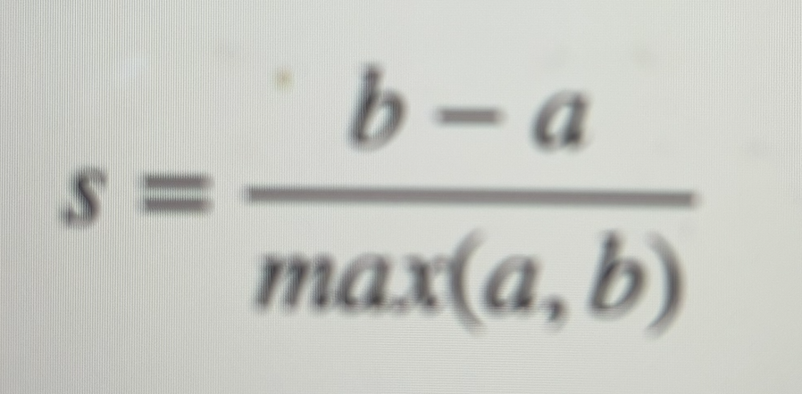
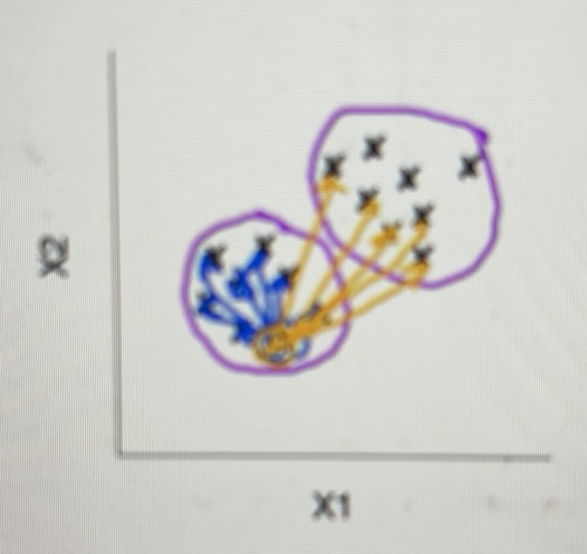
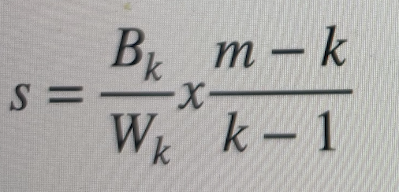
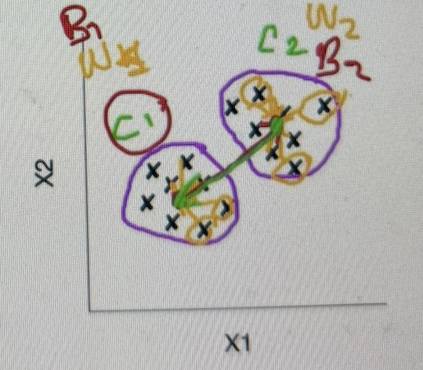

# Evaluación de los resultados de clustering

Hay dos formas de evaluar:
- Si disponemos de un conjunto de datos etiquetado, porque le pasamos las clases y luego vemos qué tal ha hecho los clusters porque tenemos las etiquetas para comparar. 
- Si disponemos de un conjunto de datos sin etiquetar

- Evaluar el resultado de algoritmos basados en aprendizaje supervisado es sencillo, se dispone de las etiquetas correctas para el conjunto de entrenamiento.
- El *clustering* se corresponde con un método basado en aprendizaje no supervisado.
- Es posible que no se disponga de un conjunto de datos etiquetado.

## Conjunto de datos etiquetado
- Existen varias métricas:
  - **Homogeneidad**: grado en el que los clusters contienen miembros de una clase determinada. Si tengo dos miembros de la misma clase en un cluster la homogeneidad es perfecta.
  - **Plenitud**: grado por el que todos los miembros de una clase determinada han sido asignados al mismo cluster. En este caso, todos los ejemplos de una clase se tienen que encontrar en el mismo cluster.
  - **V-measure**: métricada basada en la homogeneidad y en la plenitud que representa la precisión de las operaciones de agrupamiento.
  - **Pureza**: para calcular la pureza, cada grupo se asigna a la clase que es más frecuente en el grupo, y luego la precisión de esta asignación se mide contando el número de documentos asignados correctamente y dividiendo por el número de elementos.

## Conjunto de datos no etiquetado
- En la mayoría de los casos de uso probablemente no dispongamos de las etiquetas de los ejemplos de entrenamiento. No se puede usar homogeneidad ni plenitud porque requiere de las etiquetas.
- Para este tipo de casos existen dos métricas principales:
  - **Silhouette coefficient**
  - **Calinski-Harabaz index**

### Silhoutette coefficient
- Se calcula de manera independiente para cada ejemplo en el conjunto de datos.
- Utilizando una métrica de distancia (por ejemplo, la distancia euclídea) encontramos las siguientes dos distancias medias para una muestra x:
  - a: la distancia media entre la muestra x y todas las demás muestras en el mismo cluster
  - b: la distancia media entre la muestra x y todas las demás muestras en el siguiente cluster más cercano.
  

- El resultado se encuentra entre -1 y 1
- Cuanto más cercano sea de 1 mejor se considera el resultado del algoritmo de clustering
- Cuando el resultado se encuentra próximo a 0, significa que tendremos clusters que se superponen
- Esta métrica funciona bien para algoritmos de clustering basados en distancia, como KMEANS.
- Esta métrica no funciona bien para algoritmos de clustering basados en densidad como DBSCAN.

### Calinski-Harabaz index

- Considera que el resultado del algoritmo de clustering es bueno si se forman clusters visiblemente separados y densamente reunidos.
- Utiliza dos medidas (k el número de clusters):
  - **Wk**: la dispersión dentro del cluster, una matriz de distancias entre muestras en un cluster y el centro geométrico del mismo.
  - **Bk**: la dispersión entre grupos, una matriz de distancias entre el centro de un clúster y los centros de todos los otros clusters.

- Cuanto mayor sea el resultado de esta métrica, más densos y separados están los clústers.
- Funciona bien para algoritmos de clustering basados en densidad, como DBSCAN.
