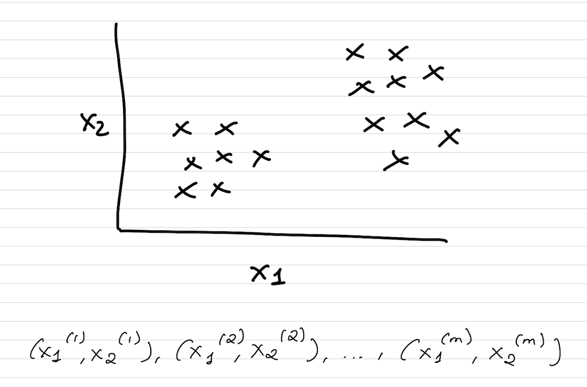
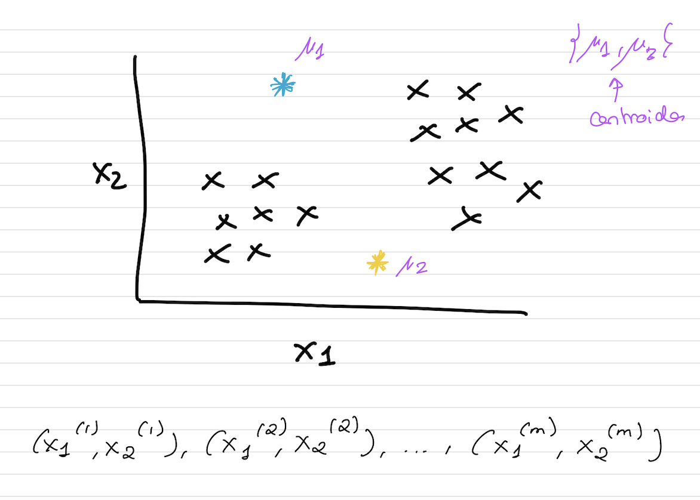
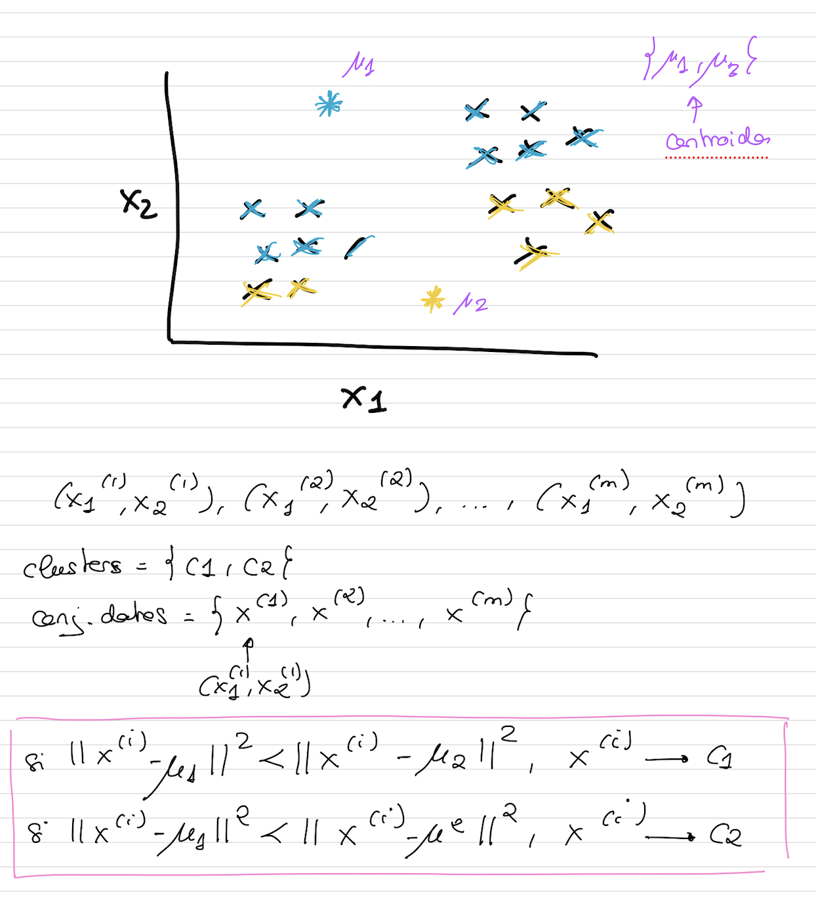
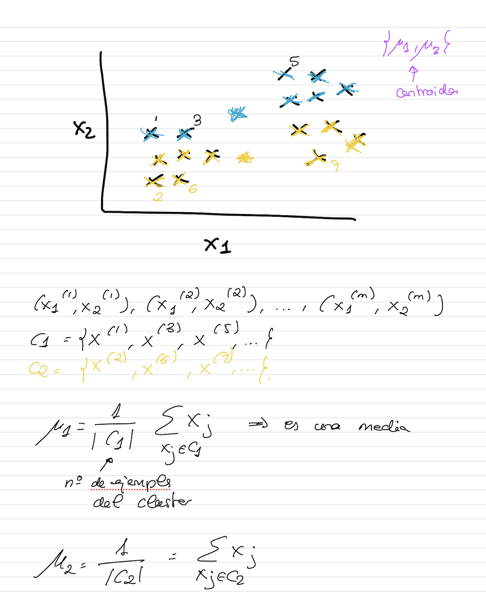
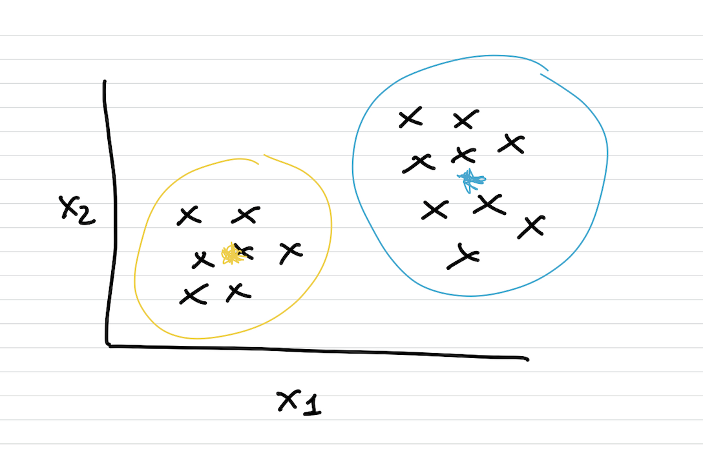
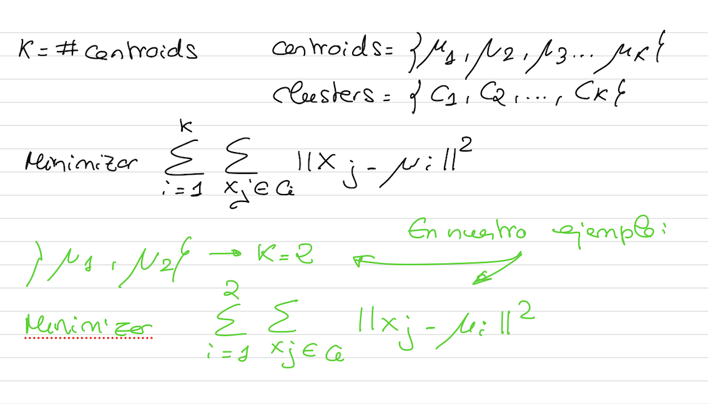
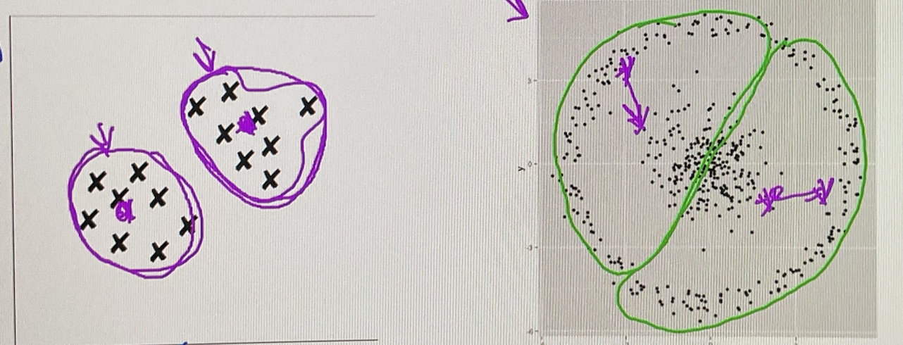

# Técnicas de clustering: KMEANS

- Algoritmo de clustering más utilizado y popular
- Aprendizaje no supervisado.
- La métrica que utiliza para calcular la distancia entre dos puntos es la **distancia Euclídea**
- Algoritmo **sencillo** que **escala muy bien** a grandes conjuntos de datos

Se dispone del siguiente conjunto de datos sin etiquetar y se desea dividirlo en dos clusters que preserven cierta coherencia.
 

 Se inicializan dos puntos de manera aleatoria dentro del conjunto de datos que se llaman **clusters centroids**

 

 Se realiza una agrupación de los datos en función de la **distancia euclídea** que les separa de cada uno de los clusters centroids.
 

 Una vez que tengo los ejemplos asignados a un cluster, se realiza un **movimiento de los cluster de los centroids** a un punto con el valor de la media de todos los puntos que se han asignado en el conjunto de un cluster centroid determinado.



Seguimos repitiendo los puntos anteriores hasta que la posición de los clusters centroids no varíe más. Se vuelven a reasignar los ejemplos a los clusters y puede que algunos ejemplos cambien su asociación a otro cluster... movemos de nuevo los centroids y así sucesivamente hasta que no se muevan más...





```
funcion k_means(numero de centroids, dataset){
    Inicialización aleatoria de centroids
    Repetir hasta que la posición de los centroids no varíe {
        Para i = 1 hasta Longitud del dataset
            Vector[i] = índice del centroid que esté más próximo a dataset[i]
        Par k = 1 hasta número de centroids
            Posición centroid k = media aritmética de los elementos asignados a k (vector[i]==k)
    }
}
```

## Limitaciones
- Se debe **intuir el número de clusters** que genera el algoritmo. Si son datos etiquetados, elegir el número de clusters como un valor entre uno y tres veces el número de etiquetas existentes.
- Hay que **aplicar normalización** al conjunto de datos
- **No debe utilizarse** KMEANS con datos categóricos a los que se le aplica **one-hot encoding**, porque no se deben dar valores numéricos ya que se basa en distancias. Por el contrario, deben tratar de codificarse estas características como *multiple binary*.
- Pierde eficiencia en conjuntos de datos con muchas dimensiones. Una práctica frecuente es **reducir las dimensiones del conjunto de datos** mediante PCA o SVD.
- Funciona mejor si los **centroides iniciales se eligen aleatoriamente**. Esto provoca que los resultados puedan cambiar dependiendo de donde se inicialicen.
- Asume que los **clusters son esféricos**. No funciona correctamente en distribuciones de datos no esféricas.
 
En el segundo caso como no es un conjunto de datos esférico no funciona bien.