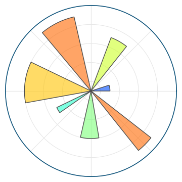

# Librerías básicas de Data Science y Machine Learning
Para comenzar con **Machine Learning** y comprender los conceptos básicos, vamos a ver algunas librerías fáciles de usar y que permiten cubrir el flujo completo de un proyecto.

- **NumPy**: esta librería es fundamental para el cálculo numérico en Python. Ofrece soporte para operaciones con arrays que son la base de trabajo con datos en Machine Learning.

- **Pandas**: es una librería esencial para la manipulación y análisis de datos. Permite trabajar con estructuras de datos como `DataFrames`, que facilitan el manejo y limpieza de datos.

- **Matplotlib**: es una librería de visualización de datos que permite crear gráficos estáticos, animados e interactivos en Python.
