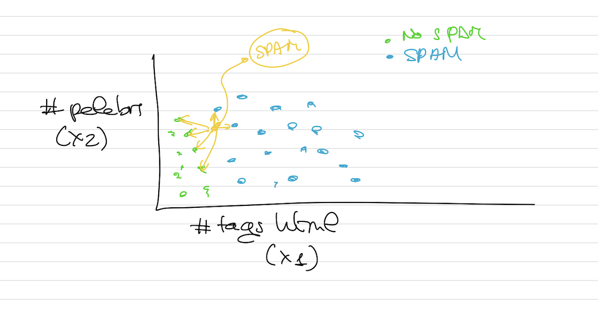

# Aprendizaje basado en instancias y modelos
## Basados en instancias
- Tipo de algoritmo de ML en el que el sistema aprende los ejemplos del conjunto de entrenamiento y luego intenta generalizar para nuevos ejemplares.
- Se requiere una **medida de similitud**

Supongamos que tengo un algoritmo de aprendizaje supervisado y basado en instancias:

El algoritmo cogerá los correos y aprenderá todas las características concretas que tiene. Coge cada instancia de nuestro conjunto de datos.
Cuando recibe otro nuevo email, en función de lo que ha aprendido del conjunto de datos, predecirá.

La **medida de similitud** se utiliza cuando el nuevo correo electrónico no coincide con ninguno del conjunto de datos. Se pondrá a calcular la similitud con otros ejemplos del conjunto de datos y según esa cercanía, determinará su predicción.

## Aprendizaje basado en modelos
- Se crea un modelo que describe el conjunto de datos y se utiliza para hacer predicciones.
- Se requiere ajustar los parámetros del modelo.

