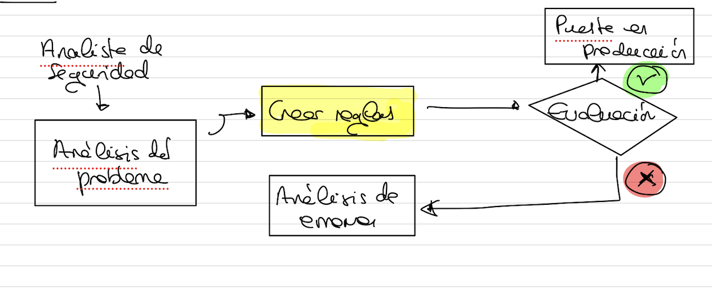
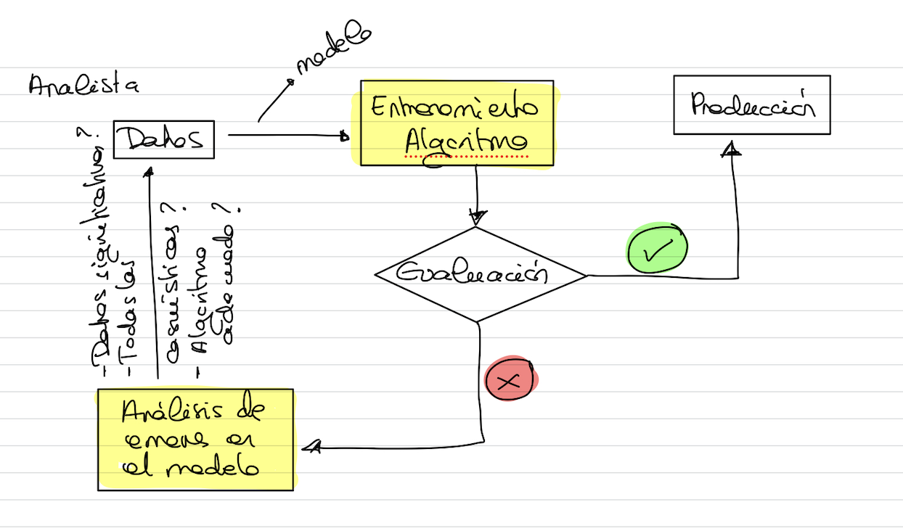

# Machine Learning

```{note}
El **aprendizaje automático** es un subdominio de la IA que proporciona a los sistemas la capacidad de aprender y mejorar automáticamente a partir de la experiencia **sin ser programado explícitamente**. Se basa en la hipótesis subyacente de **crear el modelo** y tratar de **mejorarlo ajustando más datos en el modelo** a lo largo del tiempo.
```
Tendremos algo así:


Vamos a verlo con un ejemplo: imaginemos que implementamos un filtro de SPAM, que ante un correo electrónico determina si es SPAM o es un correo legítimo.

Con una implementación tradicional tendríamos algo así:


Este tipo de sistemas son:
- Altamente acoplados con el analista.
- Reglas estáticas que hay que mantener a lo largo del tiempo.

Con algoritmos de **Machine Learning**, tenemos:
- El analista trata de obtener experiencia pasada no se dedica a analizar reglas.
- El analista, también determina qué algoritmo de ML (matemático) puede resolver este problema.



Esteo nos permite adaptarnos a cómo cambian los correos de SPAM a lo largo del tiempo... porque se entrenan con nuevos datos, no hay que cambiar un sistema de reglas, sino entrenarlo con los nuevos datos.

## Cuándo utilizar Machine Learning

- Sistemas con un conjunto extenso de reglas o heurísticas.
- Problemas complejos en los que un analista no es capaz de determinar una solución a partir de la información existente. Por ejemplo: clasificación de imágenes (aquí se utilizan técnicas de **machine learning** y **deep learning**)
- Entornos que fluctúan o varían con frecuencia. Ejemplo: tráfico de red que detectan amenazas (cualquier tema dependiente de tráfico de red...)
- También se pueden utilizar como apoyo en la fase de análisis en enfoques tradicionales en los que se dispone de conjuntos de datos muy grandes y difíciles de interpretar. Esto nos permite ver las diferencias entre los distintos tipos de datos y afinar heurísticas y reglas tradicionales o decidir si vamos a utilizar un algoritmo de machine learning.

## Clasificación de algoritmos de Machine Learning

Los algoritmos de ML se pueden clasificar en base a distintas cosas por ejemplo: rendimiento, complejidad...
Nosotros los vamos a clasificar principalmente en base a la forma en la que **aprenden**:
- Según se **entrenan**:
  - *Aprendizaje supervisado*
  - *Aprendizaje no supervisado*
  - *Aprendizaje semi-supervisado*
  - *Aprendizaje por refuerzo*
- Según **aprenden en el tiempo**:
  - *Aprendizaje online*
  - *Aprendizaje batch*
- Según realizan las **predicciones**:
  - *Aprendizaje basado en instancias*
  - *Aprendizaje basado en modelos*