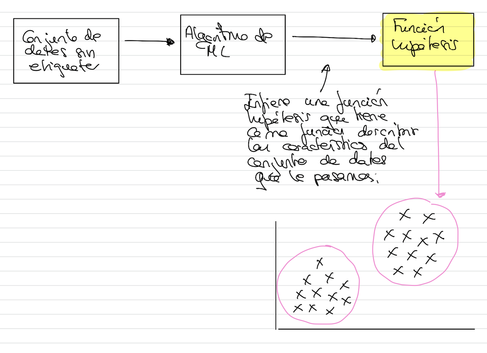
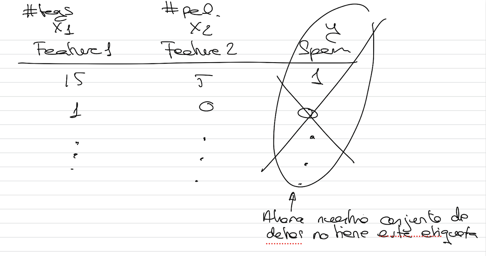
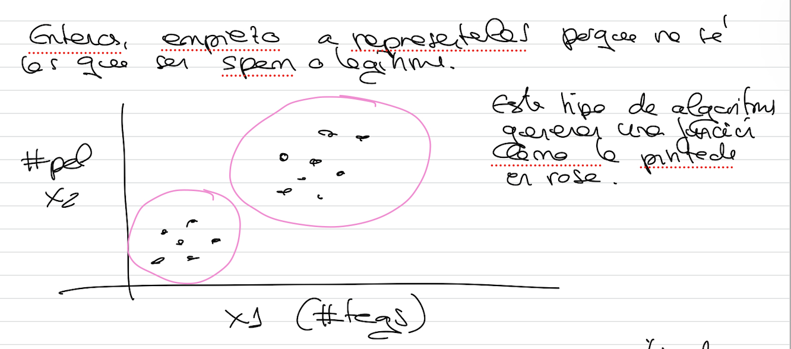

# Aprendizaje no supervisado

Es la tarea de ML que consiste en inferir una función que describe la estructura de un conjunto de datos sin etiquetar (es decir, datos que no se han etiquetado ni clasificado).

Su objetivo no es predecir, sino describir los datos.

Ahora nuestro conjunto de datos no tiene esta etiqueta.

Entonces, empiezo a representarlos, porque no sé los que son spam o legítimos.

Usamos este tipo de algoritmos para tratar conjuntos de datos enormes sin etiquetar que son imposibles de etiquetar manualmente.
