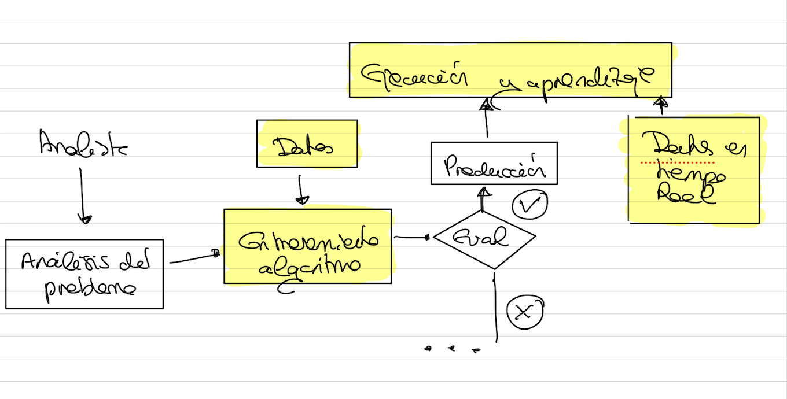

# Aprendizaje online y batch
¿Cómo aprende e ingiere un algoritmo los datos a lo largo del tiempo?

## Aprendizaje Batch

No aprenden de forma incremental, se entrenan utilizando todos los datos disponibles.

Cojo todo slos elementos disponibles y ajusto el entrenamiento de mi algoritmo.

- Si se desea que el sistema se adapte a un nuevo tipo de datos, se debe entrenar de nuevo con todos los datos disponibles.
- Es una solución mucho más sencilla que la online.
- Funciona bien para conjuntos de datos no muy grandes y que cambian con mucha frecuencia.
- Muy restringido para dispositivos con capacidad limitada de recursos, por ejemplo, un smartphone.

## Aprendizaje Online

Se entrenan mediante un conjunto incremental de datos llamados **mini-batches**.

- Recomendable para sistemas que reciben datos con frecuencia.
- Capaz de lidiar con grandes conjuntos de datos que no están en una sola máquina. Puedo partir el conjunto de datos y entrenar poco a poco.
- Pueden ser inestables si se consumen datos de baja calidad o datos no representativos del problema. Hay que filtrarlos o tratarlos antes.