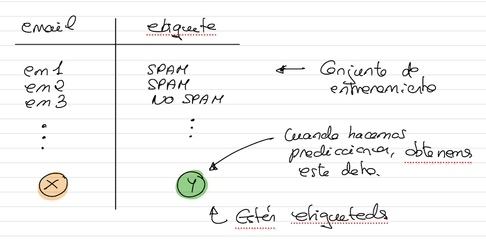
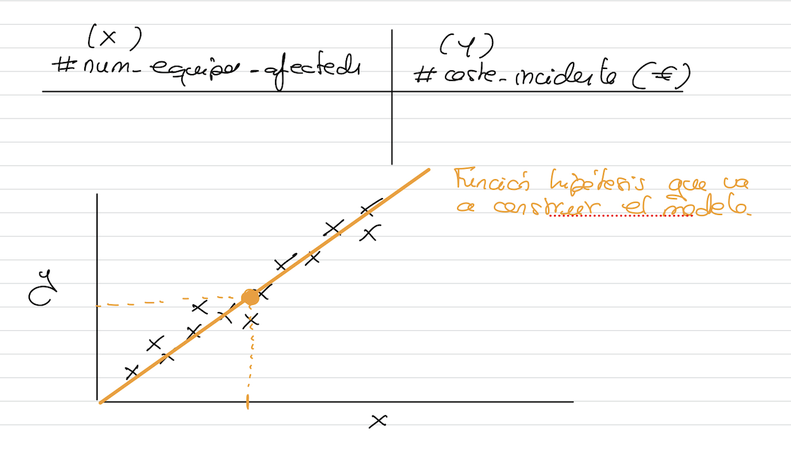
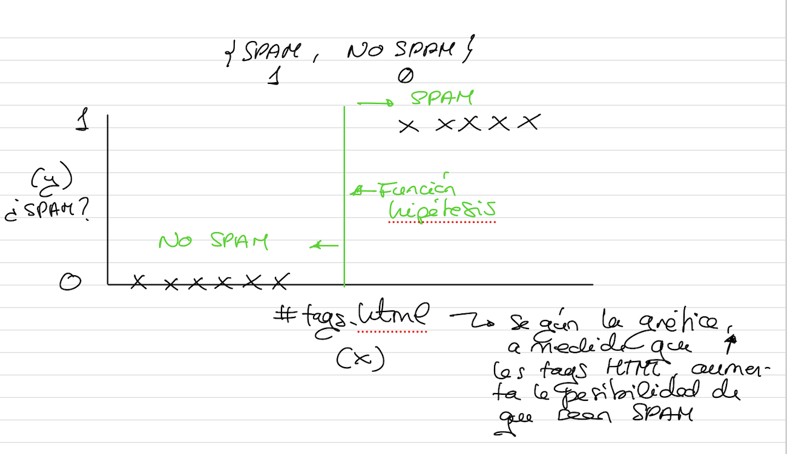
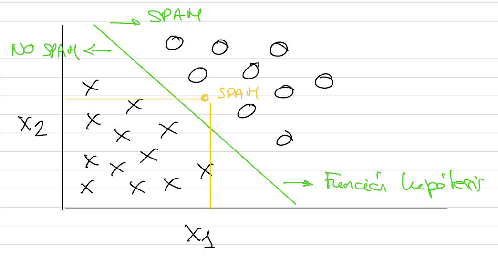

# Aprendizaje Supervisado

El aprendizaje supervisado es la tarea de ML que consiste en aprender una función que mapea una entrada a una salida basada en pares de E/S de ejemplo.


Para construir el modelo, necesita un conjunto de datos etiquetados (ejemplo: conjunto de correos que son legítimos y conjunto de correos que son spam)



## Regresión

Intenta predecir valores continuos.
Ejemplo: para predecir coste de una casa o un incidente de seguridad.

Ejemplo: coste de un incidente de seguridad
- Recopilamos datos de experiencia pasada
- X: número de servidores afectados (#num_equipos_afectados)
- Extraigo también el coste del incidente (y)



```{note}
Esta función hipótesis, me permite, en función de la experiencia pasada, predecir ante un datos que me llega con el número de equipos perdidos, el coste.
```

## Clasificación

Intentan predecir valores discretos
Ejemplo: clasificar un correo como {SPAM (1), NO_SPAM (0)}



Estas técnicas nos permiten determinar una función hipótesis para predecir si un correo es SPAM o no.
Puedo extraer más características:
- #tags_html (x1)
- #palabras_otros_idiomas (x2)
- SPAM (1) -> o, NO SPAM (0) -> x



