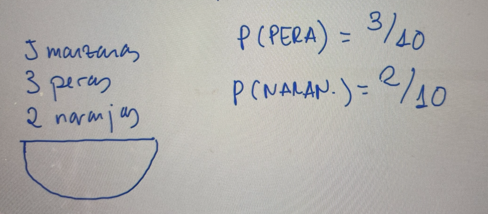
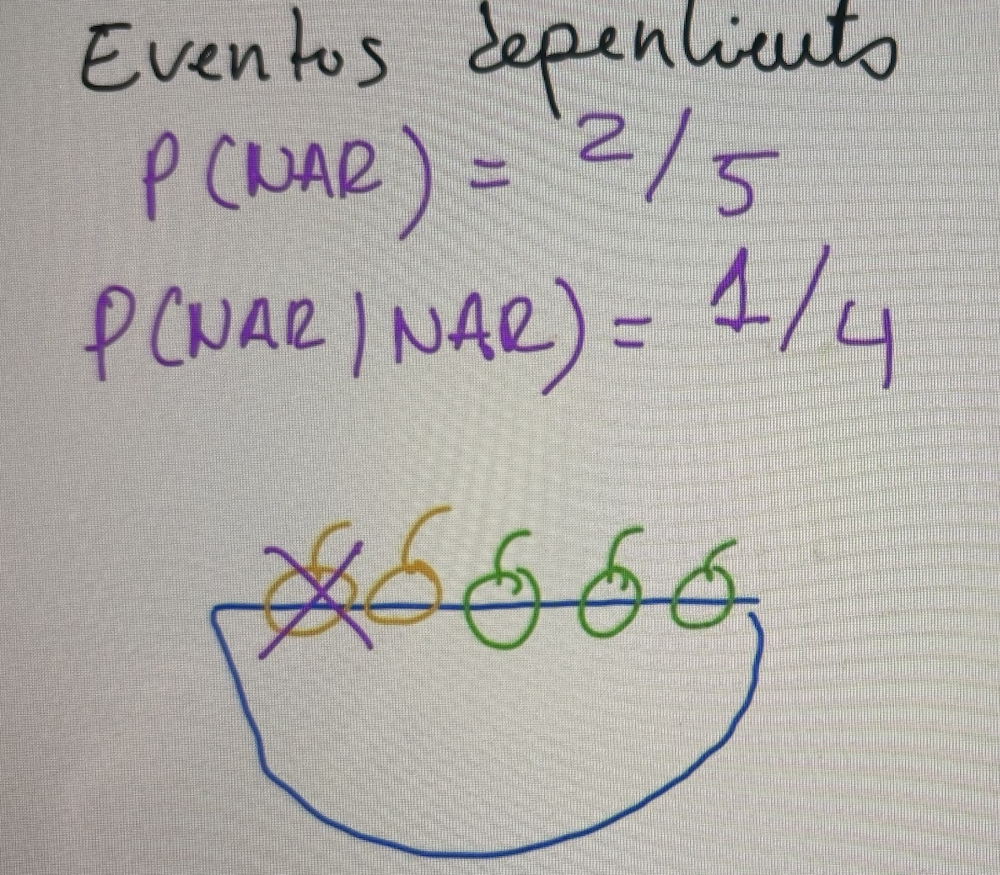
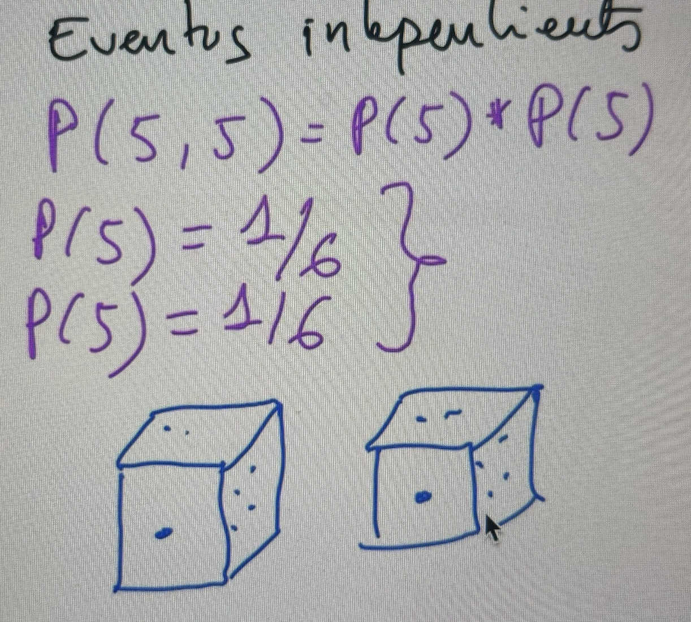

# Algoritmos basados en probabilidad

## ¿Qué es la probabilidad?

- La probabilidad es la medida de la incertidumbre asociada a un suceso o evento futuro y suele expresarse como un número entre 0 y 1.
- Un suceso puede ser improbable (cercana a 0), probable (probabilidad intermedia) o seguro (1).
- La definición de probabilidad se origina con la motivación de conocer con certeza los eventos que sucederán en el futuro.
- Se obtiene la frecuencia de un acontecimiento determinado mediante la realización de **experimentos**.

Vamos a predecir también sucesos que no son igualmente probables.

## Probabilidad condicional y conjunta

- En los problemas anteriores, cada experimento se consideraba de manera independiente.
- Otros problemas requieren considerar el grado en el que dos posibles resultados están relacionados.
- La **probabilidad condicional** trata de determinar la probabilidad de que se produzca un evento B a continuación de un evento A.
- La **probabilidad conjunta** trata de determinar la probabilidad de que se produzcan un evento A y B al mismo tiempo.

## Probabilidad condicional

Eventos dependientes: en primer lugar probabilidad de sacar una naranja y luego una vez que he sacado una naranja que probabilidad hay de sacar otra naranja habiendo sacado en primer lugar una naranja

## Probabilidad conjunta

Los eventos son independientes: por ejemplo tengo dos dados. Lanzo los dos dados a la vez y quiero saber la probabilidad de que salgan dos cincos.

