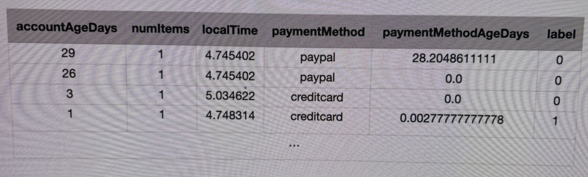
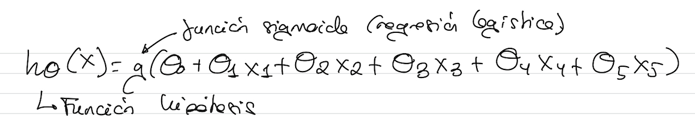
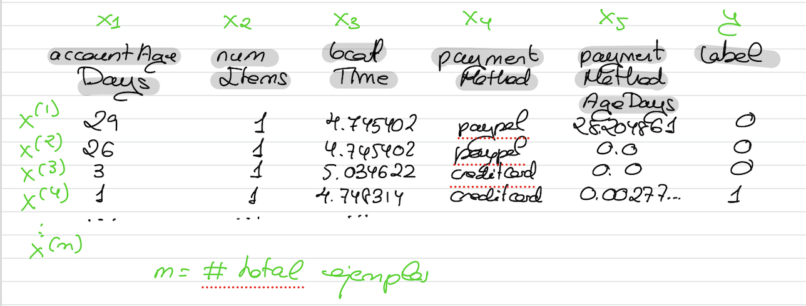

# Conjunto de datos

El conjunto de datos es una parte esencial en la resolución de un problema mediante el uso de ML.
Es tan importante elegir bien el conjunto de datos como el algoritmo que se entrenará con el conjunto de datos. En muchas ocasiones, es más importante, de hecho el conjunto de datos ya que con suficientes ejemplos teniendo un conjunto de datos suficientemente grande y completo, muchoas algoritmos de ML nos proporcionará una precisión parecida.

Imaginemos que queremos resolver un problema de clasificación de transacciones bancarias como fraudulentas o legítimas en base a un conjunto de datos



Podremos tener las siguientes características de entradas:
- Tiempo de la cuenta abierta en días
- Número de elementos
- La hora local
- Método de pago
- Tiempo en días que se realizó el pago

Finalmente viene la etiqueta que nos indica si es legítima o no.

En cada fila tendríamos una transacción con todas las características y la etiqueta o atributo de salida.

Mi objetivo, después de entrenar un algoritmo, es que nosotros le podamos dar las características de entrada de una transacción y nos determine si es legítima o no.

Si nos fijamos, tenemos atributos de distintos tipos: numéricos discretos (enteros), numéricos contínuos (localTime), categóricos (paypal, creditcard)...

Las **características** son un atributo o grupo de atributos que constituyen una propiedad particular o un conjunto de propiedades que es único, medible y diferenciable.



Una vez ajustados los parámetros, esta función hipótesis me ayudará a predecir para futuras transacciones si son legítimas o fraudulentas.



m = # ejemplos totales, n = # atributos de entrada, en este caso n = 5

```{note}
A partir de una transferencia bancaria, lo que queremos es que esa transferencia, sea recibida por un algoritmo de machine learning y dicho algoritmo sea capaz de predecir si es una transferencia legítima o fraudulenta.
```

Para resolver este problema, cojo a partir de un conjunto de transacciones bancarias, lo analizo y determino una serie de características y además... determino después de una clasificación las que eran fraudulentas y las que eran legítimas.
Una vez que tengo el conjunto de datos, se lo proporciono al algoritmo, en este caso un algoritmo de regresión logística, para que ajuste los parámetros theta0, theta1... de la función hipótesis y una vez ajustados, será capaz a partir de una nueva transacción (con las características de entrada), determinar si es legítima o fraudulenta.

```{note}
En nuestro conjunto de datos:
- Debemos tener una cantidad suficiente de datos
- Debemos utilizar un conjunto de datos representativo del problema a resolver.
- Los datos deben ser de calidad.
- Debe seleccionarse un conjunto de características adecuado, minimizando características irrelevantes (relacionado con el coste computacional).
```

