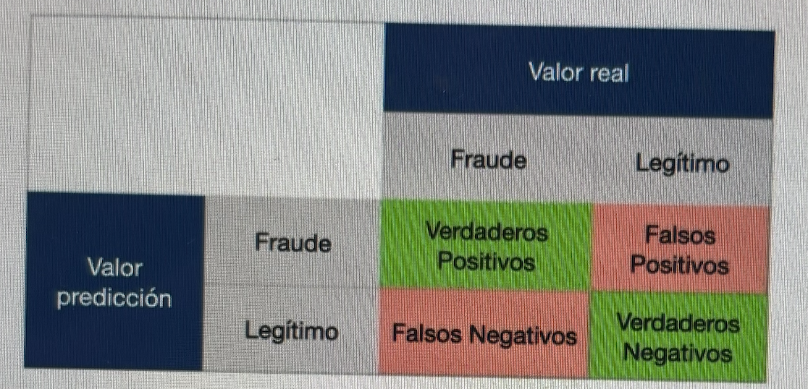
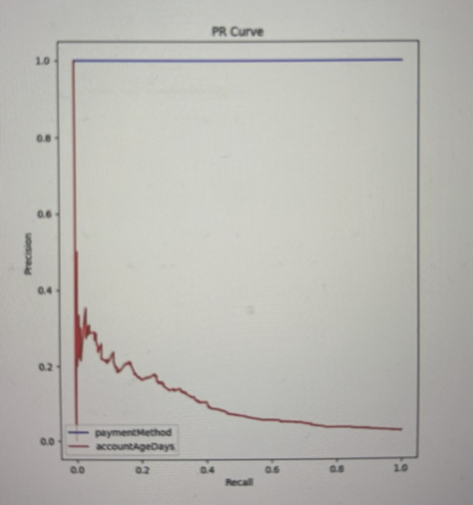

# Evaluación de resultados
Teníamos los datos divididos en:
- Entrenamiento
- Validación 
- Pruebas

Vamos a tratar las métricas que podemos utilizar para evaluar el rendimiento de una función hipótesis.

Una vez preprocesado el conjunto de datos, necesitamos un mecanismo para verificar si el modelo funciona adecuadamente.
Tenemos:
- **Métricas numéricas**: precisión, exhaustrividad, exactitud...
- **Representaciones gráficas**: curva ROC, curva PR...

Todas las métricas se basan en la matriz de confusión.

## Matriz de confusión

Nosotros vamos a tener por un lado el valor real, y por otro el valor de predicción
Nos muestra lo siguiente:
- **Verdadero positivo**: es un ejemplo que ha clasificado correctamente como perteneciente a la clase "1" o positiva.
- **Verdadero negativo**: es un ejemplo que ha clasificado correctamente como perteneciente a la clase "0" o negativa.
- **Falso positivo**: es un ejemplo que se ha clasificado como perteneciente a la clase "1" pero realmente pertenece a la clase "0".
- **Falso negativo**: es un ejemplo que se ha clasificado como perteneciente a la clase "0" pero realmente pertenece a la clase "1".
  
### Métrica: precisión

Precisión  = VP / (VP + FP)

Visión de falsos positivos.

### Métrica: exhaustividad (recall)

Recall = VP / (VP + FN)

Al contrario de la precisión nos proporciona el número de transacciones que predice como legítimas pero que realmente están etiquetadas como fraudulentas. Nos da la idea de las transacciones fraudulentas que nuestro algoritmo no detecta.
Visión de falsos negativos.

```{note}
Lo suyo es utilizar ambas métricas porque una sola nos da una visión parcial
```

### Métrica: exactitud

Accuracy = (VP + VN) / Total de ejemplos

### Métrica: Tasa de error

Error rate: Se calcula restando la exactitud del valor 1.

### Métrica: ratio de falsos positivos

Ratio de FP = FP / VN

### Métrica: F1-score

La más utilizada.
Promedio ponderado entre la precisión y la exactitud (recall), donde el F1-score alcanza su mejor valor en 1 y el peor puntaje en 0.

Auna la precisión (visión de falsos positivos) y recall (visión de falsos negativos)

La contribución relativa de la precisión y la exactitud al F1-score es la misma.

F1 = 2* (precisión * recall)/(precisión + recall)

Cuanto más se acerca a 0, peor se está comportando el algoritmo y cuanto más se acerca a 1, mejor se está comportando el algoritmo.

### Métrica: Curvas ROC (Receiver Operating Characteristic)

Suelen representar la tasa de verdaderos positivos en el eje Y y la tasa de FP en el eje X. La **esquina superior izquierda** de la gráfica es el **punto ideal**. Una tasa de falsos positivos de cero y una tasa de verdaderos positivos de uno. Como consecuencia, un área más grande debajo de la curva AUC suele ser mejor.


Hay dos curvas ROC, una en azul y otra en rojo. Queremos menos FP y el máximo VP, por eso lo mejor es la **esquina superior izquierda**.

### Métrica: Curvas PR (Precision-Recall)

Un área grande debajo de la curva representa tanto alta exactitud como alta precisión, donde la alta precisión se relaciona con una baja tasa de falsos positivos, y la alta exactitud se relaciona con una baja tasa de falsos negativos. **La esquina superior derecha de la gráfica es el punto "ideal"**

Quiero el recall alto (que se acerque a 1, una tasa de FN baja) y quiero que la precisión se acerque a 1, es decir, una tasa de FP baja.




```{note}
Evaluación de resultados:
https://github.com/igijon/ML_Proyecto_Bases

```