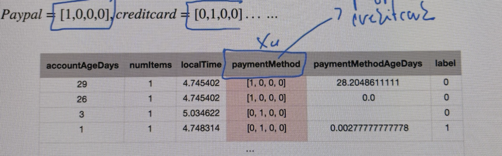
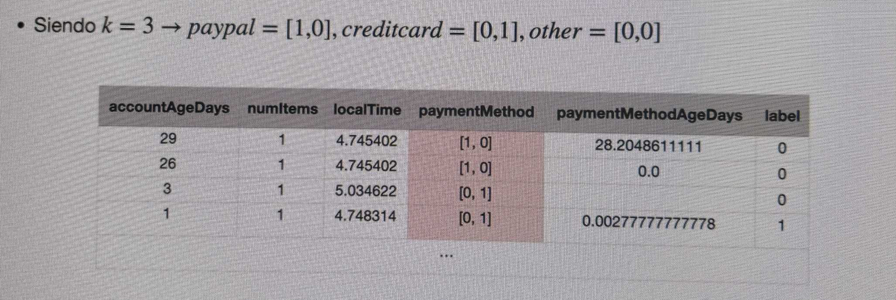
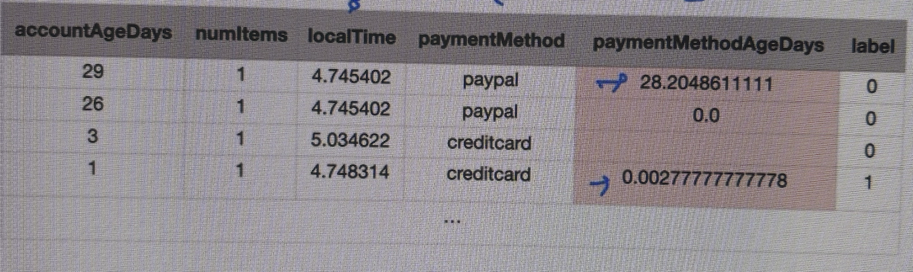
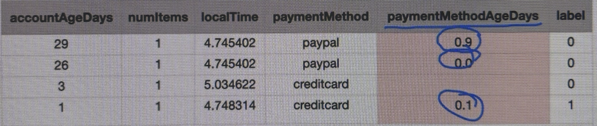
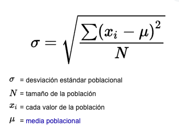
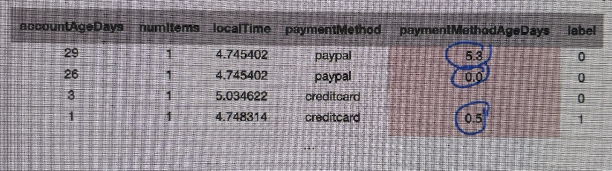

# Overfitting y Underfitting

Uno de los problemas que surgen con más frecuencia es el **overfitting** o sobrentrenamiento. Una de las formas más comunes para detectarlo, es mediante la **división del conjunto de datos inicial** en subconjuntos:
- Entrenamiento
- Validación
- Comprobación de que generaliza bien para  nuevos ejemplos

```{note}
**Overfitting**: Si el conjunto de datos tiene muchas características, es posible que la función hipótesis generada por el algoritmo se adapte muy bien al conjunto de entrenamiento (mini), pero falle al generalizar con nuevos ejemplos
```


## Soluciones al overfitting
- Aumentar el conjunto de datos
- Reducir el número de características: cuantas mas características tenemos, más flexible es nuestro modelo y más probabilidades hay de overfitting.
  - Selección manual de las características que se puedan mantener: no es una forma muy recomendada. 
  - Utilizar un algoritmo para la selección de características: como por ejemplo Random Forest que veremos más adelante).
  - Utilizar un algoritmo para la extracción de características: son algoritmos de reducción de dimensionalidad. Transforman mi conjunto de datos en otro con menos características... cambia todo... transforma también los datos devolviendo un conjunto de datos que mantiene la distribución de datos del conjunto origianl. Ejemplo: PCA o SVD que veremos más delante.
- Regularización: añadimos una penalización a determinados parámetros (que producen overfitting) del modelo de manera que se reduce la flexibilidad del modelo.
  
## Regularización

Agrega una penalización a los parámetros *theta0*, *theta1*, *theta2*..., para reducir la libertad del modelo. Es menos probable, de este modo, que el modelo se ajuste al ruido de los datos de entrenamiento y mejore las capacidades de generalización del mismo.

Mantiene todas las características, pero reduce la magnitud de los parámetros **theta**.

La regularización funciona bien cuando tenemos muchas características ligeramente útiles.


Mediante el parámetro lambda controlamos la flexibilidad de la función. Si lambda es 0 es como no aplicar regularización.
Si lambda tiende a infinito, tendríamos una función de error siempre cerca de infinito y no tendremos un modelo que se ajuste nunca.
Tendremos que buscar un valor de lambda aceptable que penalice un poquito el modelo pero tampoco demasiado.

## Evaluación de la función hipótesis

- Un número elevado de características puede provocar overfitting
- Se requiere una forma de evaluar la función hipótesis generada para comprobar si generaliza correctamente.

Para saber si se está produciendo overfitting, dividimos nuestro conjunto de datos:
- Subconjunto de entrenamiento: **train set** (60-70%) de datos de experiencias pasadas. Con este subconjunto generaré mi función hipótesis.
- Subconjunto de pruebaS: **test set** (30-40%) de datos de experiencias pasadas. Con este subconjunto, eliminaré la etiqueta Y y me quedaré con las características de entrada. Evaluaré sobre la función hipótesis (con estos no ha sido entrenado). Una vez calculadas las predicciones, comparo las predicciones con la etiqueta Y que aparté. *Si hay overfitting, tendremos error bastante grande para los valores que no ha visto nunca y cercano a cero para los datos de entrenamiento.*

## Selección del modelo
Para elegir el modelo tendré que hacer distintas pruebas, para ver qué tal se comporta.

Podemos comenzar analizando una regresión lineal básica (1 característica). 


```{note}
Calculo un error con este grado de polinomio, si el error con el testset(40%) es grande y el trainset(60%) es pequeño, tenemos overfitting. Si el error tanto en testset y trainset es grande, no es el modelo adecuado.
````

Podemos añadir otra característica polinómica y hago exactamente lo mismo, calcular con trainset y testset.

Cuando evaluamos muchos modelos con el mismo conjunto de datos, puedo caer en la posibilidad de que de manera manual, esté haciendo overfitting con el testset. No sé si generalizará bien para otros conjuntos de datos distintos cuando yo lo ponga en producción y llegue un ejemplo completamente nuevo. 

Para evitar esto, vamos a hacer una subdivisión más:
- Trainset (60%-70% de la información): entrenar los modelos.
- Validationset (20%-15% de la información): evaluaremos si se está produciendo overfitting sobre el training set.
- Testset (20%-15% de la información): evaluaremos una vez seleccionado el modelo que mejor se comporta, si también es capaz de generalizar bien para los ejemplos que no están ni en el trainset ni en el validationset.

En resumen:
- Dividimos el conjunto de datos en **entrenamiento, validación y pruebas**
- Se calcula la función hipótesis con el subconjunto de entrenamiento
- Se calcula el número de características óptimo mediante la evaluación de las hipótesis anteriores con el subconjunto de validación (elección del modelo)
- Se evalúa la función de hipótesis mediante el subconjunto de pruebas calculando su error, para ver si generaliza bien.

```{note}
Particionado de los datos:
https://github.com/igijon/ML_Proyecto_Bases
```
## Preparación del conjunto de datos.

Los algoritmos de Machine Learning, en su gran mayoría, reciben valores numéricos. Los valores de las características y de la salida Y no deben tener valores nulos o perdidos.

Tendremos que transformar las variables categóricas por ejemplo, en numéricas. Tendremos que deshacernos de valores perdidos.

### Valores perdidos

El conjunto de datos puede contener ejemplos que no dispongan de un valor para una determinada característica (feature)


Los algoritmos de ML no pueden recibir valores perdidos. 

Soluciones:
- Eliminar el elemento del conjunto de datos.
- Eliminar la característica: si tenemos muchos datos nulos de una feature, podría ser una solución.
- Asignarle un valor determinado (por ejemplo, la media)

### Características categóricas

Como por ejemplo **paymentMethod**.
Como la mayoría de algoritmos requieren de valores numéricos para funcionar, tenemos que hacer una transformación.

Lo más común es hacer una codificación o **encoding**. 

#### One-Hot Encoding

Uno de los más conocidos es **One-Hot Encoding**.

```{note}
One-Hot Encoding utiliza un array de bits con tantos bits como valores diferentes tiene la característica categórica.
```



#### Dummy Coding

En este caso se reduce el grado de libertad, usando k-1 nuevas características. Siendo k el número de posibles valores distintos para la característica categórica.



### Escalado y estandarización de características

Puede que para algunas características tengamos valores con distintas escalas o valores muy dispares. Tenemos que buscar un algoritmo para homogeneizar los valores. Cuando escalo los valores, debo mantener la distribución del conjunto original.

Existen dos mecanismos principales para igualar la escala de los valores: **min-max scaling (normalización)** y **estandarización**.

#### Min-Max scaling o normalización

Escalamos los valores en el rango 0 y 1.
Se calcula restando el valor mínimo y dividiendo por el máximo menos el mínimo.





#### Estandarización

Se refiere a cambiar la distribución de cada característica para que tenga una media de cero y una desviación estándar de 1 (ya lo veremos más adelante).

Se calcula restando el valor medio y dividiendo el resultado por la desviación estándar.

```{note}
La desviación estándar es una medida de dispersión que nos indica cómo de dispersos están los datos con respecto a la media. A mayor desviación estándar, mayor dispersión de dtaos.

```



### Desequilibrio de los datos

En muchos casos de uso relacionados con la ciberseguridad, sucederá que dispondremos de un conjunto de datos con un 0.1% de ejemplos positivos y un 99.9% de ejemplos negativos.

Ante esto, podemos:
    - Repetir los ejemplos de casos positivos en el conjutno de datos para balancear la proporción (**oversample**)
    - Seleccionar un subconjunto de la clase mayoritaria para balancear la proporción (**undersample**)
    - Modificar la función de error para que cada ejemplo de la clase minoritaria tenga más influencia en el modelo (esto se suele hacer menos).

```{note}
Preparación del conjunto de datos:
https://github.com/igijon/ML_Proyecto_Bases
Creación de Transformadores y Pipelines personalizados:
https://github.com/igijon/ML_Proyecto_Bases
```