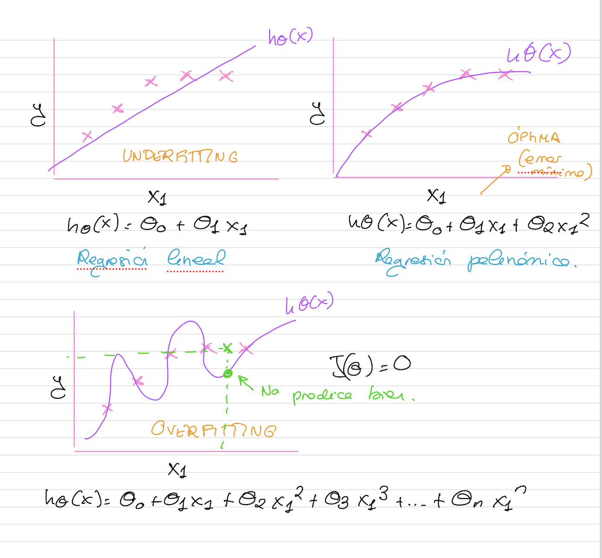
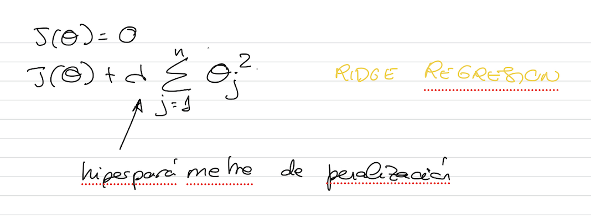

# Overfitting y Underfitting

Uno de los problemas que surgen con más frecuencia es el **overfitting** o sobrentrenamiento. Una de las formas más comunes para detectarlo, es mediante la **división del conjunto de datos inicial** en subconjuntos:
- Entrenamiento
- Validación
- Comprobación de que generaliza bien para  nuevos ejemplos

```{note}
**Overfitting**: Si el conjunto de datos tiene muchas características, es posible que la función hipótesis generada por el algoritmo se adapte muy bien al conjunto de entrenamiento (mini), pero falle al generalizar con nuevos ejemplos
```


## Soluciones al overfitting
- Aumentar el conjunto de datos
- Reducir el número de características: cuantas mas características tenemos, más flexible es nuestro modelo y más probabilidades hay de overfitting.
  - Selección manual de las características que se puedan mantener: no es una forma muy recomendada. 
  - Utilizar un algoritmo para la selección de características: como por ejemplo Random Forest que veremos más adelante).
  - Utilizar un algoritmo para la extracción de características: son algoritmos de reducción de dimensionalidad. Transforman mi conjunto de datos en otro con menos características... cambia todo... transforma también los datos devolviendo un conjunto de datos que mantiene la distribución de datos del conjunto origianl. Ejemplo: PCA o SVD que veremos más delante.
- Regularización: añadimos una penalización a determinados parámetros (que producen overfitting) del modelo de manera que se reduce la flexibilidad del modelo.
  
## Regularización

Agrega una penalización a los parámetros *theta0*, *theta1*, *theta2*..., para reducir la libertad del modelo. Es menos probable, de este modo, que el modelo se ajuste al ruido de los datos de entrenamiento y mejore las capacidades de generalización del mismo.

Mantiene todas las características, pero reduce la magnitud de los parámetros **theta**.

La regularización funciona bien cuando tenemos muchas características ligeramente útiles.



Mediante el parámetro lambda controlamos la flexibilidad de la función. Si lambda es 0 es como no aplicar regularización.
Si lambda tiende a infinito, tendríamos una función de error siempre cerca de infinito y no tendremos un modelo que se ajuste nunca.
Tendremos que buscar un valor de lambda aceptable que penalice un poquito el modelo pero tampoco demasiado.