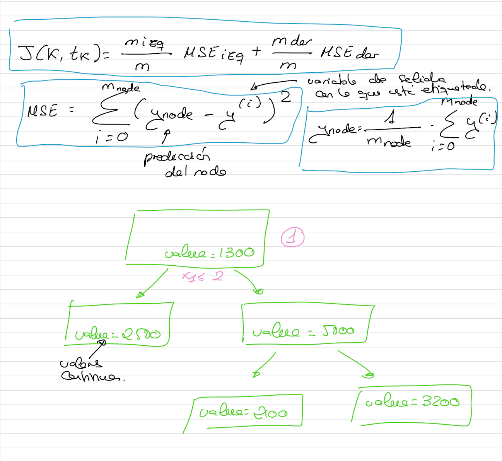

# Árboles de decisión: Clasificación y función de coste

Queremos evaluar el error no de un nodo, sino de la división en conjunto. Esta función de coste la vamos a determinar mediante una **J**.

## Classification and Regression Tree (CART)

En la regresión, en lugar de predecir valores discretos, tenemos que predecir valores continuos y los rangos son muy amplios.
Construiremos un árbol exactamente igual que antes pero con la diferencia de que los valores de las clases resultantes, en lugar de ser valores discretos, serán valores continuos.
Cuando empecemos a evaluar los valores, evaluaremos si el corte es adecuado en base a otros criterios diferentes que los que utilizaba para clasificación, es decir, no utilizaremos el Gini Impurity. Vamos a utilizar la función de coste **J(k, tk)**. Esta función de error va a depender del MSE (Mean Squared Error)

