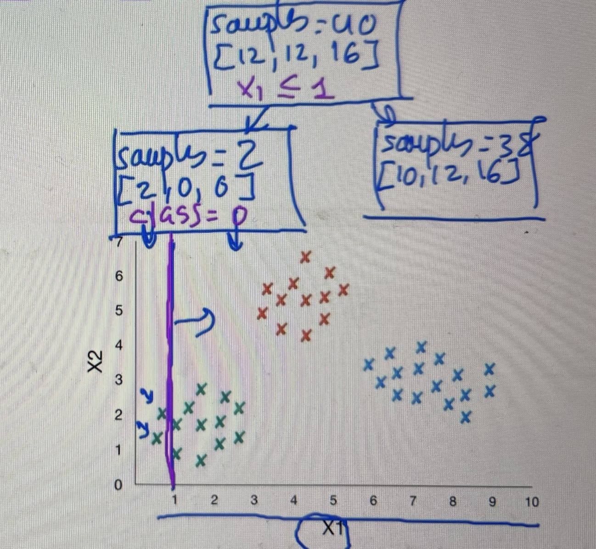

# Árboles de decisión: Gini Impuriti

El problema que tenemos es que el árbol de decisión debe separar las clases de la manera más pura posible. 

Pasos:
- Para la primera variable de entrada, selecciona un rango de valores.
- Para cada valor del rango, establece límites de decisión y lo hace para todos los valores de X1 y X2.
  
  

La métrica **Gini Impurity** calcula el error que se produce. Evaluando con esta métrica en esta primera clasificación, se calcula el error en el segundo nodo del árbol. 

Se obtiene el valor de 0 porque este nodo es **completamente puro** porque todos los ejemplos son de la misma clase. El error para este nodo en este caso es 0.

Indica que tengo 2 ejemplos de la primera clase, del total de 2 ejemplos que tengo en la subdivisión, 0 ejemplos de la segunda clase del total de 2 ejemplos y 0 ejemplos de la tercera clase del total de 2 ejemplos.

Sin embargo, en el nodo 3 obtenemos un valor bastante malo, porque este error va entre 0 y 1.

Luego pasaría a la variable X2 y haría lo mismo para todos los valores.

