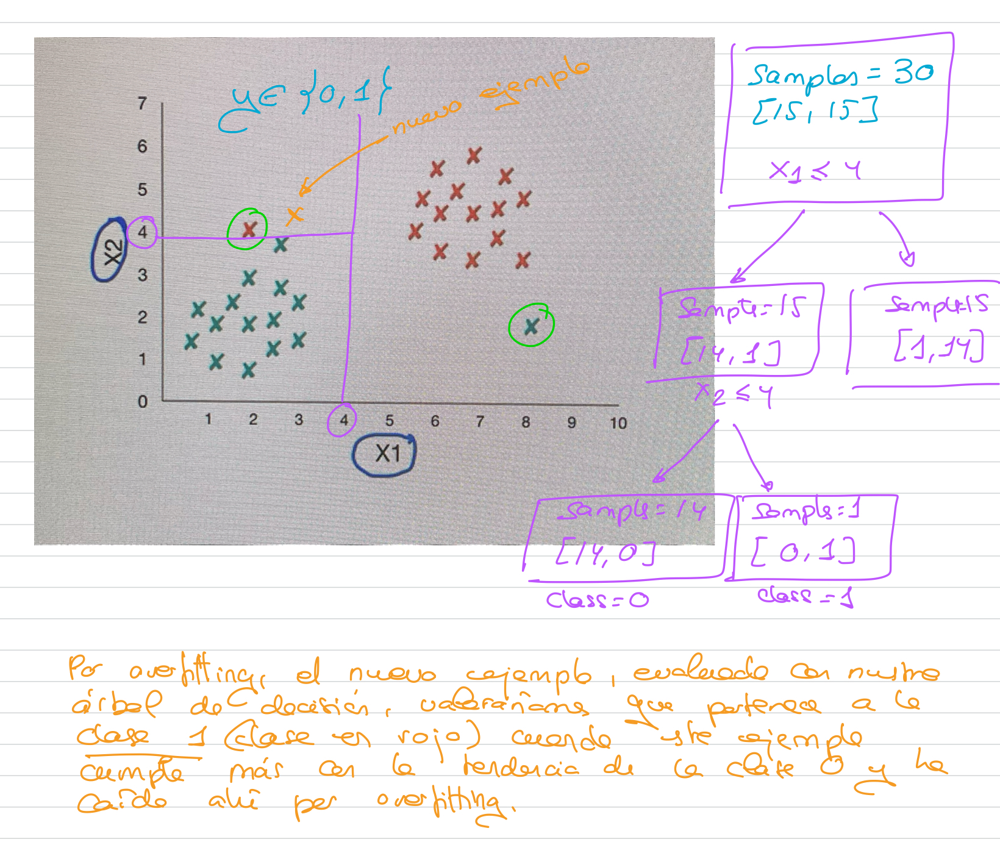

# Árboles de decisión: Limitaciones

- La versión implementada en Scikit-learn pueden producir árboles de decisión complejos que producen **overfitting** sobre conjuntos de datos de entrenamiento.
- La implementación del algoritmo, se basa en la **obtención de óptimos locales** entre el nodo padre y el nodo hijo. Como consecuencia, no hay manera de asegurar que el árbol alcance una forma óptima global. 

En el caso de árboles de decisión, buscaremos óptimos locales en los nodos. Son locales, porque sólo se miran los nodos a los que afectan. Si mirase el conjunto completo de divisiones podría tener una visión más global.

- Los árboles de decisión **pueden ser inestables**. Una pequeña variación en el conjunto de datos puede producir que se genere un árbol completamente diferente.
- Pueden **mitigarse gran parte de los efectos** de estas limitaciones si se utilizan conjuntos aleatorios de árboles que toman decisiones conjuntas (**Random forest**).

## Overfitting

- Los árboles de decisión también pueden producir Overfitting. Cuando existe un número muy elevado de características o valores atípicos, es posible que el árbol de decisión genere un número muy elevado de ramas que desemboque en problemas para generalizar.
- Aplicar un **criterio de parada** (hiperparámetros):
  - **max_depth**: determina la cantidad máxima de ramas y hojas permitidas antes de que se termine la construcción del árbol.
  - **min_samples_split**: determina el número mínimo de muestras que un nodo debe poseer para ser elegible para una división.
  - **min_samples_leaf**: determina el número mínimo de muestras necesarias para crear una hoja secundaria.
  - **max_leaf_nodes**: determina cuántas hojas se pueden crear en total.
  
  
   
   Si hubiésemos por ejemplo limitado los niveles del árbol a 2 nunca hubiese llegado a ese punto. Podríamos jugar con los distintos hiperparámetros.