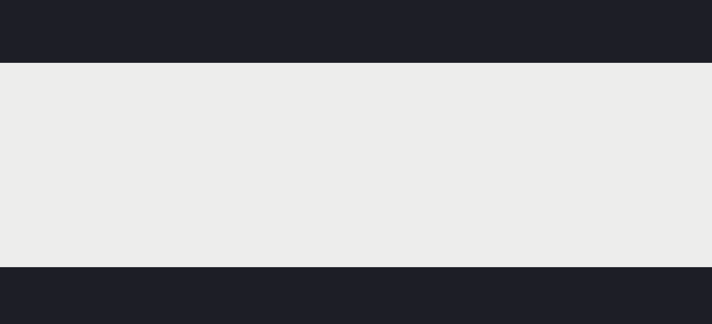

# Árboles de decisión

Permiten realizar tareas de clasificación y regresión.
Esta técnica de machine learning:
- Se engloba dentro de algoritmos basados en **aprendizaje supervisado** (conjunto de datos etiquetado)
- Se basa en **modelos**, construye una función hipótesis ajustada aunque diferente a cómo se hace en los algoritmos anteriores.
- Son clasificadores **no lineales**. Capaces de clasificar conjuntos de datos que no son linealmente separables. Al contrario de la regresión logística o SVM, no va a construir los límites de decisión con líneas o planos rectos. Esto tiene una base matemática en la que no vamos a entrar.
- Predice **valores continuos** (regresión) y **valores discretos** (clasificación).
- Determina si un vector pertenece a una o a otra clase estableciendo un **conjunto de reglas de decisión if-then else** que determinan en la predicción de una clase concreta.

## Ejemplo de funcionamiento

Problema de clasificación multiclase con tres clases.

Tentremos un total de 40 ejemplos: **samples = 40**.
**values = [12, 12, 16]**
12 ejemplos de la clase 0, 12 de la clase 1 y 16 de la clase 2

Queremos construir un límite de decisión que separe las tres clases.

Si lo separamos de forma intuitiva estableciendo una línea para **x1 <= 3**, obtenemos la siguiente situación:

**12 ejemplos de la clase 0** [12, 0, 0]
**0 ejemplos de la clase 0, 12 de la clase 1 y 16 de la clase 2** [0, 12, 16]

Vamos a seguir subdividiendo nuestro conjunto para intentar que queden subconjuntos con clases únicas.

Si nos fijamos, en el valor 4 de X2 podemos establecer también un valor de corte.

Cuando la variable **x2 <=4**, podremos dividir en dos clases.

Esto que hemos construido con cajas a la izquierda es un **árbol de decisión.**
Este árbol, no es más que un conjunto de reglas **if-then else** que van a determinar según si se cumplen los valores de corte si encasillamos en un subconjunto o en otro.

**Si entra un ejemplo nuevo, para el cuál queremos predecir el valor de salida. Por ejemplo (x1=4, x2=3) pertenecería a la clase y=2**

Va evaluando nodo por nodo del árbol.

