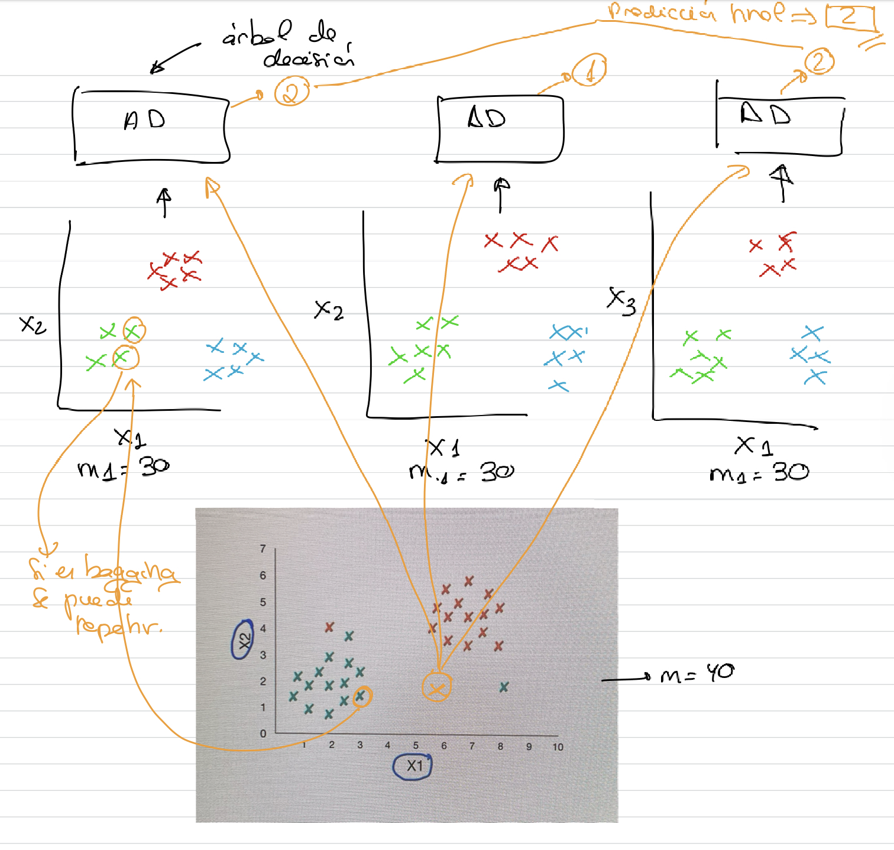

# Ensemble Learning: Bagging y Pasting

- Se agrupan varias instancias del **mismo algoritmo de predicción**. 
- Cada instancia se entrena en diferentes subconjuntos del conjunto de datos de entrenamiento.
- En ambos casos los ejemplos de entrenamiento pueden ser seleccionados varias veces para distintas instancias del algoritmo de predicción.
- En ambos casos los ejemplos de entrenamiento pueden ser seleccionados varias veces para distintas instancias del algoritmo de predicción.
- En la técnica de **bagging** un mismo ejemplo de entrenamiento puede ser seleccionado varias veces para la misma instancia del algoritmo de predicción. En este caso, coge los ejemplos de forma aleatoria y una misma instancia podría tener ejemplos repetidos.
- En la técnica **Pasting**, se pueden repetir ejemplos de entrenamiento entre distintas instancias pero no en un mismo modelo.
- El resultado de la predicción en las tareas de claseificación es la **clase más repetida** entre las intancias, en las tareas de regresión es la **media de las predicciones**.

