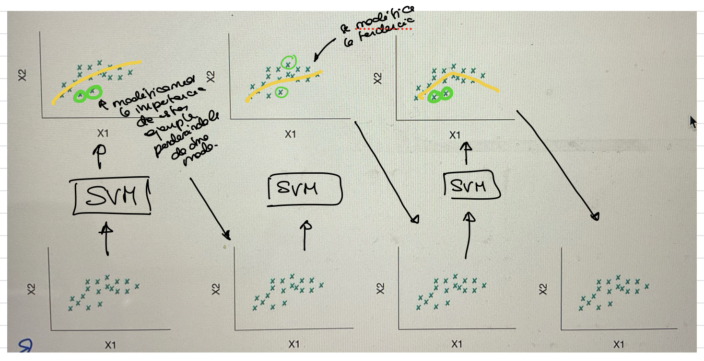
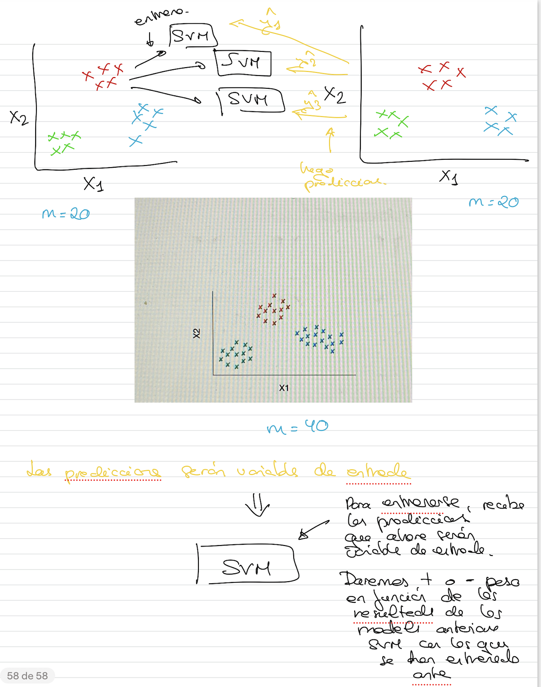

# Ensemble Learning: Boosting y Stacking

## Boosting

Su objetivo principal es generar modelos en los que tengamos en cuenta casos que son difíciles de clasificar. Si nosotros utilizamos una única intancia (un único modelo, como svm), nuestra función que se genera puede dejar algunos ejemplos sin clasificar correctamente y pueden ser ejemplos importantes.
Con Boosting, estos ejemplos importantes, trataremos de aumentarle la influencia dentro de la construcción del modelo para que se modifique el modelo y los tenga en cuenta.

## Stacking

Tendremos un conjunto de datos que dividimos en dos subconjuntos. 
Un subconjunto lo utilizamos para entrenar un conjunto de estimadores (algorimtos). Luego, utilizaremos el otro subconjunto para predecir. Con estas predicciones, después entrenaremos un modelo que está por encima y se va a encargar de realizar la predicción final.

Se basa en el concepto de en lugar de tener varias instancias que todas hacen una predicción y luego nos quedamos con la que más se repite, ahora lo que tendremos son varias instancias y con las predicciones obtenidas de estos, entrenaremos otro modelo que nos dará la predicción final. Ese algoritmo seleccionará qué instancias tienen más peso.

