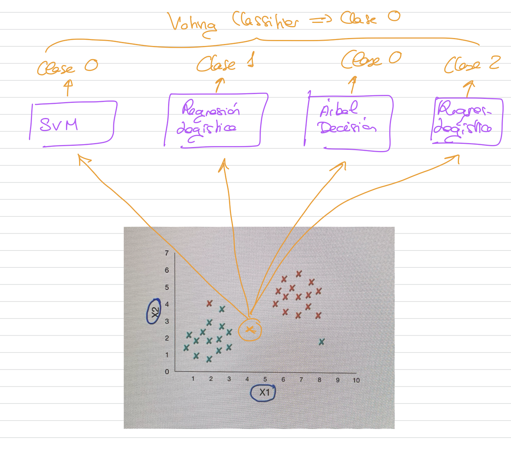

# Ensemble Learning y Random Forests

Técnicas que resuelven las limitaciones de los árboles de decisión.

## Ensemble Learning

- Si agregas la predicción de un conjunto de algoritmos es muy probable que obtengas una predicción mejor. 
  
  Si cogemos, por ejemplo un algoritmo de regresion logística y entrenamos y generamos un modelo, si realizamos una predicción para un ejemplo nuevo, obtendremos un resultado. Podemos hacerlo con otro algoritmo y obtener otra predicción.

  La calidad de la predicción de estos algoritmos, es mejor si junto varios algoritmos y obtengo las distintas predicciones y luego hago una agrupación de esas predicciones y me quedo con la predicción que se repita más entre todas las predicciones hechas de los distintos algoritmos.

  Elegir la predicción que más se repite entre los algoritmos que se han entrenado previamente se llama **Voting Classifiers**
- Un conjunto de algoritmos de predicción agrupados para realizar predicciones se denomina **Ensemble Learning**
- Este tipo de métodos deben utilizarse al final del proyecto, cuando ya se han entrenado un conjunto de algoritmos de predicción.
- Los métodos principales de Ensemble Learning son: **bagging (random forests), pasting, boosting y stacking**.

