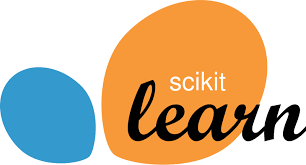

# Ejemplo completo

Vamos a comenzar a utilizar la librería `sklearn`, también conocida como **Scikit-learn**. Es una biblioteca de Python ampliamente utilizada para ML. Proporciona herramientas eficientes y fáciles de usar para realizar tareas comunes en el ámbito del aprendizaje automático y minería de datos (proceso que implica analizar grandes conjuntos de datos para descubrir patrones, tendencias, relaciones y conocimientos útiles).




```{warning}
Ejemplo completo: https://github.com/igijon/ML_Regresion_clasificacion
```

