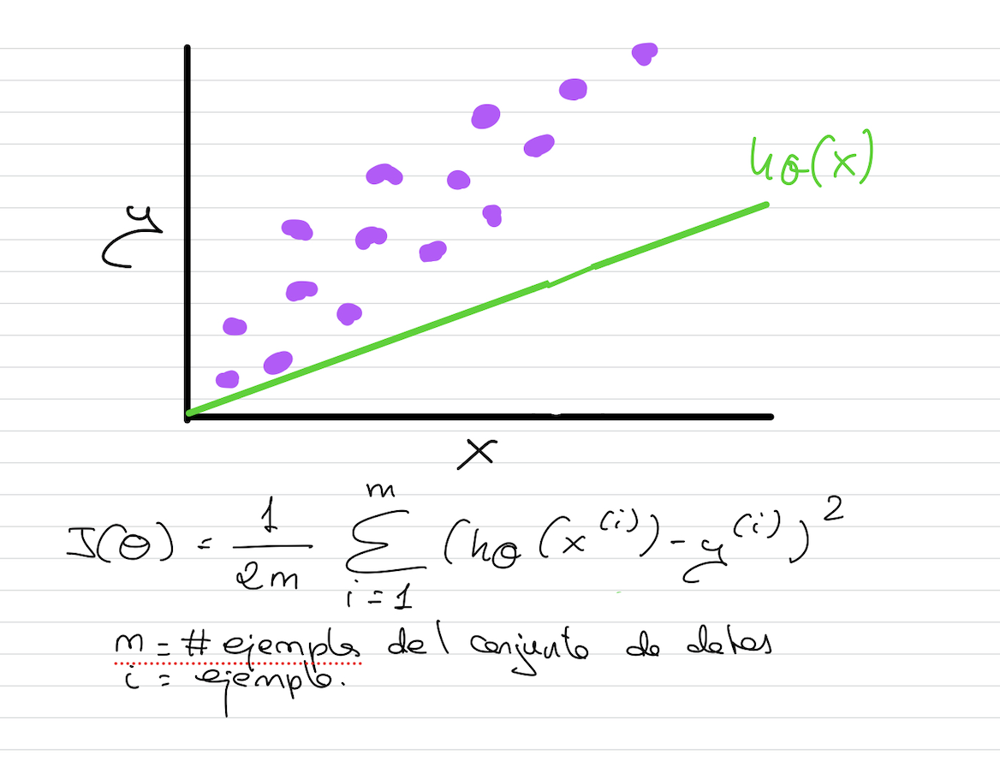
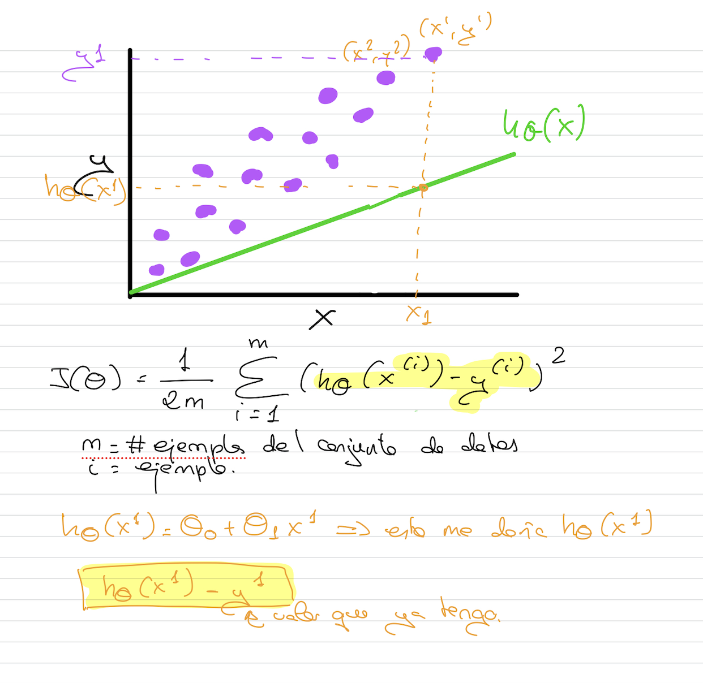

# Función de coste

En este tipo de algoritmos de regresión lineal, solemos aplicar una función de coste que se llama **Mean Squared Error (MSE)**.

Cada punto morado del dibujo es un ejemplo de nuestro conjunto de datos.

