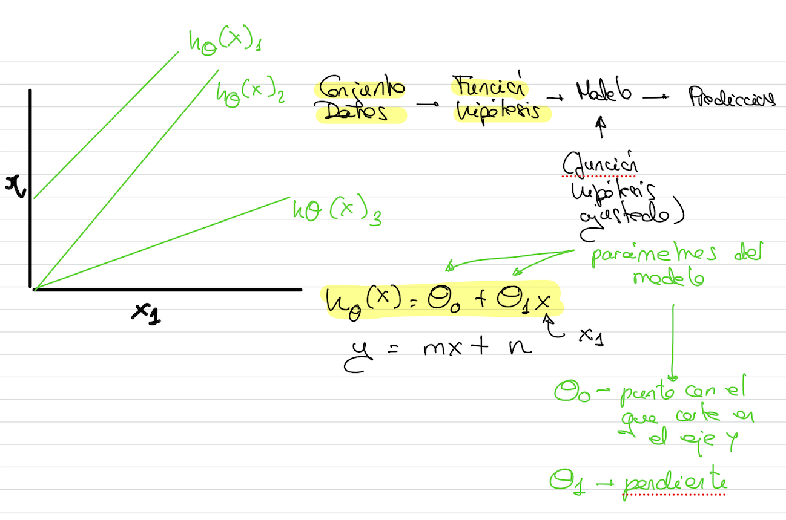

# Función hipótesis

```{note}
El objetivo es encontrar los mejores parámetros theta1 y theta0 que mejor ajuste la recta a la tendencia de nuestro conjunto de datos
```


Cuando tenemos una sola característica, el algoritmo se llama **Regresión lineal univariable**.

Si tuviésemos n características de entrada (x1, x2, ..., xn), el algoritmo se llamaría **regresión lineal multivariable** y tendríamos que ajustar los distintos parámetros theta0, theta1..., thetan.

En las la función hipótesis, el *bías* se corresponde con el parámetro theta0.

El ajuste de la función hipótesis para construir el modelo es a lo que se llama **entrenamiento**.


