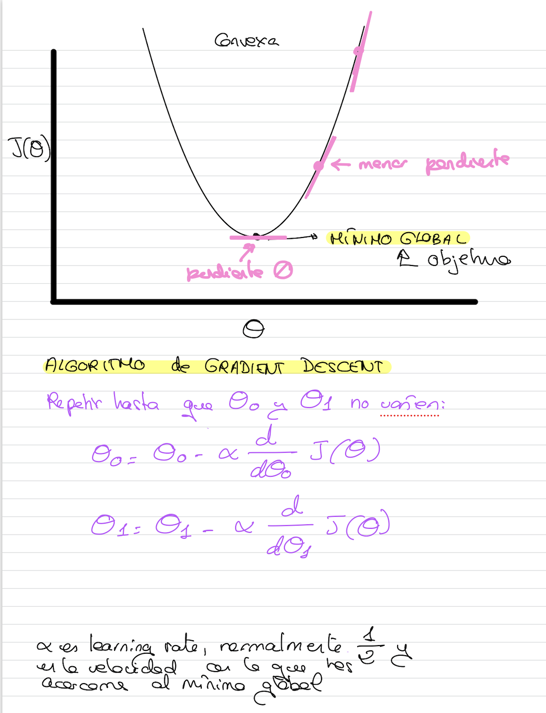

# Función de optimización

La función de optimización que más se utiliza con diferencia se llama **Gradient Descent**. Esta función está muy ligada a la función de coste que estemos utilizando, en este caso MSE.

La función de optimización tiene como objetivo minimizar la función de coste.

La función de optimización, utiliza el concepto de **gradiente** que es equivalente al concepto de pendiente o **derivada** para encontrar el valor óptimo de los parámetros que minimiza la función de error.

La derivada en un punto, según nos vamos alejando del valor mínimo óptimo, va aumentando, y según nos acercamos al mínimo global, el valor va disminuyendo.

El algoritmo de **gradient descent** hace lo siguiente:

Cuando el valor de theta0 y theta1 no varíen en varias iteraciones, ya hemos llegado al mínimo global.

Haremos ejemplos con una o dos variables porque si no se complica mucho a nivel gráfico.

