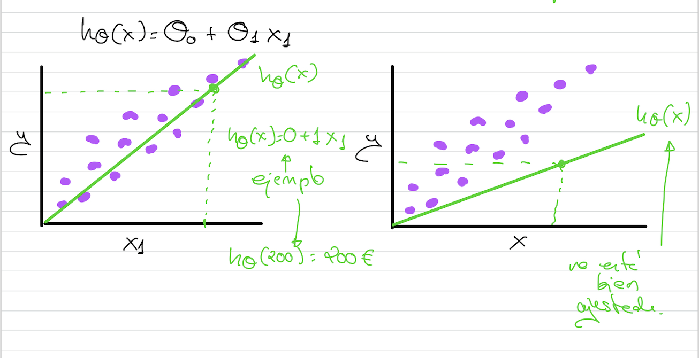

# Construcción del modelo



Para ver si la función hipótesis es buena, hay que minimizar una **función coste** o función de error. Calcula el error que hay, teniendo en cuenta que tengo valores en el conjunto de entrenamiento que ya están etiquetados, si les aplico la función hipótesis y la diferencia del coste que me devuelve y el coste real es muy grande, hay que ajustar.

La **función de coste** calcula el error que hay para todos los ejemplos de nuestro conjunto de datos. Esto permite, con una función posterior, que se va a llamar **función de optimización** ir modificando la **función hipótesis** hasta que la **función de coste** cada vez sea menor y nos quedaremos con la **función hipótesis** que no se pueda optimizar más.

```{warning}
**Algoritmo**: Va inicializar theta0 y theta1 de forma aleatoria, utilizará la función de coste para calcular el error de la función hipótesis y luego utilizará una función de optimización para minimizar el error y modificaremos la función hipótesis hasta que la función de coste no se pueda minimizar más. Esto es **entrenar un algoritmo de machine learning**
```

