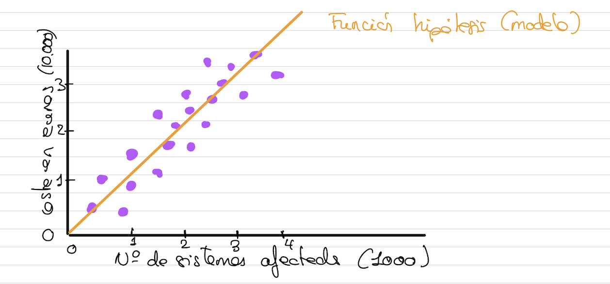
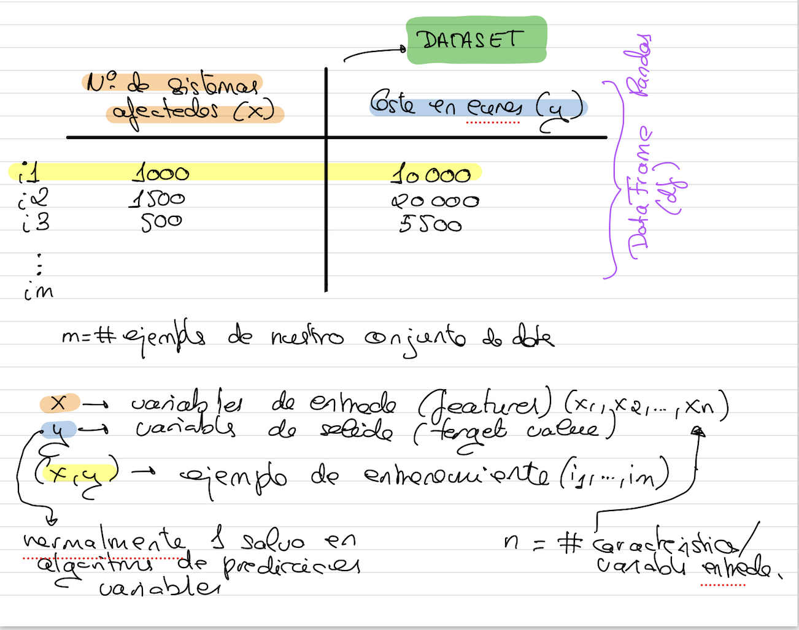

# Regresión lineal

- Aprendizaje supervisado (conjunto de datos etiquetado)
- Aprendizaje basado en modelos (construye una función hipótesis)
- Se corresponde con un modelo lineal
- Realiza predicciones computando una suma ponderada de las características de entrada y sumándole una constante conocida como *bias*
- Intenta predecir valores continuos (regresión)
  

```{note}
Dándole un conjunto de datos de entrenamiento, construye una función hipótesis.
```


Veamos la nomenclatura que utilizaremos:



