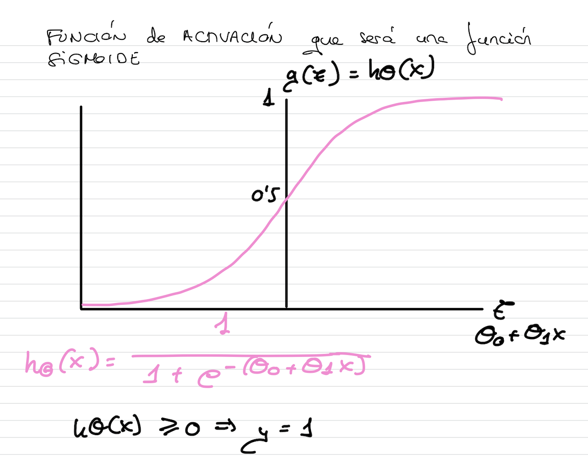

# Construcción del modelo

La función nos dice la probabilidad de que y valga 1 para una entrada x.
La suma de la probabilidad de que y valga 0 más la probabilidad de que y valga 1 debe darnos un total de 1.

Para determinar dónde lo clasificamos, utilizaremos un **threshold**. Por ejemplo, si la probabilidad es > 0.5, el correo lo determinaremos como SPAM y NO SPAM en caso contrario.

 

 

 