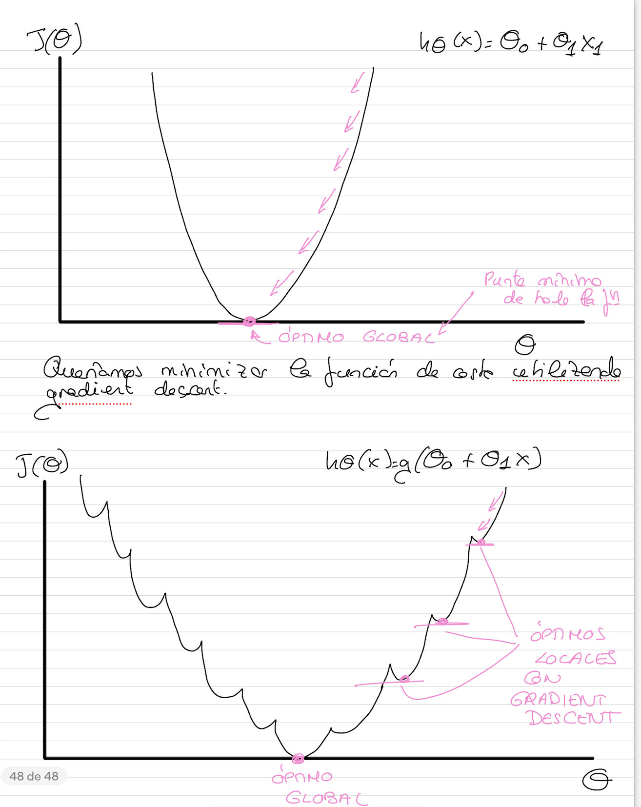
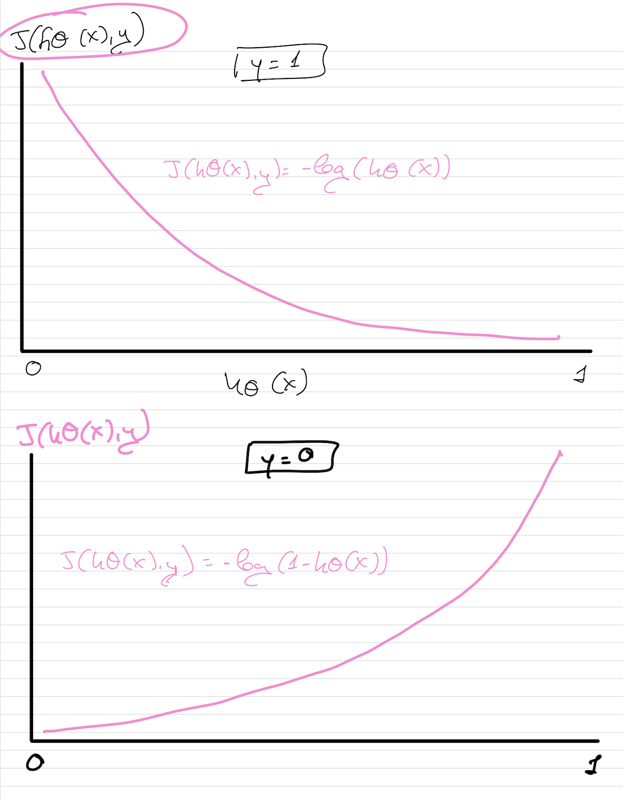
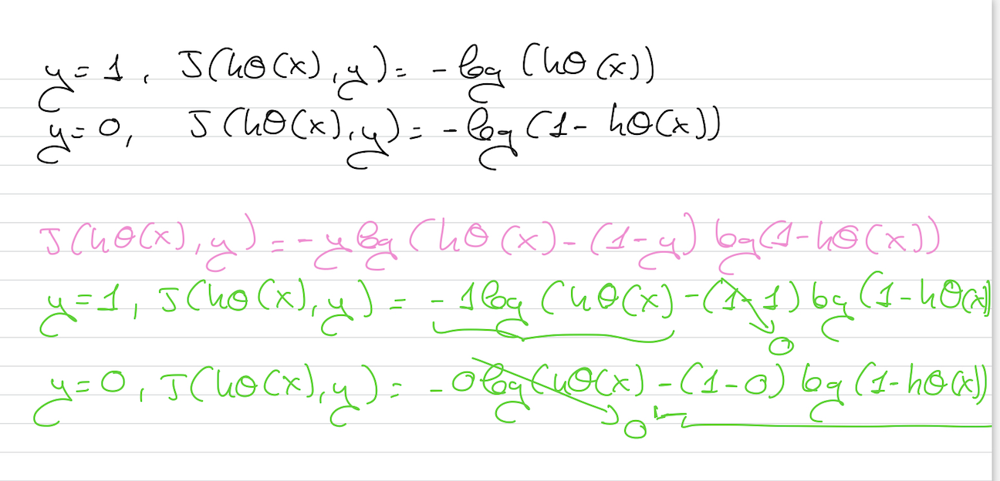

# Función de coste

No podemos utilizar la misma función de coste que se utiliza para la regresión lineal debido a que, aplicada a la regresión logística, **genera óptimos locales**.

Si nuestra respuesta correcta y = 0, entonces la función de coste será 0 si nuestra función hipótesis también emite 0. Si nuestra hipótesis se acerca a 1, entonces la función de coste se aproximará a infinito.

La función de coste para la regresión logísticava a tener dos partes, una para cada valor de la clasificación.

