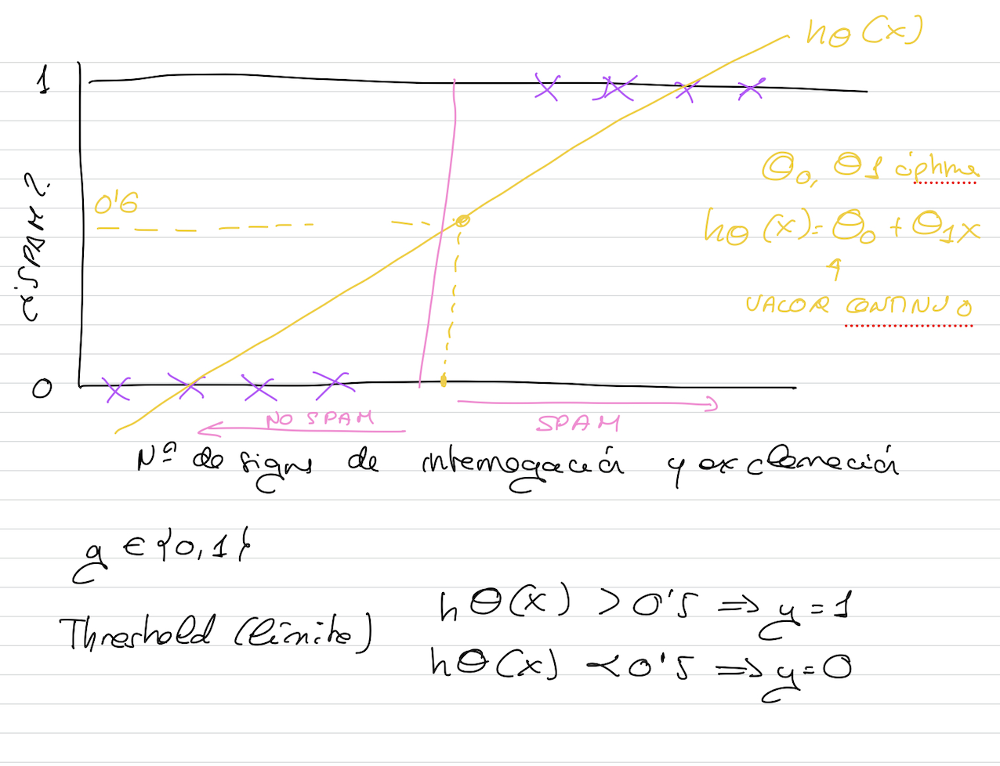
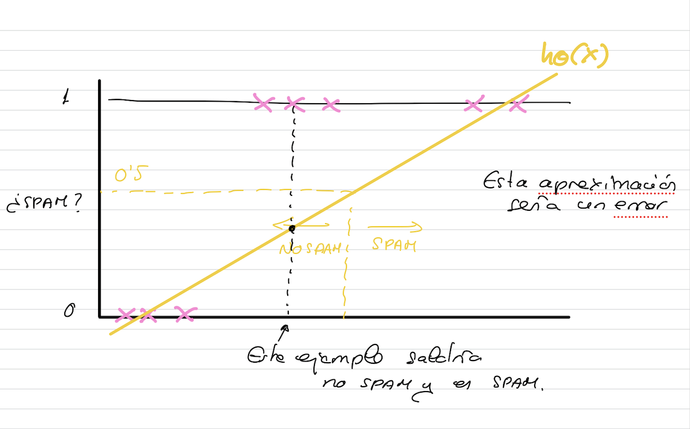

# Función Hipótesis

Podríamos pensar que no nos hace falta regresión logística, sino un límite o **threshold** que nos permita ajustarla para un problema de clasificción.
Pero imaginemos otro conjunto de datos.

Por esto no podríamos utilizar la función hipótesis de la regresión lineal, porque llega un momento que dependiendo del conjunto de datos precice mal.