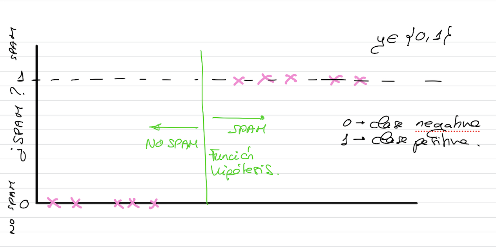

# Regresión logística (clasificación)

- Aprendizaje **supervisado**: conjunto de datos etiquetado.
- Aprendizaje **basado en modelos**.
- Se corresponde con un **modelo lineal generalizado**.
- Realiza predicciones computando una **suma ponderada de las características de entrada** y sumándole una constante conocida como *bias*, pero se aplica una función logística al resultado.
- Intenta predecir **valores discretos.**

