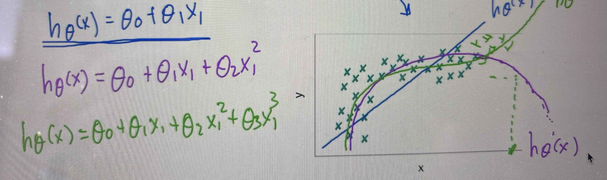

# Kernels - Regresión polinómica 

Vamos a ver cómo gestionar conjuntos de datos linealmente no separables.

Los clasificadores SVM lineales son eficientes y funcionan muy bien, sin embargo, existen **conjuntos de datos que no son linealmente separables**.

## Regresión polinómica

Una técnica para generar modelos no lineales sin ser aún un kernel.

Se crean un conjunto de características polinómicas que permiten la creación de límites de decisión no lineales.

No se suele aplicar a casos de usos reales por problemas de deficiencias y por eso se usan los kernels.

Se crean un conjunto de características polinómicas que permiten la creación de límites de decisión no lineales.

Si recordamos el ejemplo de los correos spam:

Utilizar características polinómicas para generar límites de decisión no lineales tiene un gran inconveniente:
- Si se dispone de polinomios con un grado bajo, no pueden generarse límites de decisiión complejos.
- Si se dispone de polinomios con un grado alto, se generan un gran número de características, lo que requiere una capacidad de cómputo elevada y el modelo es lento.

